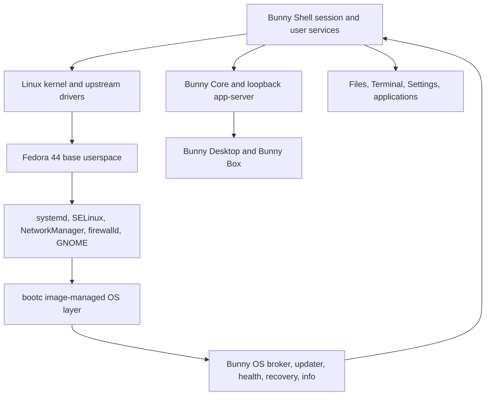

# Bunny OS Phase 1 architecture

## System boundary

The kernel owns scheduling, memory, filesystems, devices, networking, and mandatory access control. systemd owns boot, services, sessions, power, and shutdown. GNOME/Mutter owns the Wayland session. `bootc` owns OS deployment state. Bunny OS exposes only explicit integration operations.

## Processes and authority

| Process | Identity | Interface | Authority |
|---|---|---|---|
| Bunny Desktop | logged-in user | Tauri/portals; broker UDS | user files and approved broker methods |
| Bunny Core/app-server | same user, supervised by Desktop | loopback token-authenticated app protocol v3 | Bunny data and granted capabilities |
| `bunny-system-broker` | root system service | `/run/bunny/broker.sock` only | fixed allowlisted OS operations |
| update agent | root one-shot | fixed systemd instances | verify manifest and invoke exact `bootc` target |
| health check | root one-shot | local files/socket | boot-success evidence only |
| recovery | root on physical console | conventional tools | explicit, confirmed repair actions |

The broker is not a shell, package manager, file-write proxy, D-Bus tunnel, kernel-module loader, or provider-credential store. Mutations require an active local session and operation-specific Polkit authorization. Peer PID/UID/GID and process start time are verified through `SO_PEERCRED` and `/proc`.

## Data and update separation

`/usr`, Bunny OS executables, and `/opt/bunny` are delivered by the OCI image. `/etc` is deployment-managed configuration with bootc/OSTree semantics. `/var` and `/home` persist across deployments. Bunny application releases and OS image releases have independent versions; a compatibility range is the only coordination point.

An OS update is: HTTPS manifest fetch → Ed25519 verification → channel/architecture/contract/sequence/expiry checks → disk-space check → exact repository and digest → `bootc switch` → staged deployment → reboot → offline health checks → boot success. The prior deployment remains selectable. Developer images have no active trust key or automatic update check.

## Desktop and display

GNOME/Mutter is the Phase 1 desktop and compositor. Wayland is default, XWayland is compatibility-only, and X11 fallback is a documented troubleshooting choice rather than an automatic security downgrade. Screen capture, remote desktop, and synthetic input use explicit user-mediated desktop portals/accessibility APIs; Bunny receives no silent capture or injection permission.

## Bunny Shell desktop layer

Phase 2 retains GNOME/Mutter and adds an image-owned GNOME Shell 50 extension, GTK4 surfaces, desktop/Nautilus integration, private XDG state, and bounded systemd user services. GDM offers Bunny, base GNOME, and Bunny Safe Shell. Safe Shell stops the Bunny target and the extension becomes a no-op.

Launcher intent, workspace metadata, search metadata, settings, terminal proposals, and Bunny Core projections have separate versioned schemas. The shell cannot grant Bunny permissions, mutate a Bunny database, call a generic root command, or claim security evidence it has not observed. System actions still traverse the Phase 1 broker and Polkit. Files, Terminal, Settings, workspaces, update/recovery access, and base GNOME continue without Bunny Core.

## Conventional administration

The image retains a normal terminal, journald, `systemctl`, `bootc`, `nmcli`, `firewall-cmd`, storage tools, and the `bunny-os` CLI. Recovery and boot do not require Bunny Core, Desktop, a cloud account, telemetry, a model, or network connectivity.

Detailed decisions are in `docs/adr`, and source diagrams are in `docs/diagrams`.
