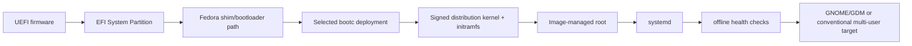

# Boot architecture

Phase 1 targets UEFI x86-64 with GPT. Legacy BIOS is unsupported. image-builder creates the disk/ESP/root layout from the derived bootc container; Bunny never implements a bootloader, kernel, initramfs, driver, or root selector.

The boot menu and `bootc status` expose current and previous deployments. `bootc rollback` selects the previous deployment for the next boot. A failed boot/health result must not delete the prior deployment or retry an update indefinitely.

An authenticated broker request writes a root-only one-shot marker. The early systemd generator validates exact fields and selects `bunny-recovery.target` for the next boot only. Recovery runs on a physical console without GDM, Bunny Core, Desktop, app-server, models, plugins, or cloud. A separately composed recovery profile provides the same conventional tool foundation.

Secure Boot uses Fedora's signed boot chain as its starting point, but derived Bunny OS Secure Boot support is **unqualified** until the produced disk is tested with Secure Boot on and off, unsigned boot components are rejected, updates and rollback boot, and NVIDIA/custom module cases are covered. Emergency access follows distribution/systemd recovery policy and requires local administrative/disk-unlock credentials; no unauthenticated network rescue shell is enabled.

