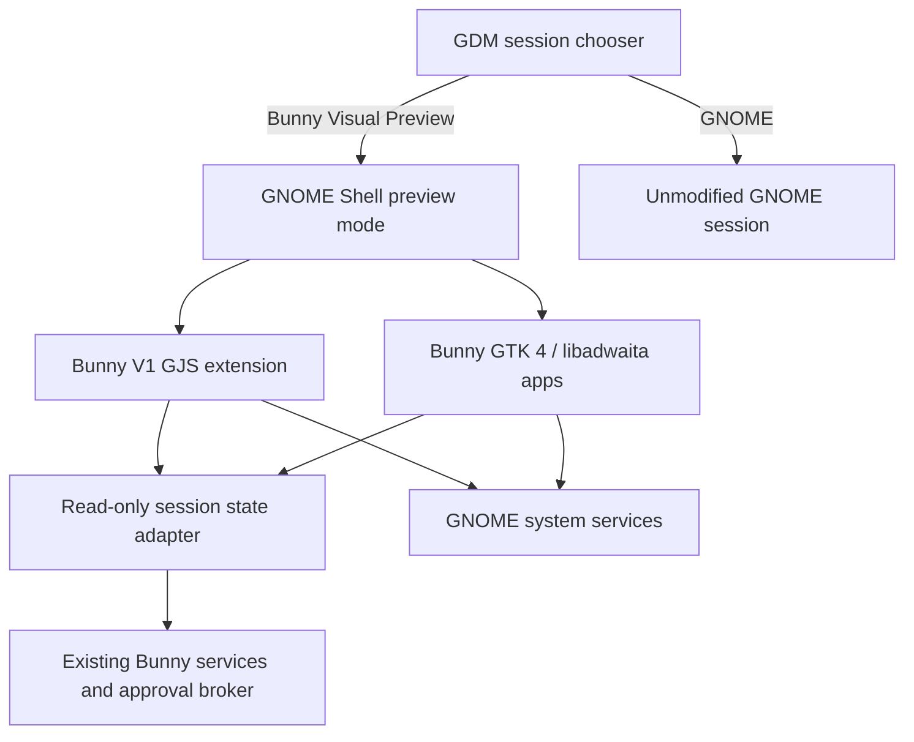

# Bunny Desktop Visual V1 architecture

> **Status: visual prototype; not release qualified**

## Decision

Visual V1 is an additive presentation layer on Wayland, GNOME Shell, GJS,
GTK 4, libadwaita, GSettings, and system SVG assets. It validates the Bunny
visual language and interaction hierarchy without creating a compositor or
forking authentication, networking, audio, display, notification, or power
backends.

## Layers

1. **Preview session** — a separate GDM entry and GNOME Shell session mode.
2. **Shell extension** — desktop frame, overview additions, command palette,
   quick controls, assistant state, approvals, and notification presentation.
3. **Bunny applications** — GTK 4/libadwaita surfaces for Control Center,
   Approval Center, Assistant, Diagnostics, and Welcome.
4. **Existing backends** — system services and Bunny's approval broker remain
   authoritative. The visual layer observes their result; it never predicts it.
5. **Design system** — versioned JSON tokens generate shell and GTK CSS.

## Trust boundaries

- Visual components can launch only fixed desktop IDs or audited Bunny entry
  points. Search text is never interpreted as a shell command.
- Privileged, sensitive, and irreversible actions are routed to the existing
  approval path; UI controls cannot grant authority.
- Provider secrets and authentication remain outside visual-process memory and
  storage.
- An observed action remains `proposed`, `waiting`, or `running` until an actual
  backend result changes it to a terminal state.
- Missing data is shown as unavailable, never inferred.
- No component polls continuously or performs visual-layer network activity.

## Runtime state

Visual surfaces subscribe to GNOME signals, GSettings changes, and a file
monitor on the existing per-session Bunny status projection. The projection is
read-only and privacy-filtered. A missing or invalid projection produces a
usable conventional desktop and an explicit unavailable state.

Mock fixtures are outside the runtime path unless
`BUNNY_VISUAL_MOCK_MODE=1`. Mock mode is visually persistent and package
assembly rejects it.

## Compatibility

The extension targets the GNOME Shell API declared in its metadata. Version
compatibility is validated statically and must be exercised in the nested
preview before packaging. GNOME remains the fallback session at all times.

## Out of scope

Custom Wayland compositor work, authentication changes, production image
publication, stable tags, qualification evidence, pilot work, and automatic
session selection are outside Visual V1.
