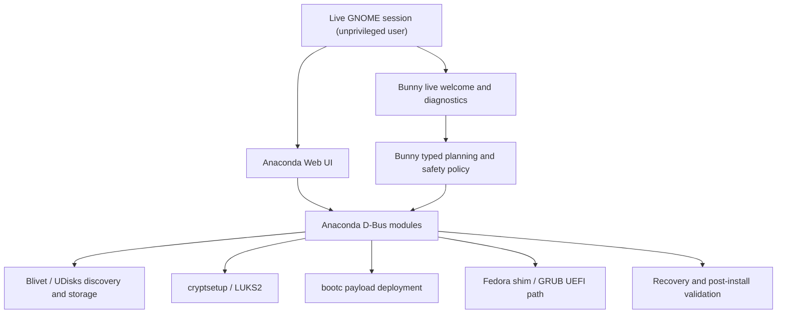

# Installer architecture

## Status

Phase 3 selects Fedora 44 Anaconda/Blivet and its Web UI, with OSBuild unified `image-builder` composing a `bootc-generic-iso`. Bunny-owned code is presently a host-tested planning and policy layer. The Anaconda adapter and booted live image remain unvalidated; consequently destructive execution fails closed.

## Boundaries

- The frontend is unprivileged and never supplies root command strings.
- `installer/protocol.py` accepts ten versioned operations and rejects all others.
- Passwords, passphrases, keys, and provider tokens are forbidden in protocol JSON.
- `installer/storage/probe.py` runs one constant `lsblk` argv and bounds output.
- Full serials and UUIDs are reduced to short hashes before they cross the UI boundary.
- Plans bind disk ID, device path, and expected byte size; identity is revalidated before execution.
- Erase requires a disk-specific phrase and a second confirmation.
- The source backend can probe, validate, preview, report, and return redacted logs; `install.start` returns unavailable unless a reviewed production adapter is injected.
- Anaconda/Blivet/bootc, not Bunny, must execute partition, filesystem, encryption, image, and bootloader operations.

## Lifecycle and failure

Stages are Preparing, Validating storage, Partitioning, Encrypting, Creating filesystems, Deploying Bunny OS, Installing bootloader, Creating user, Installing recovery, Configuring hardware, Final verification, and Complete. Progress is stage-based; no fabricated time estimate is emitted. Cancellation is accepted only before the first write boundary. After a write, errors name the failed stage, close mappings/unmount where the adapter can do so, and never promise complete rollback.

The live-only backend is conditioned on `/run/bunny-installer/live-session` and is not enabled on installed systems. Its session is bound to the live UID, a protected random token, fresh timestamps, and replay-protected nonces. Production must use kernel peer credentials on AF_UNIX and have no TCP listener.

## Installed-system boundaries

Anaconda creates the first Linux user or seals an OEM first-run state. `bunny-first-run` is a separate per-user program. OS images remain bootc-managed; Flatpaks and development containers remain outside the image; Bunny plugins remain outside both.

