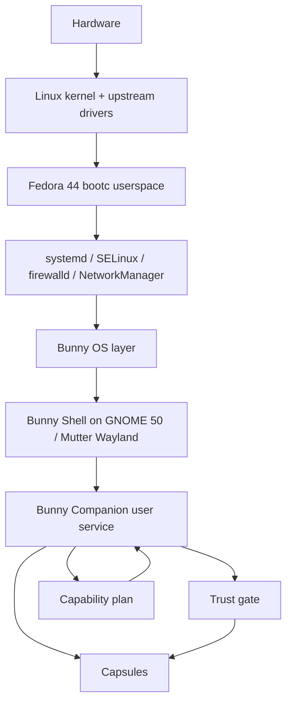
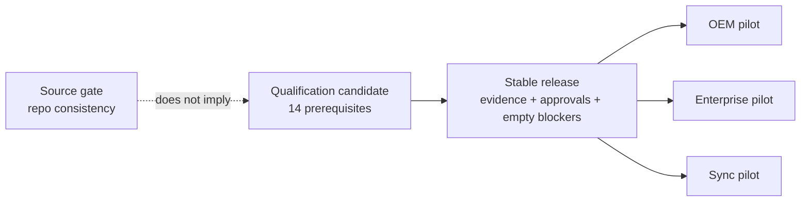

# Bunny OS — how it works, and what is actually broken

**Audience:** Ravi (software engineer) and the coordinator showing this to a human.
**Date:** 2026-09-11.
**Base of this reading:** `origin/main` at `b6a2fa6f` (merge of #40; also includes #38 Trust demo and #39 guest Trust harness).
**This document’s branch** also carries host-side bug fixes found while investigating. Those fixes do **not** make a stable release, a guest boot, or a pilot.

This report is grounded in this checkout, GitHub Actions on `main`, and commands that actually ran on an Ubuntu 24.04 cloud host. It is **not** marketing. It does **not** claim `gate-stable-release` GO, guest Trust PASS, physical hardware results, or a new CVE count.

---

## Executive snapshot

Bunny OS is a **Linux operating-system layer** on **Fedora 44 bootc**, with **GNOME 50 / Mutter (Wayland)** as the desktop, a **user-session Companion** as the intelligence runtime, and **Trust + capsules + capability** as the permission and sandbox path. The repository is large, carefully gated, and unusually honest about `NOT_RUN` versus `PASS`.

On `main` at `b6a2fa6f`, **GitHub CI is red** on all three workflows. **Stable release is NO-GO. All three pilots are BLOCKED.** The README’s “Source gate PASS at `85dead7`” is a **historical measurement**, not a claim about this commit.

On this Ubuntu host:

| Ran | Result |
|---|---|
| `python3 scripts/task.py audit` | PASS (required docs present) |
| `python3 scripts/task.py validate` | PASS after ShellCheck was installed; see Part 2 for the frozen-script conflict that was failing CI |
| `python3 scripts/task.py test` (after discovery fix) | **7209 tests**, ~212s: **5 failures + 1 error** before the extra test-hygiene fixes in this branch. Failures were LFS stubs, umask, demo `out/` leakage, and (on `main`) a discovery crash. Not a product GO. |
| `python3 scripts/task.py test-trust` | 91 OK |
| `python3 scripts/task.py test-capsules` | 109 OK |
| `python3 demos/08-visible-trust/run.py` | exit 0; host Trust surfaces PASS; `guestBoot=NOT_RUN`; stable NO-GO |
| `python3 demos/09-guest-trust/run.py` | exit 0; **honest guest `NOT_RUN`**; harness tests PASS; `probePassed=true`, `guestPassed=false`, **`passed=false`** (NOT_RUN is not a guest PASS) |
| `python3 demos/10-product-vision/run.py` | exit 0; 13/13 screenshots; voice STT/mic/TTS **NOT_RUN**; `passed=true` because NOT_RUN ≠ FAIL |

**Could not run here:** Fedora `image-builder`, QEMU guest boot, composed QCOW2, Podman image build, physical hardware, Orca, live microphone STT, neural TTS *playback* in a graphical session, `jsonschema` (not installed on this image; CI installs it). `/dev/kvm` exists but is **not writable** for this user. Git LFS voice bytes **were** pulled for a provenance re-measure.

---

## Part 1 — How the project works

### 1. High-level architecture

The stack is a series of **authority boundaries**, not a single app:



| Layer | What it actually is in this tree |
|---|---|
| **Linux kernel / Fedora 44 bootc** | The OS. Bunny is not a kernel, init, or driver stack. Images are bootc/OSBuild `image-builder` QCOW2 definitions under `build/`. |
| **Bunny OS layer** | Privileged broker (`services/bunny-system-broker`), update agent, capability supervisor, systemd units, SELinux/firewall/sysctl inputs, installer/OEM/enterprise/sync packages. Mutations go through a **narrow broker + Polkit**, not a root shell. |
| **Bunny Shell (GNOME)** | Image-owned GNOME Shell 50 extension, GTK surfaces, sessions (normal / base GNOME / Safe Shell), launcher, workspaces, private search, settings, notifications, approval centre. The shell **cannot grant Bunny permissions**. |
| **Bunny Companion** | Long-lived **user** systemd service (`bunny-companion.service`) plus a GTK window client. Owns sessions, tasks, the event stream, local executors, and the AF_UNIX protocol the Shell assistant talks to. |
| **Trust / capsules / capability** | **Capability** scores hardware and produces a deterministic execution plan (what may run here, and why — no product “modes”). **Trust** is a ticketed Allow/Deny prompt (deny-by-default; there is no “Always allow everything”). **Capsules** are the sandbox: a transient **systemd service** wrapping bubblewrap/flatpak/scope, not a scope forked from the Companion (the Companion sets `RestrictNamespaces=yes`, which would make `unshare(2)` fail). |

The Phase 1 architecture note in `ARCHITECTURE.md` still mentions Bunny Desktop / Bunny Core as the upstream client. On this tree those artifacts are often **unavailable**; surfaces are required to **degrade honestly** rather than pretend the client is present.

### 2. Major directories

| Path | Owns |
|---|---|
| `build/` | OCI/bootc image profiles, `install-root.py` / `install_routes.py`, CI unit fixture, VM story scripts, image-builder wrappers. `build/out/` is generated and gitignored. |
| `shell/` | Bunny Shell: GNOME extension, GTK, sessions, `bunny-shell-assistant`, search/workspaces/settings services. |
| `companion/` | Companion runtime, planner/executors, presentation/character, GTK window, voice, desktop adapters. |
| `capability/` | Hardware discovery, scoring, budgets, service manifests, **observe-only** supervisor policy. Same image on a tiny board and a big box; the plan differs, not the edition. |
| `services/` | Privileged broker, update agent, companion service entry, capability supervisor entry. |
| `trust/` | Permission gate (`TrustGate`): ticketed Allow/Deny, audit, store. |
| `capsules/` | Isolation plan, backends, launcher vector (`systemd-run --user` **service**, not scope), grant lifetime (`_drop_session_grants`). |
| `systemd/` | System and user units. Restart limits belong in `[Unit]`; a copy in `[Service]` is ignored by systemd. |
| `demos/08-visible-trust` | Host-runnable Trust prompt (production `TrustPrompt` HTML + TrustGate by accessible name). **Does not boot a guest.** |
| `demos/09-guest-trust` | One-command Fedora+KVM AT-SPI journeys, or **honest NOT_RUN**. |
| `demos/10-product-vision` | Host surfaces: Visual Keys, appearance, outcomes, memory defaults, first-run copy, voice story with NOT_RUN. **Does not boot a guest.** |
| `tests/` | Host unit/integration tests. Nested discovery under `tests/fedora_host/` must not reuse the parent `TestLoader` (Python 3.12 `_top_level_dir` trap). |
| `release/` | Gate arithmetic: source / qualification-candidate / stable / three pilots. `SOURCE_GATE_REQUIREMENTS` is six repo checks and **implies neither a release nor a pilot**. |
| `qualification/` | Evidence trees. Phases 4–6 (and more) are **byte-frozen** by `qualification/phase7/immutability/frozen-evidence.json`. Editing those files to please a linter fails the immutability guard. |
| `installer/` | Anaconda/bootc installation architecture. Production adapter is intentionally absent. |
| `oem/`, `enterprise/`, `sync/` | Phase 7 packages. Standard-library only; hardware/crypto executors report **unavailable** rather than degrade into fake success. |
| `scripts/task.py` | Cross-platform host entry: `audit`, `validate`, `test`, slice tests. |
| `assets/voice/` | Neural TTS/STT packaging. Real model bytes are **Git LFS**. Pointer stubs fail provenance tests. |
| `docs/` | Product and qualification documentation. Governing history also lives in `docs/phase-1/` and many root `*_REPORT.md` files. |

### 3. Runtime pipeline (user intent → feedback)

What a typed or spoken request actually does, as implemented:

```mermaid
sequenceDiagram
  participant User
  participant Shell as Bunny Shell assistant
  participant Comp as Companion runtime
  participant Cap as Capability router
  participant Trust as TrustGate
  participant Tools as ToolBroker / capsules
  participant UI as Bubbles / character / TTS

  User->>Shell: type or speak an intent
  Shell->>Comp: AF_UNIX protocol (create session, submit task)
  Comp->>Cap: where may this run? (local / remote / refuse)
  Cap-->>Comp: plan + reasons (offline, memory, locality)
  Comp->>Comp: planner/executor proposes operations
  Comp->>Trust: consent for the plan that is about to run
  Trust-->>User: Allow this Bunny action / Deny this Bunny action
  alt denied or timeout-as-approval
    Trust-->>Comp: deny-by-default
    Comp->>UI: denied / failed presentation
  else allowed
    Comp->>Tools: execute through ToolBroker only
    Tools-->>Comp: operations completed or failed
    Comp->>Comp: worst_outcome(executor, observed)
    Comp->>UI: bubbles, character state, optional TTS
    Shell->>Shell: watch() classifies after poll; approval is not a missed deadline
  end
```

Details that matter:

1. **Intent** lands in the Shell assistant (`shell/services/bin/bunny-shell-assistant`) or the GTK companion window. Voice is Vosk → bounded intent → TTS when packaged; otherwise the product-vision demo labels **NOT_RUN** and uses a fixture transcript.
2. **Companion** (`companion/runtime.py`) is the only module allowed to make things happen. It asks capability where the task may run, derives consent from **tool declarations** (not the executor’s opinion), runs operations only through `ToolBroker`, and writes events before and after so a kill is recoverable.
3. **Approvals bind to the plan that is about to run.** A revision invalidates the previous approval.
4. **Trust** is deny-by-default. Accessible names used by the guest harness and the host demo are `Allow this Bunny action` and `Deny this Bunny action`. There is no “Always allow everything”.
5. **Capsules** launch as a **transient systemd user service**. Allow-once grants are dropped in `capsules/runtime.py` `reconcile()` / `stop()` via `_drop_session_grants`.
6. **Verification** combines the executor’s `TaskResult.outcome` with `_observed_outcome` using `worst_outcome`. A plan with **no** operations is treated as success (Q&A). A mix of completed + failed operations is **observed success** by design — the executor must report failure if the whole task failed.
7. **Feedback** is presentation state (idle / thinking / waiting_for_approval / …), speech bubbles, character renderer, and optional TTS. `watch()` classifies the clock **after** the poll: `PRE_APPROVAL_PHASES` and an unanswered `waiting_for_approval` are not “the runtime missed its deadline”.

### 4. How demos 08 / 09 / 10 work vs `NOT_RUN`

| Demo | Command | What it proves | What `NOT_RUN` means |
|---|---|---|---|
| **08 visible Trust** | `python3 demos/08-visible-trust/run.py` | Host can draw the production Trust prompt, photograph idle → thinking → waiting_for_approval → granted/denied/failed, and drive Allow/Deny through `TrustGate` by accessible name. Capability CLI and companion local path run. Deadline classification is tested. | This demo **never boots a guest**. After the honesty fix, `guestBoot` is always `NOT_RUN`, even if KVM+QEMU exist. |
| **09 guest Trust** | `python3 demos/09-guest-trust/run.py` | On a Fedora 44 image-builder host with a composed `shell-test` QCOW2, writable `/dev/kvm`, QEMU, OVMF, guestfish: boot twice, wait for `BUNNY_SESSION_READY`, type the resize request, press Allow/Deny at AT-SPI extents. The driver does **not** call `resolve_approval`. | On this Ubuntu host: no QEMU, no image-builder, no qcow, kvm not writable → journeys `NOT_RUN`. Exit 0 if host harness tests pass (`probePassed`). Top-level `passed` is `guestPassed` only, so NOT_RUN yields `passed=false` unless `BUNNY_GUEST_TRUST_PROBE_OK=1`. `BUNNY_GUEST_TRUST_REQUIRE=1` → exit 2 if guest is not PASS. |
| **10 product vision** | `python3 demos/10-product-vision/run.py` | Host HTML/Chrome captures of Visual Keys, appearance (full-3d / 2d / minimal from capability signals), outcome copy, memory defaults (session/durable/cloud **off**), first-run “Hi. I'm Bunny.” / “Ready.” Bounded voice intent without vendoring models. | Guest always `NOT_RUN`. Voice STT, microphone, and TTS are `NOT_RUN` when Vosk/mic/espeak are missing (this host). Unit tests of the surfaces can still PASS. |

`NOT_RUN` is a first-class outcome in this project. It is **blocking** for qualification/stable gates. It is **not** a silent skip that gets renamed PASS. Demos that exit 0 with `NOT_RUN` are telling you the probe was honest, not that the missing layer worked.

### 5. Release posture: source gate vs stable NO-GO vs pilots BLOCKED



From `release/gates.py`:

**Source gate** (six requirements): repository validation, source suites, qualification suites, licence gate, package minimisation, baseline recorded. Passing it means **the tree is internally consistent**. Explicitly: *nothing about a built image, a booted system, a review, a device or a signature is asserted.* `impliesRelease: false`, `impliesPilot: false`. No other gate consults it.

**Qualification candidate:** BLOCKED until the fourteen prerequisites in `release/candidate.py` are ready. README on 2026-08-08 recorded **3 of 14** satisfied. This investigation did **not** re-count those fourteen on new evidence.

**Stable release:** the only gate that may call anything stable. Needs complete evidence, empty blocker list, nine protected approvals, no blocking vulnerabilities, production signing keys, physical hardware, independent reviews, … Recommendation is `GO` or `NO-GO`. **Current posture: NO-GO.**

**Pilots (OEM / enterprise / sync):** each requires a **passing stable gate plus its own extras** (qualified hardware, fleet control plane, independent crypto review, …). A green source gate contributes nothing. **All three: BLOCKED.**

README still prints “Source gate: PASS at `85dead7`”. That is bound to that commit on a Fedora 44 reference host as user `bunny`. **`b6a2fa6f` is not that commit.** GitHub on this main SHA refused the source gate (exit 2) because ShellCheck failed — see Part 2.

Do not confuse:

- host tests passing
- source gate PASS (repo)
- functional-alpha development candidate
- historical frozen artifact `e906a48793d7`
- **stable GO** (does not exist)

### 6. How to run host gates and demos on a normal machine

**Any development host** (Linux/macOS/Windows with Python 3):

```text
python3 scripts/task.py audit
python3 scripts/task.py validate          # ShellCheck SKIP if the binary is missing
python3 scripts/task.py test              # or test-trust / test-capsules / test-companion / test-shell
python3 demos/08-visible-trust/run.py
python3 demos/09-guest-trust/run.py       # will NOT_RUN without Fedora+KVM+qcow
python3 demos/10-product-vision/run.py    # Chrome optional for screenshots
```

`validate` is strict: no ShellCheck severity floor, no `--exclude`. If `shellcheck` is absent, that validator **SKIP**s (a skip is not a pass). Ubuntu/Debian: `apt install shellcheck`. Fedora image-builder hosts typically have it.

**Fedora 44 image-builder host** (guest photographs, images, `make gate`):

```text
sudo dnf install -y git make podman image-builder osbuild-selinux \
  qemu-system-x86 edk2-ovmf guestfs-tools ShellCheck
# add the operator to the kvm group so /dev/kvm is writable
make gate
make build-shell-test-image
python3 demos/09-guest-trust/run.py
# equivalent: make demo-guest-trust
```

Release builds additionally need `BUNNY_RELEASE_BUILD=1`, a digest-pinned `BUNNY_BASE_IMAGE`, reviewed update keys, and a signed upstream Bunny Linux artifact. See `docs/BUILDING.md` and `KNOWN_LIMITATIONS.md`.

---

## Part 2 — Bug findings

Severity scale: **Blocker** (release/CI/source-gate or security default), **High** (wrong product behaviour or false PASS), **Medium**, **Low**, **Nit**.

Status: **Confirmed** (reproduced or clear defect in this tree), **Likely**, **Historical-fixed** (still present as tests/comments; not re-broken), **Fixed on this branch**.

### CI on `main` (`b6a2fa6f`) — 2026-09-11

All three workflows **failure** (also failed on the #38 and #39 merges):

| Workflow | Run | Failed jobs |
|---|---|---|
| [Bunny OS Phase 1 and 2](https://github.com/COMRADEART/bunny-os/actions/runs/34554910395) | `34554910395` | **host-gate** (ShellCheck SC2002), **systemd-units** (missing ExecStart binaries + ignored StartLimit keys), **phase7-gate** (same ShellCheck). selinux/installer/gnome/operations OK. full-image skipped. |
| [Release blocker closure](https://github.com/COMRADEART/bunny-os/actions/runs/34554910383) | `34554910383` | **Blocker closure test suites** |
| [Qualification evidence closure](https://github.com/COMRADEART/bunny-os/actions/runs/34554910443) | `34554910443` | **Qualification evidence suites**, **Gate state** (source gate refused, exit 2) |

CI has been red since at least the functional-alpha merge (#37, 2026-08-25). The **current** tripwires on this SHA are the ShellCheck finding and the systemd-units fixture — not a new guest/CVE measurement.

### Known footguns from `NEXT_PHASE.md` / prior reports — verified on this tree

| Item | Status on `b6a2fa6f` + this branch |
|---|---|
| Trust deadline / unanswered approval reported as “runtime missed deadline” | **Historical-fixed** (#38). `watch()` classifies after poll; `PRE_APPROVAL_PHASES` do not spend the execution deadline. `ApprovalIsNotASlowAnswerTests` exist. |
| Allow-once grant dropped too early | **Historical-fixed**. `capsules/runtime.py` `reconcile()` calls `_drop_session_grants`. Covered in `tests/capsules/test_runtime.py`. |
| `TaskResult` failure presented as completed | **Historical-fixed** for “executor defaulted success while every op failed”. Mixed completed+failed is **intentionally** observed success (`test_a_mix_is_not_reported_as_a_total_failure`). |
| `RestrictNamespaces` vs bubblewrap | **Historical-fixed**. Launcher is a transient **service** (`capsules/command.py`). Companion units still set `RestrictNamespaces=yes` (correct for the Companion; wrong if the capsule inherited it). |
| Companion `ProtectHome` + export EROFS | **Historical-fixed** in unit form: `ReadWritePaths=` for `%h/.local/share/bunny`, `%h/.local/state/bunny`, and `-%h/Pictures`. **Improved on this branch:** user generator `bunny-pictures-path-generator` adds a drop-in for a relocated Pictures directory still under `$HOME`. A portal is still the long-term answer; ProtectHome is not widened. Graphical load of the drop-in is **NOT_RUN** here. |
| NSS / `User=` races (chronyd 217/USER) | **Partially fixed.** `chronyd.service.d` waits on `nss-user-lookup.target`. Repo `User=` units are classified at build time. **This branch** adds `bunny-nss-order-generator` to overlay the same drop-in on installed altfiles-backed units that lack it. Runtime proof still needs a booted Fedora image (`/usr/lib/passwd` absent here → generator no-op, **NOT_RUN**). |
| Voice provenance 605-byte excess | **Not reproduced after `git lfs pull`.** Measured `436,603,718` bytes equals `PROVENANCE.json` `selectedAssetAndNoticeSizeBytes`. The historical 605-byte excess was **not** present with materialised LFS bytes; JSON was not rewritten. Pointer-stub clones still skip with “run `git lfs pull`”. |
| Capsule bridge “no UI caller” / graphical Trust in guest | Host demo #38 covers the prompt **on the development host**. Graphical AT-SPI inside Bunny Shell still needs Fedora QCOW2 (#39 path). **NOT_RUN here.** |

### Findings — each with evidence

#### B1. Source gate / CI ShellCheck vs frozen evidence (SC2002)

- **Severity:** Blocker (for source gate and GitHub host-gate / phase7-gate / qualification Gate state).
- **Status:** Confirmed on `main`. **Fixed on this branch without editing frozen bytes.**
- **Location:** `qualification/phase5/isolation/certification/verify.sh:21` (`cat /proc/pressure/memory | tee …`) is pinned in `qualification/phase7/immutability/frozen-evidence.json`. `release/validation.py` `_shell_paths` already skipped `qualification/*/evidence/` but **not** other frozen scripts. CI log: `SC2002 (style): Useless cat` on 124 scripts, no suppression.
- **Impact:** `python scripts/release.py gate --kind source` refuses (exit 2) on any host that has ShellCheck. README’s historical PASS does not apply. Editing the frozen script to please ShellCheck would fail `tests/release/test_frozen_evidence.py::test_every_frozen_file_is_byte_identical_and_none_was_added`.
- **Fix direction (landed here):** treat frozen-record `*.sh` paths the same as `evidence/` trees — do not lint them. Do **not** rewrite frozen bytes. Live scripts remain unsuppressed.

#### B2. Capability supervisor restart limits were in `[Service]` (ignored)

- **Severity:** High (root supervisor restart ceiling not enforced).
- **Status:** Confirmed in CI (`Unknown key 'StartLimitIntervalSec' in section [Service], ignoring.`). **Fixed on this branch.**
- **Location:** `systemd/bunny-capability-supervisor.service`. systemd only honours `StartLimitIntervalSec` / `StartLimitBurst` in `[Unit]`.
- **Impact:** a crashing root supervisor would restart without the documented five-in-five-minutes ceiling.
- **Fix direction (landed):** moved to `[Unit]`. Comments must not contain the substring `[Service]` — `test_start_limits_are_unit_directives` splits on the first `[Service]` heading. Test list extended to supervisor + companion units.

#### B3. CI unit fixture did not install Companion / supervisor programs

- **Severity:** High (CI systemd-units job red; does not mean the image is missing them).
- **Status:** Confirmed in CI. **Fixed on this branch.**
- **Location:** `build/scripts/ci-verify-units.sh` vs `build/scripts/install_routes.py` destinations `/usr/libexec/bunny-capability-supervisor`, `bunny-companion-service`, `bunny-companion-window`.
- **Impact:** `systemd-analyze verify` in CI: `Command … is not executable: No such file or directory` for three units the image build actually ships. Noise that hid other unit defects.
- **Fix direction (landed):** install the same sources the route table installs. Regression in `tests/companion/test_image_integration.py`.

#### B4. `python scripts/task.py test` crashed on Python 3.12 (nested discovery)

- **Severity:** High (entire host suite undiscoverable).
- **Status:** Confirmed on this host (`AssertionError: Path must be within the project` at `tests/first_login`). **Fixed on this branch.**
- **Location:** `tests/fedora_host/test_host_infrastructure.py` `load_tests` reused the parent loader and set `_top_level_dir` to `infrastructure/fedora-host/tests`.
- **Impact:** `task.py test` died before running the rest of `tests/`. Slice targets (`test-trust`) still worked.
- **Fix direction (landed):** fresh `TestLoader()`; add nested suite into the parent suite; regression `NestedDiscoveryDoesNotStealTheSuite`.

#### B5. Demo 09 would attempt guest boot without writable `/dev/kvm`

- **Severity:** High (false boot attempt → FAIL instead of BLOCKED/NOT_RUN).
- **Status:** Confirmed in code on `main`. **Fixed on this branch.** Not reproduced as a QEMU failure here because QEMU is absent.
- **Location:** `demos/09-guest-trust/run.py` `can_boot` / post-compose recalc used `kvm` existence, not `kvm_rw`. This host: `kvmDevice=true`, `kvmWritable=false`.
- **Impact:** an operator not in the `kvm` group would get a QEMU permission FAIL, which is the wrong honesty class.
- **Fix direction (landed):** require `kvm && kvm_rw && qemu && firmware && guestfish && qcow`. Test in `tests/shell/test_guest_trust_harness.py`.

#### B6. Demos 08 and 10 labelled `guestBoot=AVAILABLE` without booting

- **Severity:** Medium (harness honesty / false “available”).
- **Status:** Confirmed on `main`. **Fixed on this branch.**
- **Location:** `demos/08-visible-trust/run.py`, `demos/10-product-vision/run.py` `probe_host()`.
- **Impact:** a machine with KVM+QEMU would record `AVAILABLE` even though those demos never start a guest. Easy to misread as guest Trust coverage.
- **Fix direction (landed):** always `NOT_RUN` with reason “this demo does not start a guest”.

#### B7. GTK window imported Gdk 4 without `require_version`

- **Severity:** Low (warning in guest journals; can become a hard error depending on GI).
- **Status:** Confirmed in source. **Fixed on this branch.**
- **Location:** `companion/gtk_shell.py` `_gtk()`.
- **Impact:** PyGIWarning; version skew vs Gtk 4.
- **Fix direction (landed):** `gi.require_version("Gdk", "4.0")` after Gtk 4, before import.

#### B8. `vm-desktop-story.sh` required QEMU before checking for a disk

- **Severity:** Medium (wrong exit class on a host without an image).
- **Status:** Confirmed. **Fixed on this branch.**
- **Location:** `build/scripts/vm-desktop-story.sh`. Demo 09 host tests expect exit **2** + “no qcow2”; missing QEMU is exit **3**.
- **Impact:** Ubuntu-like hosts without QEMU failed the harness test with the wrong reason.
- **Fix direction (landed):** find/require the qcow2 first, then `bunny_require_commands`.

#### B9. Evidence gate test hardcoded `python` (missing on Ubuntu)

- **Severity:** Medium (test error, not product).
- **Status:** Confirmed (`FileNotFoundError`). **Fixed on this branch.**
- **Location:** `tests/evidence/test_invalidated_evidence.py`.
- **Impact:** that test cannot run on hosts that only ship `python3`.
- **Fix direction (landed):** `sys.executable`.

#### B10. Makefile duplicate `test-companion` recipe

- **Severity:** Nit / Low (Make warning; last recipe wins).
- **Status:** Confirmed. **Fixed on this branch.**
- **Location:** `Makefile` had `test-companion` at line 39 and a later override.
- **Impact:** confusion about which recipe runs; `.PHONY` lines remain triplicated (still a nit).
- **Fix direction (landed):** removed the later duplicate recipe. Overlapping `.PHONY` lines left as nit.

#### B11. Search-index ERROR-state test vs umask 0022

- **Severity:** Medium (host suite error).
- **Status:** Confirmed on this host (`PermissionError: state file permissions are too broad`). **Fixed on this branch** in the test.
- **Location:** `tests/shell/test_search_state.py` wrote `index.json` via `write_text` (0644); `JsonStore.read` → `assert_private_file` rejects group/other bits **before** JSON parse. Product behaviour is intentional.
- **Impact:** the launcher ERROR path was not what failed; the test never reached `ValueError`.
- **Fix direction (landed):** `chmod 0o600` after writing the malformed index.

#### B12. “No companion runtime state committed” scanned demo `out/`

- **Severity:** Low (test false fail after a local demo).
- **Status:** Confirmed after running demo 08 (`approvals.json` under `demos/08-visible-trust/out/`). **Fixed on this branch.**
- **Location:** `tests/companion/test_image_integration.py`.
- **Impact:** a developer who ran the Trust demo then ran the full suite got a FAIL even though nothing was committed.
- **Fix direction (landed):** ignore paths with an `out` part (gitignored demo/build output).

#### B13. Demo 09 `report.passed=true` when guest is `NOT_RUN`

- **Severity:** Medium (misread risk).
- **Status:** **Fixed on this branch.** `passed` is now `guestPassed` (`guest.status == PASS`). `probePassed` is the host harness. Default NOT_RUN → `passed=false`. `BUNNY_GUEST_TRUST_PROBE_OK=1` restores the old probe-only `passed` bit. Exit 0 still means an honest probe whose host tests passed.
- **Location:** `demos/09-guest-trust/run.py`, WALKTHROUGH, `tests/shell/test_guest_trust_harness.py`, checked-in `demos/09-guest-trust/evidence/`.
- **Impact:** a JSON consumer that only looks at `passed` no longer treats an unbooted guest as success.
- **Evidence:** source tests require `passed = guest_passed`; evidence `report.json` has `probePassed: true`, `guestPassed: false`, `passed: false`. Guest journeys remain **NOT_RUN** on this host.

#### B14. Neural TTS / voice provenance tests fail without Git LFS

- **Severity:** Medium for builders who forget `git lfs pull`.
- **Status:** **Fixed (test honesty + re-measure) on this branch.** `git lfs pull` on this host materialised the torch wheel (184,378,318 bytes) and Pocket weights. Measured selected TTS+runtime+license bytes: **436,603,718**, equal to `PROVENANCE.json`. The historical 605-byte excess was **not reproduced**; the JSON was not changed. Pointer stubs still skip with “run `git lfs pull`” instead of a fake size FAIL.
- **Location:** `tests/companion/test_neural_tts.py`; `assets/voice/PROVENANCE.json`.
- **Impact:** a default clone without LFS skips provenance honestly. A clone with LFS pulled can assert the recorded total.
- **Won’t fake-fix:** do not edit the provenance number to match stubs.

#### B15. `bunny-policy-agent` unit names a program nothing installs

- **Severity:** Medium (recorded gap).
- **Status:** **Fixed on this branch** by installing a real fail-closed program, not by skipping the unit in CI.
- **Location:** `scripts/bunny-policy-agent.py` → `/usr/libexec/bunny-policy-agent`; `config/sysusers/bunny-policy.conf` (UID/GID 471); tmpfiles `/var/lib/bunny-os/policy`; removed from `operations/data/unit-program-gaps.json`; `KNOWN_LIMITATIONS.md` rewritten. Frozen `qualification/installed-system/evidence/` still records the old gap (byte-identical; not edited).
- **Impact:** an enrolled device no longer fails at ExecStart with “not executable”. The agent exits 2 without writing managed-settings or staging unsigned policy. Enterprise pilot remains **BLOCKED**.
- **Evidence:** `tests/policy/test_policy_agent.py`; `ci-verify-units.sh` installs the program.

#### B16. Companion Pictures export is not XDG-dynamic

- **Severity:** Low/Medium for users who relocate Pictures.
- **Status:** **Fixed (safe interim) on this branch.** Full xdg-desktop-portal export is **Still open** as the long-term design.
- **Location:** `scripts/bunny-pictures-path-generator.py` (user generator); default `ReadWritePaths=-%h/Pictures` kept; ProtectHome not widened. Paths outside `$HOME` or named like credential dirs are refused.
- **Impact:** a relocated Pictures directory under the home gets an extra ReadWritePaths drop-in. Portal is still the right product answer. Graphical session load is **NOT_RUN** here.
- **Evidence:** `tests/companion/test_pictures_path_generator.py`.

#### B17. NSS race class beyond chronyd

- **Severity:** Medium (boot reliability), runtime **NOT_RUN** here.
- **Status:** **Fixed at source / generator level on this branch; runtime still NOT_RUN.** Repo `User=` units were already classified (root / bunny-policy / numeric). This branch adds `bunny-nss-order-generator` to write the chronyd drop-in pattern for installed altfiles-backed units that lack it. Without Fedora `/usr/lib/passwd` the generator writes nothing (honest no-op).
- **Impact:** first-boot `217/USER` on identity lookup is addressed for the class on a booted image, not invented as a count on Ubuntu.
- **Evidence:** `tests/first_login/test_nss_order_generator.py`. Runtime proof: booted Bunny OS + `scripts/nss_account_sweep.py`.

#### B18. Chrome `--no-sandbox` in host screenshot helpers

- **Severity:** Low (demo-only on the development host).
- **Status:** **Fixed (guard) on this branch.** Flag kept for headless CI; product trees must not copy it.
- **Location:** `demos/host_chrome.py` (`DEMO_ONLY_CHROME_FLAGS`); demos 08 and 10 import it. `tests/demos/test_host_chrome_flags.py` greps companion/shell/services/capability/capsules/trust.
- **Impact:** none for the shipped image. A copy into a user-facing launcher now fails the test.

#### B19. `_observed_outcome` treats any completed op as success

- **Severity:** Low if executors are honest; High if they are not.
- **Status:** **Won’t change product semantics.** Clarifying comment + test landed: a mixed completed+failed plan is observed success; `worst_outcome` still reports failure when the executor sets `TaskResult.outcome` to `failed`.
- **Location:** `companion/runtime.py` `_observed_outcome`; `tests/companion/test_terminal_outcomes.py` `test_the_executor_must_report_failure_when_the_whole_task_failed`.
- **Impact:** none. A buggy executor that returns `success` after a partial failure can still present completed — that remains an executor contract, not a runtime rewrite.

#### B20. `jsonschema` missing on this host

- **Severity:** Low (validator SKIP).
- **Status:** **Fixed (message / contributor note) on this branch.** Schema header failures still FAIL. Missing `jsonschema` is SKIP with install hint (`python3-jsonschema` / `pip install jsonschema`), not PASS. Noted in `docs/TESTING.md`.
- **Impact:** schema validator SKIP here; not a product defect. CI installs it.

### What this host did **not** run (do not invent)

- Guest boot, AT-SPI inside Bunny Shell, `BUNNY_SESSION_READY` journeys.
- `make build-shell-test-image` / Podman / image-builder / osbuild.
- Physical UEFI + Secure Boot + TPM 2.0.
- Orca / 17 accessibility runtime flows.
- Production signing keys, independent reviews, CVE re-disposition of the Fedora bootc base.
- `gate-stable-release` (would be NO-GO even if source were green).
- Neural TTS with real LFS weights; live Vosk microphone.

---

## Fixes included on this branch (for reviewers)

These are the code changes beside this document. They restore host-gate honesty and close several recorded gaps. They do **not** move stable or pilots.

1. Exclude frozen-record shell scripts from ShellCheck (do not edit frozen `verify.sh`).
2. Move supervisor `StartLimit*` to `[Unit]`; extend the unit-directive test.
3. Install Companion + supervisor programs in `ci-verify-units.sh`.
4. Nested `TestLoader` so `task.py test` discovers on Python 3.12.
5. Demo 09 requires writable KVM; 08/10 never claim `guestBoot=AVAILABLE`.
6. Gdk 4 `require_version`; disk-before-QEMU in `vm-desktop-story.sh`; `sys.executable` in the evidence test; drop duplicate Makefile recipe.
7. Search-index test `chmod 0600`; companion state test ignores `out/`.
8. Demo 09 `passed` is `guestPassed` only; `probePassed` is the host harness (B13).
9. Fail-closed `bunny-policy-agent` program + sysusers; removed from unit-program-gaps (B15).
10. User generator for relocated XDG Pictures without widening ProtectHome (B16).
11. System generator for altfiles `User=` NSS ordering; runtime NOT_RUN here (B17).
12. Voice provenance tests skip on Git LFS pointers; with `git lfs pull`, measured bytes match `PROVENANCE.json` (B14).
13. Demo-only Chrome `--no-sandbox` helper; product-tree grep (B18).
14. Mixed `_observed_outcome` comment + executor `worst_outcome` test (B19, semantics unchanged).
15. `jsonschema` validator SKIP message + `docs/TESTING.md` (B20).

---

## How a coordinator should talk about this

**Accurate:** Bunny OS is a Fedora 44 bootc + GNOME Shell + Companion + Trust/capsules tree. Host demos 08 and 10 show the Trust prompt and product-vision surfaces without a guest. Demo 09 is the Fedora+KVM path and is `NOT_RUN` without that builder; top-level `passed` is guest success only. Source completeness is not a release. Stable is NO-GO. Pilots are BLOCKED. Main’s GitHub workflows were red at `b6a2fa6f`; this branch addresses the ShellCheck/frozen conflict, ignored supervisor start limits, the CI unit fixture, and the remaining honest host-side findings B13–B20.

**Not accurate:** “Source gate is green on current main.” “Guest Trust passed.” “Stable is close.” “We scanned CVEs and they’re fine.” “Voice models are verified in this clone.” “Enterprise policy is applied.”
