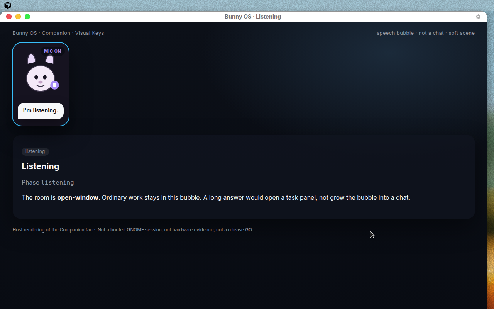
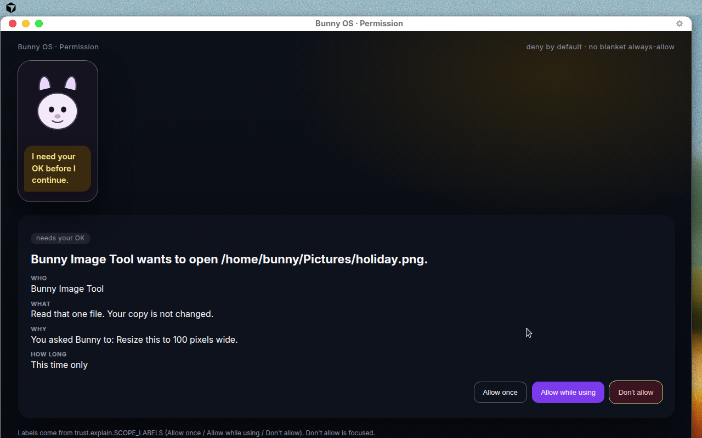
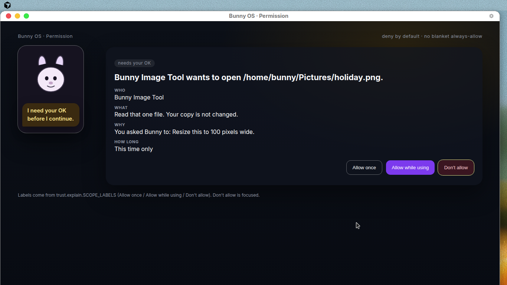
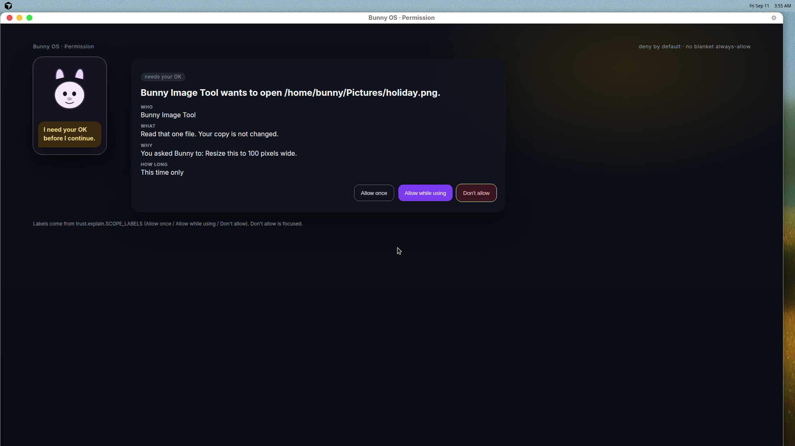
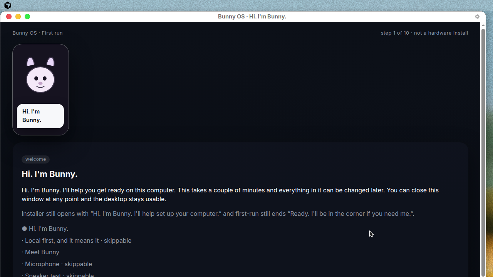
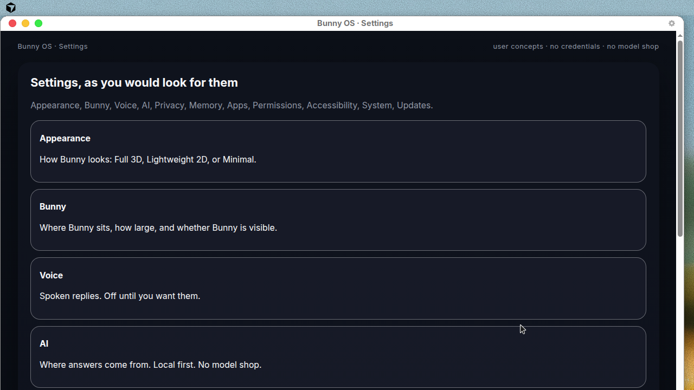
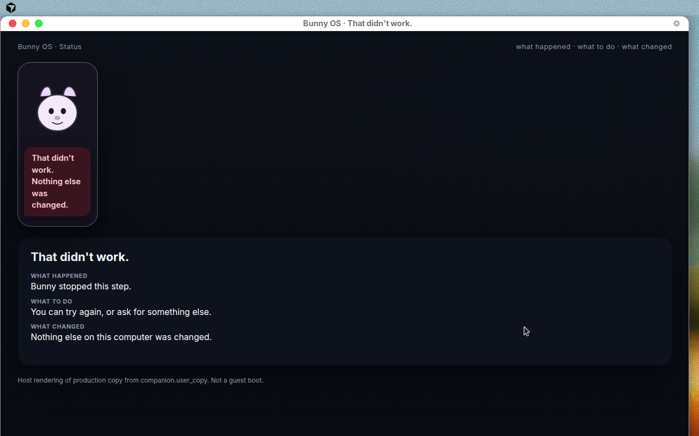

# Bunny OS UI/UX polish report

This is a presentation polish of existing Bunny OS surfaces. It does not
redesign the product, replace the desktop with a character, or turn Companion
into a chatbot. Deny-by-default, TrustGate, capability routing, memory
boundaries, and appearance modes (Full 3D / Lightweight 2D / Minimal as the
same product) are unchanged.

**Evidence labels below are only for what actually ran.** Host HTML is not a
guest boot. Guest boot is `NOT_RUN`. Hardware is `NOT_RUN`. Stable release
remains **NO-GO**. Pilots remain **BLOCKED**.

Checked-in host photographs live in
[`demos/10-product-vision/evidence/screenshots/`](../demos/10-product-vision/evidence/screenshots/).
They are Chrome `--app` captures of production-backed HTML, grabbed with
ffmpeg on `DISPLAY=:1`. They are not GNOME Shell, not AT-SPI, and not a
Fedora guest.

---

## 1. Audit

Surfaces reviewed: Companion Visual Keys, speech bubbles, Trust / permission
prompts (shell `TrustComponent`, GTK window, host Trust HTML), onboarding,
settings catalog, search (no parallel mock), appearance, memory, voice,
offline, errors.

| Area | Issue found | Severity | Disposition |
|---|---|---|---|
| Hierarchy | Permission dialog led with a heading but not Who / What / Why / How long | High | **Fixed** in `trustPrompt.js` facts + Trust component + host Trust HTML |
| Hierarchy | Task buttons said Allow / Deny; capability prompts already said Allow once | High | **Fixed** visible labels; AT-SPI names unchanged |
| Continuity | Trust host demo used emoji faces (🤔⚠️✓✕) | High | **Fixed** — one Bunny silhouette (`bunny_silhouette_svg`) |
| Continuity | Visual Keys were 11; waiting / warning / offline / disconnected were missing as readable keys | High | **Fixed** as projections of existing phases, not a second state machine |
| Continuity | `waiting_for_approval` projected to `working` | High | **Fixed** → `waiting_for_permission` |
| Copy | Errors were often a phase name | High | **Fixed** — `companion.user_copy` three-part messages |
| Copy | Offline was not distinguished as intentional vs lost network | Medium | **Fixed** |
| Copy | Settings catalog was subsystem-shaped | Medium | **Fixed** companion `SETTINGS_NAV`; shell kept `Voice & AI` plus added Memory |
| Onboarding | Privacy was required-feeling; wizard still 10 steps | Medium | **Fixed** skip copy; essential spine documented as welcome → character → permissions → Ready |
| Motion | UI fast was 120 ms; companion pose budget was not named | Medium | **Fixed** 150–350 ms UI / 300–700 ms companion; reduced motion zeros companion too |
| Layout | Speech bubble could sit over the top bar / dock | Medium | **Fixed** `panel_top=44`, `dock_bottom=64` |
| Layout | Host bubble was `position:absolute` into the panel (covered headings) | High | **Fixed** — bubble sits under the face, never over the panel |
| Layout | Trust “How long” showed the last offered scope (session) even when Allow once existed | High | **Fixed** — duration is the first/weakest option: this time only |
| Voice | Listening was caption-only | Medium | **Fixed** — ears up, mic badge, “Mic on” label; GTK indicator gets `.listening` |
| Tokens | Permission / offline / loading had no colour roles | Medium | **Fixed** schema 4 |
| Contrast | New roles added to `CONTRAST_PAIRS` | — | **PASS** (`tests.shell.test_design_system`) |
| A11y | AT-SPI `Allow this Bunny action` / `Deny this Bunny action` | Blocker if changed | **Unchanged** — tests assert source + model |
| Responsive | No 1366 / 1920 host photographs of these pages | Medium | **Host PASS** at 1366×768 and 1920×1080 for Trust (and related) |
| Search | Desktop search UI | Low | Not restyled; no parallel mock |
| 3D renderer | Full 3D character package poses | — | **NOT_RUN** (host draws the shared SVG silhouette) |
| Guest Trust | Booted GNOME `TrustComponent` with facts | — | **NOT_RUN** |
| Hardware | Mic, TPM, Secure Boot, Orca on device | — | **NOT_RUN** |

---

## 2. Before / after (issues that shipped in this PR)

**Before.** Companion Visual Keys were eleven ordinary-work states. Permission
wait looked like “working”. Trust HTML used emoji. Task Allow/Deny did not
match capability “Allow once”. Duration, when shown, could describe a
session grant while Allow once was also on screen. Errors did not say whether
anything changed. Bubbles could cover the panel heading and the GNOME top
bar. Reduced motion did not zero companion durations.

**After.** Fifteen Visual Keys, all projections of canonical phases. One
silhouette; listening is readable without the caption (ears up + Mic on).
Permission surfaces state Who / What / Why / How long (this time only when
once is offered). Visible buttons are Allow once / Allow while using / Don't
allow. AT-SPI names are unchanged. Errors answer happened / next step /
changed. Onboarding still starts “Hi. I'm Bunny.” and ends “Ready.” Privacy
is skippable. Settings catalog uses user concepts. Tokens schema 4.

---

## 3. Design-system spec

Source of truth: `shell/components/gnome-shell-extension/lib/design/tokens.js`
(schema **4**). Generated: `shell/themes/tokens.json`,
`shell/components/gnome-shell-extension/stylesheet.css`. Python host HTML
reads the generated JSON via `companion.design_tokens`.

| Token | Values |
|---|---|
| Space | 2 / 4 / 8 / 12 / 20 / 32 / 48 (`xxs`…`xxl`) |
| Radius | control 12, card 18, panel 22, floating 20, modal 24 |
| Type | display 24, title 19, heading 14, body 12, bodySmall 11, caption 10, button 11, mono 11 |
| Motion UI | fast 150, normal 220, slow 350 (band 150–350 ms) |
| Motion companion | fast 300, normal 500, slow 700 (band 300–700 ms) |
| Reduced motion | **0 ms** for instant/fast/normal/slow **and** companionFast/Normal/Slow |
| Elevation | base / raised / overlay / dialog (Trust is dialog) |
| New colour roles | `permission`, `offline`, `loading` (all four themes) |
| Interaction | hover, pressed, disabled, loading, warning, error, success, permission, offline |
| Visual Key cues | ears `rest\|up\|tilt\|down`, `mic`, `dim` — same silhouette |
| Focus | 2px ring (3px high contrast), never the accent colour |
| Opacity | disabled 0.45, loading 0.72 |

GTK Companion still uses the Adwaita system palette on purpose (high contrast
and dark themes apply without a second token sheet). Host HTML uses the
generated CSS custom properties, including
`prefers-reduced-motion: reduce` → durations 0.

Appearance modes remain Full 3D / Lightweight 2D / Minimal — the same product,
bounded by what the machine can honour. There is no force-3D.

---

## 4. Changed files (production and tests)

**Tokens / shell**

- `shell/components/gnome-shell-extension/lib/design/tokens.js`
- `theme.js`, `stylesheet.js`, `companionPresence.js`
- `lib/trustPrompt.js`, `lib/components/trust.js`
- generated `stylesheet.css`, `shell/themes/tokens.json`, `resolved-themes.json`
- `build/scripts/render_design_assets.mjs`
- `shell/services/bunny_shell/settings.py` (Memory section; `Voice & AI` kept)

**Companion / Trust / onboarding**

- `companion/design_tokens.py` (new)
- `companion/user_copy.py` (new)
- `companion/visual_keys.py`, `companion/product_surface.py`
- `companion/visible_trust.py`, `companion/gtk_shell.py`
- `companion/character/bubble.py`
- `companion/settings.py`, `companion/memory_boundary.py`
- `companion/onboarding/model.py`, `companion/onboarding/__init__.py`

**Demos / docs / tests**

- `demos/10-product-vision/run.py` and `evidence/` (actual captures)
- `docs/DESIGN_SYSTEM.md` (motion numbers)
- `docs/UI_UX_POLISH_REPORT.md` (this file)
- `tests/companion/test_ui_polish.py` (new) and updates to product vision,
  visible Trust, speech position, design system, Trust component tests

Business logic was not moved into presentation. Visual Keys remain a
projection. Trust still answers through the gate. No “Always allow everything”.
No model marketplace.

---

## 5. Tests

| Suite | Result |
|---|---|
| `tests.companion.test_product_vision` | **PASS** |
| `tests.companion.test_ui_polish` | **PASS** |
| `tests.companion.test_visible_trust` | **PASS** |
| `tests.shell.test_design_system` | **PASS** |
| `tests.shell.test_trust_component` | **PASS** |
| `tests.companion.test_character_speech_position` | **PASS** |
| `tests.settings.test_voice_ai` | **PASS** |
| `tests.companion.test_public_alpha.OnboardingModelTests` | **PASS** |
| `tests.companion.test_interaction_invariants` | **PASS** |
| `tests.shell.test_companion_surfaces` | **PASS** |
| `tests.companion.test_integration_slice` | **PASS** (disconnected caption still names the runtime and that work is unaffected) |
| Combined host run of the above | **251 tests, PASS** (2.05s) |
| `demos/10-product-vision/run.py` unit tests | **46 run, PASS** |
| Product-vision surfaces | **PASS** (15 Visual Keys, no forbidden labels) |
| Host screenshots | **20/20 PASS** at 1280×800 |
| Responsive screenshots | **6/6 PASS** (1366×768 and 1920×1080) |
| Guest boot | **NOT_RUN** |
| Hardware | **NOT_RUN** |

Covered: token motion bands, reduced-motion zeros companion, Visual Key
projections, a11y names, onboarding essential IDs + skippable privacy, Trust
facts and Allow once / Don't allow labels, bubble vs panel, user-copy
three-part messages, settings catalog titles.

---

## 6. Responsive / a11y / performance

**Responsive (host-tested).** Display was 1920×1200. Captures:

- 1280×800 — Companion + Trust + onboarding + settings (settings catalog scrolls; later sections are below the fold, not clipped)
- **1366×768** — Trust: Who/What/Why/How long and all three actions visible, no clipped controls. Settings: first sections visible, remainder via scroll
- **1920×1080** — Trust panel capped; actions fully visible. Onboarding hello photographed

CSS: `@media (max-width: 1366px)` stacks the companion column; `@media (min-width: 1920px)` widens padding. Text scale still 0.75–2.0 via the existing theme resolver. Guest 200% text-scale of GNOME Shell: **NOT_RUN**.

**A11y.** AT-SPI names unchanged. Deny remains initial focus / default / Escape.
`prefers-reduced-motion` zeros host CSS durations. High-contrast colour roles
include permission/offline/loading; contrast gate **PASS**. Screen-reader
announcement for task prompts now says “Allow once, or don't allow.”

**Performance.** No new animation loops. Companion motion budget 300–700 ms
(0 if reduced). Host HTML is static. No extra network. Regenerating tokens
is the same `node build/scripts/render_design_assets.mjs` path as before.

---

## 7. Screenshots (actual host surfaces)

These are real ffmpeg grabs. Window chrome is host Google Chrome, not GNOME.

### Companion — listening (mic visible without relying on text alone)



### Permission — who / what / why / this time only



1366×768 (required check):



1920×1080 (required check):



### Onboarding — Hi I'm Bunny



### Settings — user concepts



### Error — happened / next / changed



Further frames in `demos/10-product-vision/evidence/screenshots/`: idle,
thinking, working, waiting_for_permission, offline, disconnected, success,
onboarding Ready, appearance (laptop / embedded-64mb), outcomes, memory, voice.

---

## 8. Remaining blockers

| Item | Status |
|---|---|
| Booted Fedora guest + AT-SPI photograph of `TrustComponent` facts | **NOT_RUN** — needs QEMU guest image |
| GNOME Shell bubble vs top bar on a live session | **NOT_RUN** — layout math is unit-tested |
| Full 3D / Lightweight 2D / Minimal character packages on GPU | **NOT_RUN** — host uses the shared SVG; modes still the same product in `companion.appearance` |
| Physical microphone + packaged Vosk | **NOT_RUN** |
| Orca + high-contrast on hardware | **NOT_RUN** |
| Independent security / privacy / accessibility reviews | Unchanged |
| Production signing keys | Unchanged |
| Stable release / pilots | **NO-GO** / **BLOCKED** |

Settings: companion catalog is user-concept shaped; the desktop store still
exposes Network, Bluetooth, Displays, **Voice & AI**, etc. That split is
intentional (two documents). Do not collapse them.

TrustComponent still draws **two** widgets (`_allow`, `_deny`) so the guest
harness contract is intact. Extra allow scopes exist on the capability model
and on host HTML; the shell component shows the first allow + deny.

---

## 9. Implemented vs tested

| Layer | Result |
|---|---|
| Implemented in production presentation path | **Yes** — tokens, Visual Keys, Trust model/component, GTK labels/copy, onboarding, settings catalog, bubbles, user copy |
| Host-tested (unit) | **PASS** |
| Host-tested (demo HTML + Chrome screenshots) | **PASS** |
| Guest-tested (Fedora / GNOME / AT-SPI) | **NOT_RUN** |
| Hardware-tested | **NOT_RUN** |

---

## 10. Next-phase recommendation

1. Guest requalification of Trust: photograph Who/What/Why/How long and press
   by AT-SPI name. Do not rename the accessible names.
2. On a live GNOME session, confirm the speech bubble clears the top bar and
   dock at 100% and 200% text scale.
3. Bind the SVG silhouette cues (ears / mic / dim) into the 2D/3D character
   packages so Full 3D / Lightweight 2D / Minimal stay one face.
4. Settings window: draw `settings_nav()` as the Bunny-side index without
   deleting hardware sections.
5. Keep host demo `demos/10-product-vision/run.py` as the honest product-vision
   photograph; do not promote it to a release GO.

---

## How to run

From the repository root:

```text
node build/scripts/render_design_assets.mjs
python3 -m unittest tests.companion.test_product_vision tests.companion.test_ui_polish tests.companion.test_visible_trust tests.shell.test_design_system tests.shell.test_trust_component
python3 demos/10-product-vision/run.py
make demo-product-vision
```

Open `demos/10-product-vision/out/latest/WALKTHROUGH.md` after a run.
Checked-in copies are under `demos/10-product-vision/evidence/`.
