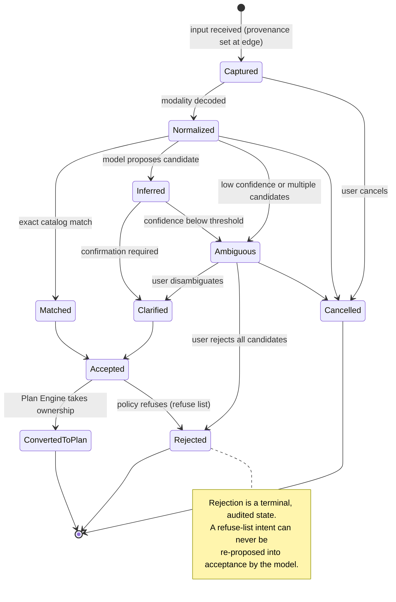
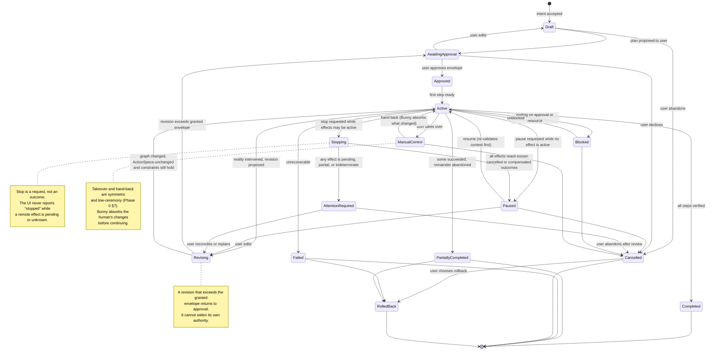
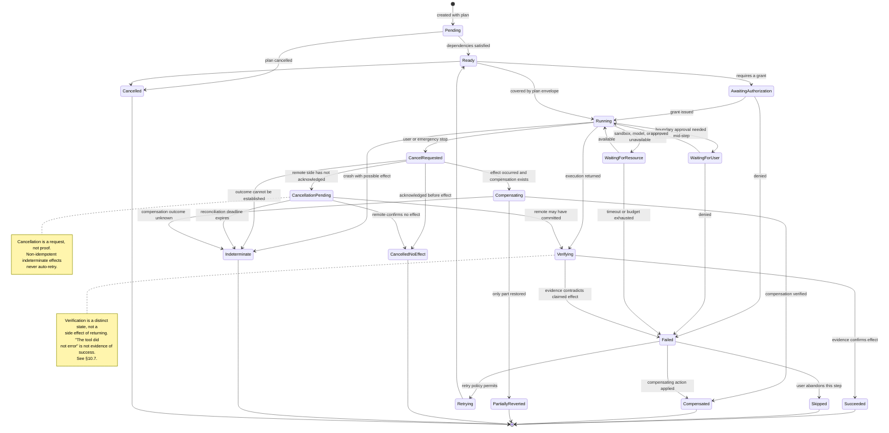
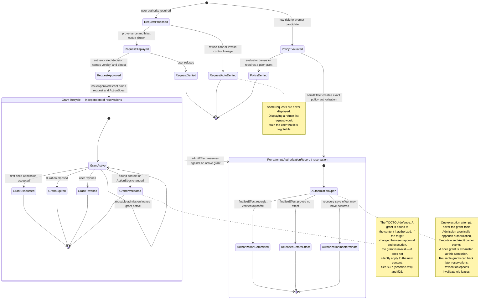
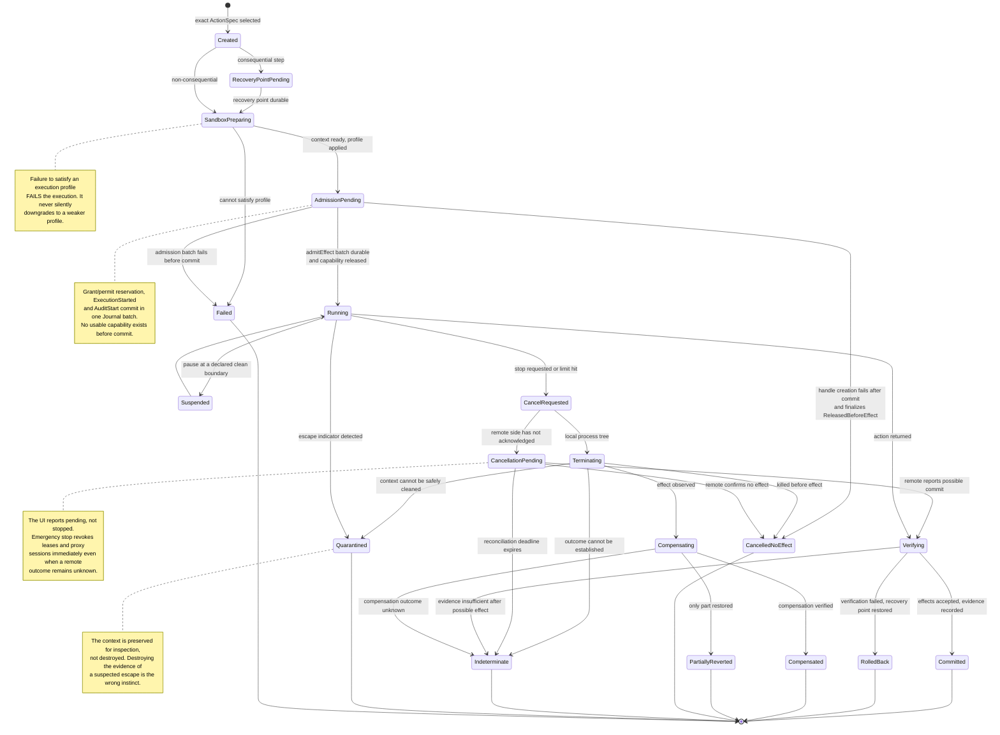

# Bunny OS Phase 1: Architecture and Technical Specification

**Version:** 1.1 · **Date:** 2026-07-26 · **Status:** Phase 1 architecture — **provisional**, pending the amendments in §31.1 and the unmet Phase 0 entry criteria in §5.4
**Governs:** Phase 2 implementation · **Governed by:** `BUNNY_OS_PHASE_0.md` (Product Constitution, v1.0)

---

## How to read this document

This is a specification, not a constitution. Phase 0 fixed *what must be true*; this document decides *how*, and it is subordinate to Phase 0 in every case of conflict.

**Evidence discipline.** Four kinds of statement appear here and are kept typographically and grammatically distinct:

- **Repository facts** are grounded in a direct read of `COMRADEART/bunny` at commit `f147f07`, verified against `origin/main`. Every one cites a path. Where a claim was reported by research but not independently confirmed, it is marked **[research]**; where it was confirmed during this work, **[verified here]**.
- **External evidence** carries its source. Time-sensitive and contested claims were re-verified in July 2026. The curated primary-source trail, claim map, and evidence limitations are in [`SOURCES.md`](SOURCES.md). Claims that could not be confirmed are marked **[unverified]** and are not load-bearing.
- **Recommendations** appear in sections whose content is normative, or are explicitly labelled.
- **Assumptions, open questions, and requested Phase 0 amendments** are collected in §31 rather than scattered.

**All schemas, pseudocode, and interface fragments are illustrative.** None is production code.

**Structure.** §§1–35 follow the Phase 1 brief. Two additions: **§3.6a** (defects found during Phase 1 research) exists because a specification that omits present vulnerabilities in the code it builds on is not honest; and **§31.3** (the reversibility audit) exists because Phase 0 §24 names it a Phase 1 deliverable in its own right and the brief omits it. Diagrams are version-controlled Mermaid under `diagrams/`; the twenty ADRs are one file each under `adr/`; the Phase 2 backlog is `PHASE_2_BACKLOG.md`.

**A note on what this document found.** Phase 1 research located **twelve live security and authority defects** in the current codebase beyond the three Phase 0 already named — nine confirmed directly here, including a hostile repository entering the highest-trust model context, connection-local turn guards, cross-session background-process state, non-cancellable remote effects, and multi-provider disclosure without a routing grant. They are in §3.6a, and §35 recommends fixing them before any Phase 2 architecture work begins. It also found that **the ordered task list Phase 0 designates as the authoritative interface does not exist on the wire at all** (§16.1).

---

## 1. Executive Summary

**The recommended architecture.** “Bunny Core” is the logical runtime, not a process boundary. Its safe configuration has two baseline roles: a trusted **Bunny Broker/control-plane process** containing bounded authoritative modules, and one or more **sandboxed Agent Workers** that hold no ambient authority. Additional processes exist only at trust boundaries — action sandboxes, extension runtimes, the local inference engine, and clients. Within the broker, authorization lives in exactly two components: a stateless **Policy Evaluator** that decides, and a durable **Grant Ledger** that owns permission requests and records and enforces `(action class, scope, duration)` grants. Everything else proposes.

**The single structural decision.** The permission gate today is a closure living inside the process it is supposed to constrain, so Phase 0's guarantee 9 — that the sandbox honours the gate even if the agent layer is compromised — is not implementable as built. **Phase 1 splits the process.** A Broker outside every worker/action sandbox owns policy evaluation, grants, the refuse list, egress/credential mediation, execution admission, authenticated user decisions, and audit writing. The Agent Worker and every model-directed action process run confined with no durable authority. The Broker's reply is **not a boolean but a bounded means of performing the exact effect**—a spawn-time descriptor/mount for an FD-aware action, a single-operation protocol channel, or an `ActionSpec`- and epoch-bound lease enforced at a Broker endpoint. **Deny becomes the absence of usable authority rather than a "no" the caller could ignore.** That is a design hypothesis until P1/P14 and independent boundary review pass; cost and bypass resistance are not assumed.

**Major components.** Intent Service, Plan Engine, Policy Evaluator, Grant Ledger, Execution Controller, Sandbox Manager, Capability Registry, Capability Router, Provider Adapters, Local Inference Manager, Hardware Capability Service, Memory Service, Session & Transcript Service, Audit Service, Identity & Profile Service, Budget Service, Extension Manager, Update & Recovery Service, durable Event Journal, Event Bus, Gateway, **Task Surface Model Projector**, and Bunny Shell (§7). Every authoritative state has exactly one owner. The TSM Projector is explicitly a deterministic semantic projection of Plan/Grant/Execution state; Bunny Shell separately owns localization, platform role mapping, focus, and announcements.

**Deployment strategy.** One architecture, four staged deployment forms, with **Bunny Core logically identical in all of them**. What varies is the client surface and an explicitly qualified support-tuple adapter. Mode A (cross-platform application) remains the V1 target per D3; the first implementation experiment is a smaller pre-V1 Fedora terminal slice. Mode B (Bunny Box) waits for plan/execution, accessible client, isolation, and hostile-LAN gates. Mode C is a kiosk-style Wayland session, never a general-purpose desktop. Mode D uses bootc on an existing atomic base—architecturally an image layer rather than a kernel/distribution fork, but operationally a separate signing, update, recovery and incident-response program deferred beyond the solo-maintainer preview.

**Security posture.** Contain rather than detect. Provenance is a broker-derived lineage and taint set, not a caller-supplied bit. Third-party content may fill an explicitly typed **data slot**, but it can never supply action authority or silently choose an operation, executable, destination, path, credential, or scope; a boundary effect carrying such data requires an exact, content-bound user authorization. This makes indirect prompt injection a containment problem rather than a detection problem Bunny would lose. The plan is an **effect envelope**, not a stated intention: the executor binds action identity, control-significant arguments, resources, budgets, and data slots, and reauthorizes anything outside it. Ten structural invariants (§26.3) are written as tests that fail when a constitutional principle is violated, and a failure is a release blocker.

Two honesty commitments run against interest. **The per-OS guarantee matrix (§12.4) publishes which of the twelve sandbox guarantees do not hold on Windows and macOS** — several do not. And **§26.1 publishes a capability-regression budget**: CaMeL's AgentDojo configuration reported 77% task completion with its security construction versus 84% for the undefended baseline. That is not a universal 8% tax, but it is enough evidence that containment can cost capability and that hiding the cost invites the "advanced mode" bypass that dissolves the whole model.

**Reuse strategy.** Mostly new construction inside an existing seam structure. **Retain** the provider seam, capability declarations, fail-closed defaults, credential store, workspace trust, transcripts, checkpoints, subagent privilege model, self-check discipline, and the protocol schema drift guard. **Refactor** the permission gate, the agent loop, session scope, and the app-server protocol. **Replace** the memory layer and the browser client. **Build** the sandbox, the router, the Grant Ledger, the Hardware Capability Service, the Task Surface Model, and extension isolation. The reuse matrix (§3.8) classifies every subsystem with path evidence.

**Highest-risk decisions.** The memory schema is the sharpest one-way door in the phase and should not freeze until P7 reports on whether crypto-shredding actually makes erasure real over an append-only substrate. The broker split is the decision everything else in the security architecture depends on. The read-confinement guarantee is asserted more strictly than any shipping comparable product and is prototype-gated rather than assumed. And the permission engine cannot ship before the sandbox — `Bash` alone spans action classes 2 through 15, so a class-based engine without isolation has an empty low-friction zone and drives users to bypass mode.

**Phase 2 recommendation.** Begin with **Stage 0**—patch bounded defects and disable the larger unrepaired surfaces. Subject to the constitutional start gate in §33, build only the **Safe Linux CLI Preview**: Fedora 44 x86-64, stdio, one workspace/turn, a read-only inspection profile plus a disposable no-network work overlay and content-bound Broker apply, once grants, immutable `ActionSpec`, and atomic write-ahead effect records. It combines the minimum authority, isolation, plan, and execution pieces because those are one security deliverable. Memory, routing expansion, Shell, extensions, additional OS tuples, Bunny Box, and Bunny OS are a multi-release roadmap, not one phase commitment. Security invariants land with each boundary.

Phase 1 is **provisional** until the fifteen requested Phase 0 amendments (§31.1) are ratified or rejected, and until the four substantively unmet Phase 0 entry criteria (§5.4) are satisfied or amendment A14 explicitly authorizes a named exception. The constitution provides an amendment process, not an informal waiver. The document is a reviewed proposal; its premises — a second maintainer, user validation, legal clearance, and a landed permission baseline — are not yet ready.

---
## 2. Phase 0 Traceability

Phase 0 is product policy and this document is subordinate to it. Every architectural decision below traces to a constitutional principle, a Phase 0 decision, or a named conflict resolved under §2.4's protocol. An architecture proposal that cites a §20 prohibited assumption is returned, not debated. The compact tables below are navigational; [`TRACEABILITY_MATRIX.md`](TRACEABILITY_MATRIX.md) is the accountable ledger with one owner, verification evidence, backlog link, and amendment status for every C1–C16 and D1–D17 row.

Component names used in this section are defined in §7. In brief: **Intent Service**, **Plan Engine**, **Policy Evaluator**, **Grant Ledger**, **Execution Controller**, **Sandbox Manager**, **Capability Registry**, **Capability Router**, **Provider Adapters**, **Local Inference Manager**, **Hardware Capability Service**, **Memory Service**, **Session & Transcript Service**, **Audit Service**, **Identity & Profile Service**, **Budget Service**, **Extension Manager**, **Update & Recovery Service**, **Durable Event Journal**, **Event Bus**, **Gateway**, **Task Surface Model Projector**, and **Bunny Shell**.

### 2.1 Constitutional principles → architecture

| Phase 0 principle | Architectural requirement | Owning component | Verification method |
|---|---|---|---|
| **C1** The plan is the interface | One authoritative, versioned, inspectable plan object per unit of delegated work, carrying goal, understanding, ordered steps with per-step action classes, current step, results, failures, and pending approvals. Plan revisions are diffs, never silent rewrites. Approval operates at plan level and grants exactly the capabilities the steps declare. | **Plan Engine** | Self-check: a plan revision that is not expressible as a diff against its prior version fails. Every executed action resolves to a plan step or an out-of-plan boundary approval — an action with neither is a test failure. |
| **C2** Powerless by default; power by explicit, scoped grant | Every consequential capability is denied until a policy permit or scoped user grant has a durable authorization record. A grant is `(action class, scope, duration)`, revocable and auditable. Undeclared capabilities fail closed. | **Policy Evaluator** (pure decision) + **Grant Ledger** (requests, issues, reserves, expires, revokes) | Existing `UNDECLARED_TOOL_CAPABILITIES` pattern (`src/tools/registry.ts:12`) is retained. New self-check: an action with no matching authorization record is refused at capability issuance and use, not only at a model-facing gate. |
| **C3** Prompts must be rare enough to mean something | Prompt reduction is structural — sandboxing, scoping, plan-level approval — never cosmetic suppression. First-party operations generate zero dialogs. Every prompt carries who is asking, instruction provenance, exact effect, and blast radius. | **Policy Evaluator**, **Grant Ledger**, **Bunny Shell** | P2 measures only default-deny **egress** prompt feasibility. B-12 supplies the broader representative first-/third-party prompt-volume, comprehension and redundant-prompt evidence; any prompt lacking broker-derived provenance and an exact effect digest fails schema validation. |
| **C4** Guarantees live in deterministic code, never in the prompt | No security property may depend on model instruction. Every invariant is enforced by the Broker's Policy Evaluator/Grant Ledger, the Sandbox Manager, or an operation boundary. | **Bunny Broker**, **Sandbox Manager** | §26's structural-invariant tests fail if a guarantee is relocated into a prompt. P14's always-comply worker must not change an authorization or obtain an unauthorized effect. |
| **C5** The lethal trifecta is an architectural violation | No execution context simultaneously holds private-data access, untrusted-content ingestion, and open external egress. Combining all three requires per-instance elevated authorization. | **Sandbox Manager** (execution profiles), **Execution Controller** | A static property of every execution profile in §12.7: each profile declares its trifecta coordinates and a profile asserting all three without an elevation record fails a self-check. |
| **C6** Reversibility beats obedience | Recovery points precede consequential steps; workspace changes are transactional; one-step rollback exists; irreversible actions are a distinct highest-friction class. Every action is classified reversible / compensable / irreversible before it runs. | **Update & Recovery Service**, **Plan Engine** | Extends `src/store/checkpoints.ts`. Self-check: an action classed reversible whose compensating operation is absent fails. §32's crash-recovery prototype measures the real window. |
| **C7** The user owns memory; providers never do | Memory is a local-first system of record in inspectable, exportable form. Providers receive per-request context and are never authoritative. | **Memory Service** | Export completeness test: a full export re-imports to an equivalent store. Provider-context minimization is measured — what left the device is reconstructible from the audit trail alone. |
| **C8** Memory writes are privileged actions | No silent durable writes. Every write is permission-classed, attributed, workspace-scoped by default, individually correctable and deletable, with deletion cascading through derived artifacts. | **Memory Service**, **Grant Ledger** | Schema-level: a `MemoryRecord` without Broker-issued lineage and an authorization record is unstorable (§14.3). Deletion-cascade test: deleting a source leaves no derived summary, embedding, or artifact body behind. |
| **C9** Personality is presentation; provider is disclosed routing | Personality and route are orthogonal by construction. Active model, provider, and execution locality are discoverable in one glance; material changes are disclosed at the moment they happen. | **Capability Router** (route facts), **Bunny Shell** (disclosure) | A personality package that can influence route selection fails manifest validation (§15.3). Disclosure-completeness test against the seven duties (§13.6). |
| **C10** The character is optional; the task surface is authoritative | 100% of functionality available with the character disabled, static, or replaced. System state lives in domain services and is projected through the TSM. Consent and destructive-action UI is de-characterized. | **Bunny Shell**, **TSM Projector** | Automated: every capability reachable in character mode is reachable in no-character mode; terminal parity is tested under the dedicated support matrix (§28). |
| **C11** One Bunny, honest about capability | No editions. Capability negotiated per task from detected resources. When local capability is insufficient, Bunny says so and offers escalate / degrade / decline. | **Hardware Capability Service**, **Capability Router** | Capability profiles derive from detected resources only — a profile keyed on a product tier fails review. Honesty test: a task the local tier cannot do produces a stated limitation, never a silent worse result. |
| **C12** Local-first is a preference order, not an ideology | Preference order capable → safe → timely → economical, under user-set routing posture. Departure from the device carries the seven disclosure duties. | **Capability Router** | Every routing decision emits an explanation record reconstructible after the fact. A privacy-strict workspace that escalates without consent is a test failure. |
| **C13** Accessibility is architecture, not accommodation | Plan/Grant/Execution state deterministically projects to one Task Surface Model. The TSM Projector emits semantic kinds and message keys; Bunny Shell owns platform role/name mapping, localization, focus and narration. List and spatial render from the same projection. | **TSM Projector**, **Bunny Shell** | §28's conformance plan and support matrix; keyboard and AT equivalence are hard gates for every shipped projection. WCAG 2.2 AA remains a Phase 1→2 gate unless amendment A13 is ratified. |
| **C14** Money and data flows are always visible | Live spend meter, per-task attribution, pre-execution estimates, budgets as hard stops. Egress ledger: what left, to whom, under which grant. | **Budget Service**, **Audit Service** | Budget exhaustion halts execution — a self-check asserts it does not warn-and-continue and does not silently downgrade the model. Egress ledger completeness: every outbound byte maps to a grant. |
| **C15** Own the narrow waist; rent everything else | Bunny owns the intent/plan model, permission gate, memory system, provider seam, and trust UX. Kernel, base OS, app ecosystem, inference engines, isolation primitives, and standards are adopted. | Architecture-wide; enforced in §7 and §20 | Every component is labeled own/rent in §7. A "build" proposal for a rented layer requires an ADR citing what the existing option cannot do. |
| **C16** Extensions are adversarial until proven otherwise | Signed, permission-manifested, least-privileged, sandbox-tiered by trust class, individually revocable, kill-switchable. No ambient authority from installation alone. | **Extension Manager**, **Sandbox Manager** | Install-time: a manifest declaring undeclared capabilities fails. Runtime: an extension invoking an undeclared capability is refused at the boundary. Revocation test: grants, standing jobs, and memories die together. |

### 2.2 Phase 0 decisions → architecture

| Decision | Architectural consequence | Where |
|---|---|---|
| **D1** Intent as an authoritative layer *over* applications; escape to manual control permanent | Applications, files, and terminals remain first-class objects a plan references and manipulates. Manual takeover and hand-back are symmetric first-class transitions in the Task state machine. | §9, §10.4, §21 |
| **D2** Platform sequence A→B→C→D; kernel options retired permanently | Deployment architecture is staged with gates. ADR 20 records the kernel decision as **ratified and closed**, not reopened. | §8, ADR 1, ADR 20 |
| **D3** V1 is the developer/power-user "resume and orchestrate" experience as a cross-platform application | Mode A remains the V1 target. §33 deliberately defines a **pre-V1 Safe Linux CLI Preview** as the first shippable security slice; it does not relabel that one-platform preview as V1. Cross-platform V1 requires the authority/isolation, plan/execution, and accessible client gates. | §8.2, §33 |
| **D4** The sandbox gate | No Bunny Box, no headless growth, no third-party ecosystem until §13's guarantees are enforced. **Durable jobs, headless today, are brought under the rule first.** Network transports on the app server are gated with them. | §8.3, §12, §33 |
| **D5** "Virtual Brain" retired as term and claim | The component is the **Memory Service**. See the conflict register (§2.4, C-1) — the Phase 1 brief uses the retired term throughout. | §14 |
| **D6** Permission rework to constitutional baseline | Plan-approval becomes the interactive default; deny rules become absolute in every mode; the containment exception is closed or formally justified. §3.4 adds a fourth delta: grants have no duration or scope dimension today. | §11, §3.4 |
| **D7** Character is an optional presentation layer, built stylized, static/no-character modes from v0; consent surfaces de-characterized | The TSM projection is canonical for presentation; the character is a subscriber to state it cannot originate. Static/no-character are independent preferences. | §15, §16 |
| **D8** No third-party model names as personalities; route indicator in plain text | Personality packages carry a name-validation rule at manifest level. Route disclosure renders from Provider Adapter metadata, never from personality fields. | §13.6, §15.3–§15.4, ADR 0013 |
| **D9** NVIDIA key pooling gets legal/ToS review before commercial positioning | `src/providers/key_pool.ts` is retained as a Router input and remains undocumented-by-marketing. No architecture depends on pooling being permissible. | §13.5 |
| **D10** Memory is local-first system of record with provenance, scoping, gated writes, cascade deletion, portability in the first schema | The `MemoryRecord` schema is a one-way door and is specified in full, not sketched. | §14.3, §31 |
| **D11** Accessibility floors are Phase 1 architecture inputs; the ordered task list is the source of truth for all projections | The TSM Projector and Shell responsibilities are separate and contract-bound. | §16.3–§16.4, §28 |
| **D12** EU AI Act Art. 50 compliance work starts now | A generation/disclosure record, applicability decision, human-visible disclosure, export binding, and machine-readable marking hook are part of the output contract. Shipping any affected output path remains legal-review gated. | §15.5, §27, Appendix A.13 |
| **D13** Second-maintainer onboarding is a Phase 0 exit requirement | Unmet (§5.4). Architecture is explicitly biased toward reducing bus-factor risk: adopted over built, boring over clever, tested over asserted. | §4, §5.4 |
| **D14** Trademark clearance precedes brand investment | Unmet. No architectural dependency, but naming appears in the protocol surface (`src/brand.ts` is the naming source of truth) and in extension namespaces, both of which are rename-sensitive. Recorded in §31. | §31 |
| **D15** Zero-runtime-dependency retained for Bunny Core through Phase 1, with two amendments | A hard constraint on every Core recommendation. Security-critical protocol surfaces get external review. The policy explicitly does **not** extend to the sandbox layer or extensions, where audited tooling is preferred over hand-rolling. | §4 quality goal 8, §12.2, ADR 0003, ADR 0010, amendment A9 |
| **D16** Five safety dispositions; the refuse list is constitutional | Dispositions are assigned by consequence and reversibility, not topic. The refuse list is compiled into the immutable installed policy bundle as non-configurable and is unreachable by personality, plugin, theme, or setting. | §11.1, §11.5, I3 |
| **D17** No hidden model markups, categorically; no safety/privacy/accessibility/transparency feature behind a tier | The Budget Service computes and exposes any margin as a number. Feature gating by tier is architecturally impossible for the named categories — they are in Core, not in a licensed layer. | §13.6–§13.8, §22 (`RouteDecision`), §27 |

### 2.3 Open questions Phase 1 was asked to close

Phase 0 §22 left twelve questions open. Phase 1 owns the first five; the rest are non-architectural or blocked on external input.

| # | Question | Phase 1 status |
|---|---|---|
| 1 | Sandbox mechanism per host OS | **Proposed architecture, pending A1–A3; unverified as support** — §12 and Proposed ADR 0010 define the mechanism hypothesis and per-distro/version/architecture/kernel/LSM matrix (§12.4), but it is neither ratified nor supported yet |
| 2 | Memory architecture | **Closed** — §14, ADR 8 |
| 3 | Spatial UI validation | **Deferred to prototype with a kill criterion defined in advance** — §16.7, §32. Phase 1 cannot close this without users; it closes the *architecture* by making the ordered list authoritative either way. |
| 4 | UI technology for the task surface | **Closed** — §16.2, ADR 2 |
| 5 | Routing policy mechanics | **Closed** — §13, ADR 12 |
| 6 | The business engine | **Not Phase 1's to close.** Architectural consequence recorded: §13.8 and D17 require that whatever closes it survives being described in the product's own UI. Must close before Stage B commits resources. |
| 7 | Governance and licensing | Not architectural. No dependency created. |
| 8 | Naming outcome | Not architectural, but rename-sensitive surfaces are inventoried in §31. |
| 9 | Voice stack | **Partially** — §17 specifies the pipeline and the disclosure duties; local TTS/STT selection is a Phase 2 evaluation. |
| 10 | Second personality | **Architecture closed** (§15.3 specifies the personality package format); the product question of how many ship in V1 is not Phase 1's. |
| 11 | Host-OS drift | Monitored assumption, not closable. §8.6 states what would change if it moves. |
| 12 | What "Bunny Box remote access" means safely | **Closed** — §24.4, ADR 18, under the hostile-LAN stance. |

### 2.4 Conflict register

Source 1 of the Phase 1 brief requires that a conflict between an architectural requirement and the constitution be surfaced, explained, alternatives presented, and a recommendation made — and **not resolved implicitly**. Four conflicts were found. In every case the conflict is between the *brief* and *Phase 0*, and Phase 0 wins, because the brief itself designates it the higher authority.

---

**C-1 — The brief treats "Virtual Brain" as a canonical component; Phase 0 D5 retired it.**

*The conflict.* The Phase 1 brief names Virtual Brain in its product hierarchy, as Workstream 9's title, as a component in the Workstream 2 candidate list, in three required interface contracts, and as report section 14. Phase 0 D5 states: *"Retire 'virtual brain' as a term and a claim; replace with the §12 memory constitution and a Phase 1 memory architecture. Positioning must not describe unbuilt capabilities in shipped-product language anywhere, ever (the Rabbit rule)."*

*Why it exists.* The brief was written against the pre-audit vocabulary. Phase 0's audit then established that the term described nothing: an independent search for "virtual brain" across the repository's documentation returns zero matches, and `src/memory/` is 137 lines that assemble a system prompt (§3.5). The term was aspirational in external descriptions and never a repository claim.

*Alternatives.* (a) Retain the name for continuity with the brief. (b) Retain it as an internal-only codename. (c) Retire it entirely and use Memory Service.

*Recommendation.* **(c).** (a) violates a ratified decision and reintroduces the exact failure mode D5 exists to prevent — a component named for a capability it does not have. (b) is worse than either: an internal name that leaks into commit messages, file paths, and eventually a UI string is how retired vocabulary returns. This document uses **Memory Service** throughout, and §14 delivers the architecture D5 promised in its place.

*Not resolved implicitly.* Recorded here; no Phase 0 amendment required, since Phase 0 already decided it and the brief simply predates the decision.

---

**C-2 — The brief's Linux base options are largely foreclosed by Phase 0 §18.**

*The conflict.* Workstream 14 and core question 28 ask Phase 1 to evaluate Ubuntu Minimal, Debian, an Ubuntu derivative, and a Debian derivative among the bases for Bunny OS. Phase 0 §18 evaluated exactly those options and rejected the pattern: *"both options as posed are the wrong pattern in 2026: the modern path is not a package-archive derivative at all but an image-based atomic variant,"* with Flathub as the app layer and the base choice explicitly deferred to Phase 1/2 while **the pattern is decided now**. §20 lists "package-archive distro" as out of scope.

*Why it exists.* The brief enumerates the option space neutrally; Phase 0 narrowed it with evidence (derivative maintenance economics, the small-distro failure record, the atomic-image sustainability record).

*Alternatives.* (a) Re-run the full seven-option evaluation. (b) Accept the settled pattern and choose only within it. (c) Reopen the pattern if new evidence contradicts it.

*Recommendation.* **(b), with (c) held open and discharged.** ADR 1 evaluates bases *within* the image-based atomic pattern and does not re-litigate the pattern. The sandbox and Linux-platform research tracks were explicitly instructed to report contradicting evidence; §31 records whether any was found. Re-running a settled evaluation would consume Phase 1 and produce the same answer.

---

**C-3 — The brief asks whether Bunny needs a custom compositor or desktop shell; Phase 0 already bounded the answer.**

*The conflict.* Core question 27 and Workstream 14 ask whether Bunny needs a custom compositor, desktop shell, window manager, or browser shell. Phase 0 §18 option 3 answered: Bunny Shell ships **first as an application**, and when a native session is justified, as a **kiosk-style single-purpose session** (compositor + Bunny surface + XDG portals) — *"never a general-purpose DE with settings daemons, network applets, and a control center. The delta between those two scopes is measured in years."* §20 puts "general-purpose desktop environment" out of scope.

*Why it exists.* The brief poses the architectural question in full generality; Phase 0 constrained the answer on team-capacity evidence (System76's 4.5 years with hardware revenue behind it).

*Alternatives.* (a) Evaluate the full compositor question openly. (b) Answer within the kiosk-session bound and state what would justify exceeding it.

*Recommendation.* **(b).** §20's Linux Platform Architecture specifies the kiosk-session scope, names the compositor options that fit it, and states the *falsifiable condition* under which a compositor becomes justified: an interaction requirement that cannot be met by a client window and XDG portals. Absent that condition, Stage C is an application in a dedicated session.

---

**C-4 — The brief's deployment Mode B reads as near-term; Phase 0 D4 gates it, and the repository has already partially crossed the gate.**

*The conflict.* The brief presents Bunny Box as deployment Mode B and asks (core question 30) for "the minimum architecture needed for the first meaningful Bunny Box release," implying near-term delivery. Phase 0 D4 and §18 Stage B gate Bunny Box on sandbox guarantees 1–5 and 9–12 being *enforced*, because *"a browser-accessible agent host without them is an incident generator."* D3 makes Mode A — the cross-platform application — the V1 target.

*This conflict is sharper than the other three, because the gate has already been partially crossed in code.* `docs/APP_SERVER.md` states that *"authenticated WebSocket/Unix transports are deferred until OS sandbox and network-policy hardening are complete"* — and `src/app/socket.ts` and `src/app/websocket.ts` implement exactly those transports today, wired into `src/index.ts`, with no sandbox present (§3.6). The stated precondition was not met. This is not merely stale documentation; it is a security posture asserted in writing and not honored in code.

*Alternatives.* (a) Treat Bunny Box as near-term and design the minimum release now. (b) Answer question 30 as a *gated* architecture — specify what Box requires, and state that shipping it before the gate violates D4. (c) Roll back the network transports until the sandbox lands.

*Recommendation.* **(b), plus a narrowed form of (c).** §8.3 specifies the Bunny Box architecture in full so Phase 2 can build toward it, and states the gate explicitly as the release condition. Separately, the Phase 2 backlog carries an item to bring the existing `--listen`/`--listen-web` transports under D4: either default them off pending the sandbox, or document honestly that they are a development transport with the guarantees that actually hold. The current state — shipped transports whose own documentation says they were deferred pending hardening that has not happened — is the specific pattern R3 warns about, and it is cheap to correct now.

*Phase 0 amendment recommended?* **No.** D4 is correct; the code drifted from it. The remedy is engineering, not amendment.

---

**No other conflicts were found.** In particular, the brief's treatment of gaming as an optional capability layer, its non-goals, its prohibition on unauthorized emulation and DRM circumvention, and its insistence on provider-neutrality and observable agency all align with Phase 0 without tension.
## 3. Existing Bunny Technical Assessment

### 3.1 Method and evidence basis

This section is grounded in a direct read of the repository at commit `f147f07` (`main`, 52 commits, `@comradeart/bunny` v0.2.0), verified against `origin/main` at the time of writing. Every claim below cites a path. Where a claim could not be verified, it says so. Nothing here is inferred from filenames or documentation alone unless explicitly marked as inference.

Two independent read-only audits were conducted — one covering the core runtime and platform plumbing, one covering the trust, capability, and intelligence surfaces — and their findings were reconciled against a direct inspection. Where the audits disagreed with the code, the code won; §3.6 records those corrections, because a Phase 1 document that launders a wrong finding into an architecture decision is worse than one that admits the audit was imperfect.

**Size profile** (TypeScript under `src/`, excluding `node_modules`):

| Module | LOC | Files | Role |
|---|---:|---:|---|
| `src/selfcheck/` | 6,693 | 9 | the entire test discipline |
| `src/repl/` | 3,704 | 16 | terminal client |
| `src/tools/` | 2,444 | 24 | tool registry and built-ins |
| `src/providers/` | 2,067 | 10 | the provider seam |
| `src/app/` | 1,798 | 10 | app server, three transports, browser client |
| `src/agent/` | 1,393 | 8 | turn loop, council, research, review |
| `src/permissions/` | 1,141 | 7 | the permission gate |
| `src/local/` | 1,083 | 6 | llama.cpp / GGUF runtime |
| `src/render/` | 1,017 | 9 | terminal rendering |
| `src/store/` | 1,004 | 4 | JSONL sessions, checkpoints |
| `src/mcp/` | 836 | 6 | MCP client and server |
| `src/security/` | 761 | 7 | roots, paths, egress, credentials, trust, scope |
| `src/jobs/` | 475 | 3 | durable scheduled jobs |
| `src/hooks/` | 375 | 1 | hook dispatch |
| `src/cli/` | 366 | 3 | subcommand router, arg parsing |
| `src/update/` | 283 | 2 | self-update |
| `src/search/` | 268 | 4 | grep fallback chain |
| `src/plugins/` | 261 | 2 | Ed25519 signing, manifest loading |
| `src/skills/` | 148 | 1 | skill discovery |
| **`src/memory/`** | **137** | **3** | **system-prompt assembly — see §3.5** |
| `src/agents/` | 92 | 1 | subagent definition loading |
| other | ~200 | 7 | runtime detection, io, util |
| **Total `src/`** | **27,832** | 148 | |
| `rust/search/` | 269 | 1 | `ccgrep` search accelerator |

`package.json` declares **no `dependencies` key at all** — only `devDependencies: { typescript, @types/node }`. The zero-runtime-dependency policy (C15, D15) is real and mechanically enforced, not aspirational.

There is **no `src/sandbox/`**. That absence is the single most consequential fact in this section.

### 3.2 What is genuinely strong

These are assets. Phase 1 should build on them rather than redesign around them.

**The provider seam (`src/providers/index.ts`).** `ChatProvider` is a single interface — `stream(CanonicalRequest, AbortSignal) → AsyncIterable<CanonicalEvent>` plus optional `listModels()`, `credentialHealth()`, `rotateCredential()`. Dispatch is keyed on *wire protocol* (`kind: "anthropic" | "openai"`), not provider name, so an open registry of arbitrarily-named provider entries collapses onto two real adapters. Everything downstream of the seam is provider-agnostic, which is why `/provider` and `/model` can switch mid-conversation. This is exactly the "narrow waist" C15 describes, and it already exists. **Phase 1 does not redesign this seam; it adds a decision layer above it** (§13).

**The capability-declaration model (`src/tools/types.ts`).** Every tool declares `ToolCapabilities { effect, planAllowed, parallelSafe, idempotent, defaultPermission, acceptEdits? }`. Three separate subsystems read the *same* declaration rather than maintaining parallel hardcoded tool lists: the permission gate (`gate.ts:107`, `:129`, `:130`), the parallel-dispatch scheduler (`loop.ts:93`), and the `mcp-server` exposure filter (`src/mcp/server.ts`). A single source of truth for tool risk, consumed by everything that needs it, is a real architectural achievement and the correct foundation for the action-class model in §11.

**Fail-closed defaults for undeclared tools.** `registry.ts:12–18` defines `UNDECLARED_TOOL_CAPABILITIES = { effect: "external", planAllowed: false, parallelSafe: false, idempotent: false, defaultPermission: "ask" }`, applied at `registry.ts:52` via `t.capabilities ?? UNDECLARED_TOOL_CAPABILITIES`. A tool that forgets to declare itself asks. This directly satisfies C2's "undeclared capabilities fail closed."

**The anti-self-escalation guard (`gate.ts:52–65`, `:114–116`).** `isProtectedConfigWrite()` forces an interactive prompt for any Write/Edit/NotebookEdit targeting `.cli.json`, `.cli/settings*.json`, `.cli/.mcp.json`, or anything under `.cli/plugins/` — and the code comment states the threat model precisely: *"if auto-approved, lets the model grant itself un-prompted execution (a self-escalation) — so the gate forces a prompt for it regardless of acceptEdits or any (possibly self-written) allow rule."* The **intent** is exactly right and Phase 1 generalizes it.

Its **coverage, however, is defeated by two gaps found during Phase 1 research** (§3.6a): the guard matches on tool name and covers only `Write`/`Edit`/`NotebookEdit`, while `Bash` has no path confinement at all — so every file the guard protects is writable through a shell command. And `~/.cli/plugin-keys.json`, the trust root for plugin signature verification, is not in the protected set at all. The pattern is sound; the enumeration is not, which is why §11 attaches protection to the *resource* rather than to a list of tool names.

**Subagent privilege is strictly subset.** `src/tools/agent.ts`'s `makeSubagentGate(parent, def)` wraps the parent gate and denies withheld, disallowed, and non-allowlisted tools *before* delegating. A subagent can never exceed its parent. Deep research (`src/agent/research.ts`) goes further: it builds `makeSubagentGate(makeRuleGate(async () => "deny"), ...)` so that any `ask` under parallel fan-out **fails closed** rather than firing N concurrent prompts. This is the correct instinct and the correct default.

**MCP tools are first-class `Tool` objects.** `src/mcp/index.ts:97` wraps every remote tool with `capabilities: { effect: "external", planAllowed: false, parallelSafe: false, idempotent: false, defaultPermission: "ask" }` and registers it into the same `Registry`, dispatched through the same gate. There is no bypassed or special-cased execution path for MCP. Given the MCP ecosystem's incident record (§26), this is a significant structural advantage that many hosts do not have.

**Workspace trust as a separate gate (`src/security/trust.ts`).** Project-scoped configuration that can execute code — `.cli/settings*.json` (hooks), `.cli/.mcp.json` (spawns processes), `.cli/plugins/**`, and `.cli.json` (can redirect provider base URLs and API keys) — loads only for directories the user explicitly trusted, persisted at `~/.cli/trusted-folders.json`. Non-interactive runs fail safe. This is a genuine second axis of authority, distinct from path confinement, and Phase 1 keeps it.

**Least-privilege subprocess environment (`config.ts`, `childSafeEnv()`).** Provider secret environment variables are stripped before spawning MCP servers or command hooks, with only an explicit per-server `env` block re-layered. (Note: it is a **denylist of six names, not an allowlist** — §3.6a. The seam is in the right place; the policy is inverted.) Combined with the OS credential store (`src/security/credstore.ts` — DPAPI / Keychain / `secret-tool`, secrets passed over stdin and never argv, so they do not appear in process listings) and `scrubBodyForKey()` (`src/security/keys.ts`, which *throws* rather than transmit a body containing a known key), this is most of §13's guarantee 4 already built — at the process boundary rather than a sandbox boundary, but the seam is in the right place.

**Independent containment re-check in the search binary (`rust/search/src/main.rs`).** `--project-root` is required and canonicalized *inside the Rust binary* — its header comment says "don't trust the TS validator" — and every emitted file is re-canonicalized and re-checked with `starts_with(project_root)` before a line of output is produced. Defense in depth, implemented by someone who understood why it was needed. This is the mental model §12's guarantee 9 needs applied everywhere.

**The protocol schema drift guard.** `src/app/protocol.ts` holds a declarative method table that generates `docs/app_protocol.schema.json` via `scripts/protocol_schema.mjs`; a self-check compares the committed file against freshly-built output, so **CI fails if the protocol changes without regenerating the schema**. Phase 1 adopts this pattern for every schema it introduces.

**The self-check discipline.** 179 checks across eight domain files, run on both Bun and Node, across Linux/Windows/macOS in CI (`.github/workflows/gate.yml`), with `npm run gate` as the canonical quality bar. `src/selfcheck/providers.ts` (118,513 bytes) and `src/selfcheck/permissions.ts` (84,352 bytes) are the two largest files in the entire repository — scrutiny is concentrated exactly where risk is. Phase 0 §24 asks for constitutional invariants expressed as tests that fail when a principle is violated; **this suite is where they go**, and the Phase 2 backlog names the domain file per item.

**Durability engineering in `src/store/`.** Torn-line healing for crash-truncated JSONL (`jsonl.ts`, `tornLinePrefix()`); atomic temp-file-plus-rename writes; PID-aware lock files that reclaim a dead writer's lock (`checkpoints.ts`, `withSessionLock`); checkpoint pre-images capped at 1 MiB with larger files indexed `captured: false` and `restoreThrough()` explicitly *refusing* to restore an uncaptured record rather than silently corrupting. This is careful work and it is the substrate C6's reversibility guarantee builds on.

### 3.3 The permission gate: precise behavior

Because the entire trust architecture rests on this file, its behavior is stated exactly rather than summarized. `src/permissions/gate.ts:88–133`, `makeRuleGate()`, evaluates in this order:

1. **`gate.ts:92` — `if (getMode() === "bypassPermissions") return "allow";`** No rules. No hooks. No prompt. This is the *first* statement in the function.
2. Rule evaluation (`rules.ts`, deny → ask → allow, first-match-wins) merged with `PreToolUse` hooks; `deny` from either wins (`:99`).
3. Scoped review turns: `temporaryMode() === "plan"` allows only `Read`/`Grep`/`Glob` (`:104`).
4. Plan mode blocks anything not `capabilities.planAllowed` (`:107`).
5. Protected-config-write override forces a prompt (`:114`).
6. Explicit `allow` proceeds (`:119`); explicit `ask` prompts (`:122`).
7. Mode default: `acceptEdits` auto-allows edit tools (`:129`); otherwise `capabilities.defaultPermission === "allow"` auto-allows (`:130`); else prompt (`:132`).

**There are two call sites of `permission.check()`, not one.** The audit initially reported a single choke point; that is not quite right, and the difference matters:

- `src/tools/registry.ts:52` — the dispatch path, passing `t.capabilities ?? UNDECLARED_TOOL_CAPABILITIES`.
- `src/agent/loop.ts:440` — a **preflight** inside `dispatchParallelBatch`, passing `deps.registry.get(block.name)?.capabilities`, which is `undefined` for an undeclared tool.

The preflight computes a decision per block, then dispatches with a **stub gate that replays the pre-computed decision** (`loop.ts:445–450`: `permission: { async check() { return decision; } }`), so `registry.dispatch`'s own gate call is deliberately bypassed on the parallel path to avoid double-prompting.

This is **not a live fail-open**, and the spec should not claim it is. `dispatchParallelBatch` is only reached for blocks where `isParallelSafeToolUse` is true, and that predicate is `registry.get(block.name)?.capabilities?.parallelSafe === true` (`loop.ts:93–95`) — an undeclared tool has no capabilities and therefore can never enter the batch. The fail-closed default is preserved by construction.

It is, however, a **latent fragility worth recording**: the invariant "undeclared tools never reach the preflight" is enforced in a different function in a different file from the one that would fail open if it were violated. Had the preflight passed `?? UNDECLARED_TOOL_CAPABILITIES` like the dispatch path does, the invariant would be local and self-evident. Phase 1's execution architecture (§12) makes boundary authorization independent and idempotent precisely so that this class of coupling stops mattering.

### 3.4 What must change — the D6 deltas, verified in code

Phase 0 D6 names three current behaviors that violate the permission constitution. All three are confirmed:

| Delta | Evidence | Required change |
|---|---|---|
| **Interactive default is `acceptEdits`** | `CLAUDE.md`: *"New interactive TTY sessions start in `auto (accept edits)` mode: Write/Edit/NotebookEdit are accepted automatically while Bash and other potentially destructive tools remain permission-gated."* | Interactive default becomes **plan-approval** (C1). Edits stop being silently auto-approved. |
| **`bypassPermissions` short-circuits before rule evaluation** | `gate.ts:92`, the first statement of `check()`. Explicit deny rules never evaluate. `modes.ts:10`: *"everything auto-allows."* | Deny rules become **absolute in every mode**. If a bypass mode survives at all, it is inside the sandbox only, and it never overrides deny. |
| **Transcripts and memory bypass path confinement** | `CLAUDE.md`: *"Transcripts legitimately live outside roots, under `~/.cli/projects/`."* `src/memory/memory_md.ts:54`: *"write directly to the .cli memory path … not through `resolveTargetInsideRoot` — memory files live under .cli, our own trusted dir."* `RULES.md` codifies it as policy. | Closed or formally justified in the sandbox design (§12.6). The exception is small, named, and consistently applied — but it is still an exception to a containment invariant, and §12 must state which side of the boundary each path sits on. |

To the three, this assessment adds a fourth that D6 did not name because Phase 0 did not have the code open at this depth:

**There is no duration dimension to any grant.** Phase 0 §10 requires every grant to be a triple of `(action class, scope, duration)`, with durations of *once / until task completes / until revoked / auto-expiring on disuse*. The current implementation has no such concept: `persist.ts`'s "always allow" synthesizes a rule string and appends it **permanently** to `.cli/settings.local.json`. The only time-bounded construct is the ephemeral `temporaryMode()` stack. Scope is likewise absent — a persisted rule is global to the workspace, not bound to a task or plan. **The grant model in §11 is therefore new construction, not a refactor of existing rules.** This is the largest single delta between the constitution and the code, and it is larger than D6 implies.

### 3.5 What does not exist

Stated plainly, because Phase 0's central discipline is not describing unbuilt capability in shipped-product language.

**There is no sandbox.** The Bash tool (`src/tools/bash/index.ts`) spawns with `shell: false` but passes the full command string as a single argv element to `powershell.exe -Command` (Windows) or `sh -c` (POSIX) — so the platform shell performs the interpretation, and there is no namespace, no seccomp, no restricted token, no Job object, no container, no chroot. `src/tools/bash/denylist.ts` is a small regex denylist (fork bombs, `rm -rf /`, `mkfs.`, raw `dd`, `shutdown`) whose own header states it is *"best-effort … NOT a boundary — the interactive gate is."* The permission prompt is the entire security boundary for command execution. Phase 0 §13 is right that this is the most consequential gap in the project, and D4 is right to gate everything on closing it.

**There is no memory system, and there never was a "Virtual Brain."** `src/memory/` is 137 lines across three files that assemble the system prompt. The whole of what exists is `MEMORY.md`: a single Markdown file at `.cli/memory/MEMORY.md` and/or `~/.cli/memory/MEMORY.md`, merged and **truncated to the first 200 lines / 25 KB**, spliced into the system prompt every turn. Its own header comment is more honest than any external description: *"This is the Stage-7 'memory' surface — a single index file, not the full per-fact memory system real CC has."* Specifically:

- **No model-callable write path.** Writes come only from a user-typed `/memory <text>` slash command. The code states: *"there is no model Memory tool in Stage 7."*
- **No retrieval.** The whole truncated file enters every prompt. No embeddings, no search, no per-fact recall.
- **No provenance.** A memory is a bullet line of text. No source, no timestamp, no confidence, no validity model.
- **No deletion mechanism.** There is no `/memory forget` and no removal tool; the only way to delete is to edit the file by hand outside the CLI.
- **Two flat scopes** (project, user), merged, with no namespacing.

An audit search for the string "virtual brain" across `CLAUDE.md`, `README.md`, `SYSTEM.md`, and `RULES.md` returned **zero matches**. The term was never a repository claim. Phase 0 D5 retires it as a term and a claim; this document uses **Memory Service** throughout and treats §14 as new construction on the sound episodic substrate that `src/store/` already provides.

**There is no router.** `src/providers/index.ts`'s `failoverChain(cfg)` builds a static ordered list from `cfg.provider` plus `cfg.failover[]`. Health and cooldown tracking exist, but only *within* one provider's key pool (`key_pool.ts` — round-robin/LRU selection, per-key cooldown with `Retry-After` honored, invalid-key marking on 401/403, lease/settle semantics against concurrent double-selection; the most mature single piece of provider engineering in the repo). There is no cost-aware, latency-aware, sensitivity-aware, or capability-aware selection anywhere. §13's Capability Router is new construction.

**There is no hardware detection beyond RAM.** `src/local/catalog.ts` and `src/local/cli.ts` use only `node:os`'s `totalmem()`, with `ramNeededBytes()` a flat heuristic of `fileSize * 1.2 + 2 GB`. `src/local/engine.ts` states plainly: *"managed assets are CPU builds for portability … no GPU auto-detect."* **Local inference today is CPU-only and RAM-gated.** Any Phase 1 routing design that assumes GPU-aware local placement is assuming a capability that does not exist; §13 specifies the Hardware Capability Service that would provide it.

**There is no browser tool.** Absent from `src/app/registry.ts`'s inventory and from the tree. §13's browser-automation execution profile is design, not description.

**There is no isolation for extensions.** `src/plugins/verify.ts` implements Ed25519 detached signatures properly — digest over sorted `relpath\nsha256(file)` lines, symlinks skipped during the walk so a link inside a plugin cannot follow out of it, depth-capped at 64, and a `tampered` plugin is **never loaded regardless of policy**. But signing establishes *provenance*, not *containment*. A plugin's `.mcp.json` spawns an arbitrary command; that server runs with the same OS privileges as Bunny itself, subject only to `childSafeEnv()` stripping and the per-call permission prompt. C16's sandbox-tiered trust classes are entirely unbuilt.

**The engine binary is downloaded without checksum verification.** `src/local/engine.ts` pins llama.cpp release tag `b10106` and verifies only HTTPS plus a 2 MB minimum size sanity check. Its comment is candid: *"llama.cpp publishes no signed checksums, so the pin is tag + HTTPS. Upgrade: vendor a per-asset sha256 table."* Note the asymmetry — **model files are sha256-verified** against the Hugging Face LFS digest before an atomic rename (`src/local/store.ts`), so the weights are protected and the executable that runs them is not. This is a live supply-chain gap and §26 treats it as one.

### 3.6 Corrections to the audits

Recorded because Phase 1's credibility depends on its repository claims being checkable:

1. **"A single `gate.check()` call site"** — inaccurate. There are two (`registry.ts:52`, `loop.ts:440`). The security conclusion survives, for the reason given in §3.3, but the claim as stated was wrong.
2. **"165 self-checks"** (`CHANGELOG.md`, Unreleased) — stale. Direct count on `f147f07` is **179**.
3. **`docs/APP_SERVER.md`** states *"The current transport is local stdio only. Authenticated WebSocket/Unix transports are deferred until OS sandbox and network-policy hardening are complete."* This contradicts the shipped code (`src/app/socket.ts`, `src/app/websocket.ts`), `README.md`, and `docs/CODEX_PARITY.md`. The doc was not updated when the transports landed. **This one is not merely cosmetic**: it asserts a security posture — transports deferred pending sandbox hardening — that the code does not honor. Bunny Box's precondition is stated in that sentence and the precondition was not met. Fixing the doc is a Phase 2 backlog item; the underlying question (should remote transports exist before the sandbox does?) is D4's, and §8 answers it.

### 3.6a Defects found during Phase 1 research

Phase 0's audit named three repository deltas (D6). Phase 1's adversarial research found **twelve more**, several materially more severe than the three. They are listed here rather than buried in §26 because they are live, they are actionable now, and a Phase 1 document that specifies a future architecture while omitting present vulnerabilities in the code it is built on would be exactly the kind of honesty failure the constitution exists to prevent.

Provenance is marked: **[verified here]** means confirmed directly against `f147f07` during this work; **[research]** means reported by the Phase 1 security research track and not independently re-confirmed.

**V1 — Project instruction files are loaded into the system prompt without a trust check. [verified here]**
`src/security/trust.ts` gates project-scoped configuration that can execute code. Exactly four modules consult it: `src/config.ts`, `src/mcp/config.ts`, `src/permissions/settings.ts`, `src/plugins/loader.ts`. **`src/memory/claude_md.ts` does not** — and it is the module that folds `CLAUDE.md`, `RULES.md`, `SYSTEM.md`, `.cli/memory/MEMORY.md`, skill listings, and agent definitions into the system prompt on every turn.

Cloning a hostile repository therefore places attacker-controlled text in the **highest-trust region of the model context**, with no prompt, no trust decision, and no provenance marking — before the user types anything. This is one-shot injection converted directly into persistent influence, and it is the most severe defect found. It is also cheap to fix: route those loaders through the same gate the other four use. Under this architecture the content additionally carries `third-party-content` provenance (§11.6), which disqualifies it from boundary authority even if it is loaded.

**V2 — The SSRF guard is bypassable by two documented classes. [verified here, empirically]**
Executing the repository's own `evaluateEgress` from `src/security/network.ts` with `blockPrivate: true` and an empty policy:

| URL | Result |
|---|---|
| `http://127.0.0.1/` | blocked |
| `http://169.254.169.254/` | blocked |
| `http://0x7f000001/`, `http://2130706433/` | blocked |
| `http://[::ffff:127.0.0.1]/` | **allowed** |
| `http://[0:0:0:0:0:ffff:169.254.169.254]/` | **allowed** |
| `http://127.0.0.1.nip.io/` | **allowed** |
| `http://169.254.169.254.nip.io/` | **allowed** |
| `http://localtest.me/` | **allowed** |

Two bypass classes: **IPv4-mapped IPv6 literals**, and **hostnames that resolve to private addresses** — the guard matches on the name and never resolves. The last three include the cloud-metadata endpoint, the canonical SSRF target. The hex and decimal integer forms are correctly blocked, which is better than the general reputation of hand-rolled guards.

The MCP specification, which C15 says Bunny rents, instructs implementers directly: *avoid implementing IP validation manually, because attackers exploit encoding tricks that custom parsers often miss.* §12.3 moves enforcement to the socket layer, where the resolved address is what gets checked and name tricks are structurally irrelevant.

**V3 — The WebSocket upgrade validates neither `Origin` nor `Host`. [verified here]**
`src/app/websocket.ts` references `host` only as a bind address (`:138`, `:263`, `:270`). There is no `Origin` check on the upgrade handshake. This is the defect class NVD assigned **CVE-2025-66414** to in the MCP TypeScript SDK **[research]**, fixed there with default-on host-header validation. The bearer token is the only control standing between a hostile web page in the user's browser and the local agent. Combined with C-4 (§2.4) — that this transport shipped while its own documentation said it was deferred pending sandbox hardening — this is the clearest evidence that D4's gate needs enforcing rather than restating.

**V4 — The self-escalation guard is defeated by `Bash`, and misses the plugin trust root. [verified here]**
`isProtectedConfigWrite` (`gate.ts:52–65`) matches on tool name and covers `Write`/`Edit`/`NotebookEdit` only. `Bash` has no path confinement — it hands a string to the platform shell — so every file the guard protects is writable by `echo … > .cli/settings.json`. Separately, `~/.cli/plugin-keys.json`, which holds the public keys that decide whether a plugin signature is trusted, **is not in the protected set at all** (`gate.ts:60–64`), so the model can install its own publisher key and thereby promote arbitrary plugins to `trusted`.

Both are consequences of protecting a *list of tool names* rather than a *resource*. §11 attaches protection to the resource, which is why the same enumeration mistake is not reproducible under the new model.

**V5 — `bypassPermissions` does more than skip prompts. [research]**
Beyond short-circuiting rule evaluation at `gate.ts:92` (§3.4), it reportedly also force-trusts the workspace (`src/security/trust.ts:110`), enabling project-scoped hooks and `.mcp.json` — arbitrary code execution from a checked-out repository — and sets `exposeAll` on `mcp-server` mode. Three distinct authorities collapsed into one flag. D6 requires this to become "skip the ask, never skip the deny," and §11 additionally separates workspace trust from permission mode, because they are different grants under C2.

**V6 — Hooks can produce an `allow`, and some hook types are model- or third-party-adjudicated. [research]**
`PreToolUse` hooks may return `permissionDecision: "allow"`, and the hook handler types include `prompt` (a model judges the permission), `agent` (a named agent definition judges it), and `mcp_tool` (a third-party MCP server judges it). A model or a third-party server adjudicating a permission decision is a direct C4 violation inside the shipped product. §11.8 inverts this: hooks and classifiers may only ever **tighten** a decision.

**V7 — "Always allow" for an MCP tool persists the bare tool name. [research]**
One approved call becomes a permanent grant over every future invocation with any arguments. This is the §3.4 duration-and-scope gap in its sharpest form.

**V8 — Network connection boundaries defeat process-wide turn and thread invariants. [verified here]**
Both TCP (`src/app/socket.ts:46–90`) and WebSocket (`src/app/websocket.ts:136–181`) create a fresh `BunAppServer` for every authenticated connection. Each instance owns its own `threads`, `activeTurns`, four-turn limit, sequence counter, and `ensureInactive` check (`src/app/server.ts:93–105`, `:262–354`). Because transcripts persist on disk, two connections can resume the same thread and both start a turn while each instance believes it is the only owner. They can also exceed the advertised four-turn process limit. The result is concurrent writers and duplicated scopes over one authoritative session, with connection-local sequence numbers that cannot define a global event order.

This is not solved by authentication: the same legitimate browser can open two connections, and a recovered bearer token makes it easier. Nor is a process-global map sufficient once the Broker can restart or two OS processes race. The repair needs one **fenced authoritative writer per thread across transports and processes**: durable compare-and-swap admission keyed by canonical thread ID, owner identity, lease epoch, heartbeat and stale-owner recovery; durable event-sequence allocation; and either one fenced JSONL writer or a transactional journal. The same authority enforces mixed-mode and global-turn limits.

**V9 — Background Bash tasks are process-global and readable across sessions. [verified here]**
`src/tools/bash/background.ts` stores tasks in a module-global map with predictable `bash_N` identifiers. `BashOutput` is auto-allowed, ignores its `ToolContext`, and looks up a task by bare ID; `KillShell` does the same after an ask (`src/tools/bash/output_tools.ts:6–55`). A turn in one session can therefore enumerate or read another session's background command and output, advancing its shared cursor, and can request its termination. Output frequently contains filenames, tokens, build logs, or user data. This violates the workspace/session boundary before the future sandbox exists.

The immediate repair is to key every task by `(session, workspace, task_id)`, use per-reader cursors, authorize observation as a read of the owning scope, and destroy or re-home tasks explicitly when their owner ends.

**V10 — Stopping the durable-job daemon does not stop its active child. [verified here]**
`runJobsDaemon` observes its abort signal only around the polling loop and sleep. `runDueJobs` and the default spawner do not accept that signal, retain the active `ChildProcess`, or terminate it (`src/jobs/runner.ts:31–63`, `:87–115`, `:146–166`). An emergency stop or daemon shutdown can therefore return while the active headless agent continues executing with its stored permission mode. That contradicts §11.4's global stop and makes D4's unattended-work risk concrete.

The repair requires a job-owned process group or Job object, signal propagation, a bounded graceful period, forced termination, and a durable terminal event. A self-check must demonstrate that no descendant remains after emergency stop.

**V11 — MCP turn interruption is not end-to-end. [verified here]**
The wrapper created in `src/mcp/index.ts:93–113` receives a `ToolContext` and deliberately ignores it, then invokes `client.callTool(t.name, params)` without the turn's abort signal. Interrupting a Bunny turn can therefore stop waiting locally while the MCP server continues an external action. For a read this wastes work; for send, spend, or mutation it creates the dangerous state "the UI says stopped while the effect may still commit."

The target architecture's cancellation contract already requires cooperative cancel plus an honest `cancellation_pending`/`unknown_effect` outcome where the remote protocol cannot cancel. The immediate product must thread the signal when the MCP transport supports cancellation and otherwise surface non-cancellability before execution, never report the turn simply interrupted, and reconcile the eventual result.

**V12 — Council mode sends the full prompt to every configured provider by default. [verified here]**
`councilRoster()` falls back to **all** configured providers, and `runCouncil()` fans the same prompt to them in parallel (`src/agent/council.ts:59–96`). No locality, privacy posture, budget, minimization, or per-destination grant is consulted. Separately, ordinary `failoverChain()` concatenates configured providers with no locality boundary (`src/providers/index.ts:74–87`), the violation §13.1 already names. Council amplifies it: one command can multiply both disclosure and spend across every account in configuration.

Council must be routed as an explicit multi-destination plan whose destinations, minimized payload, upper-bound cost, and locality changes are approved before any request starts. "Configured" is not consent to receive every future prompt.

**Disposition.** V1–V4 and V8–V12 are verified and should be fixed in the current product ahead of any Phase 2 architecture work. V5–V7 should be confirmed and then fixed on the same schedule. §33 and the Phase 2 backlog place all twelve in Stage 0 alongside D6's deltas. None changes the target architecture; V8–V12 sharpen its single-owner, event-ordering, scope, routing, cancellation, and emergency-stop requirements.

### 3.7 The technical-debt register

Phase 0 Appendix A.20 directs Phase 1 to adopt the repository's `ponytail:` convention as its technical-debt register wholesale rather than re-deriving debt. Each marker names a ceiling (the known limit) and an upgrade path. There are **106** in production code (excluding self-checks), distributed as: `tools` 20, `render` 9, `security` 8, `repl` 8, `local` 8, `permissions` 6, `memory` 4, `app` 4, `agent` 4, `store` 3, `providers` 3, `mcp` 3, `hooks` 3, `cli` 3, and the remainder scattered.

The architecturally consequential ones:

| Marker | Ceiling | Phase 1 consequence |
|---|---|---|
| `permissions/describe.ts:8` | *"the diff re-reads the file at prompt time; the tool re-reads at execute time, so a file changed in between shows a stale preview … TOCTOU preview only"* | **A TOCTOU in the approval path.** The user approves a diff that is not necessarily what executes. §26 treats this as a threat; §11 requires the approved content to be threaded through the grant, not re-read. |
| `permissions/rules.ts:19`, `settings.ts:9` | Rules are **additive** across settings sources; a higher-precedence `allow` does **not** cancel a lower-precedence `ask`. Only `deny` is absolute. | The precedence model must be stated explicitly in §11 and either kept deliberately or fixed deliberately — not inherited by accident. |
| `security/scope.ts:19`, `permissions/modes.ts:17` | *"a subagent cannot enter its own worktree independently of its parent"*; *"a subagent cannot hold a mode independent of the turn that spawned it"* | Concurrent-task and workspace isolation (§12.5) cannot be built on the current single-slot-per-scope model. Upgrade path is already named: fork a child scope for subagent dispatch. |
| `security/path.ts:9` | Multi-level dangling-symlink chains are confined against the lexically-resolved destination only. | Real but bounded. An enforced filesystem boundary (§12) makes it moot; until then it stands as residual risk. |
| `security/network.ts:17` | The SSRF/private-range guard applies only to **model-chosen** URLs; config-driven provider and MCP hosts may legitimately be localhost and are trusted. | §12's guarantee 3 generalizes egress control to *all* sandbox traffic. The current asymmetry is correct for today's threat model and insufficient for Bunny Box's. |
| `security/root.ts:42` | Single worktree slot per scope; entering a second clears the first without restoring. | Nested and concurrent workspaces need a stack. Named in the Phase 2 backlog. |
| `permissions/bash_split.ts:12` | Not a full POSIX grammar — case patterns, arrays, and function definitions set `ok=false` and always prompt. | **Correct failure direction.** Keep as defense-in-depth for prompt reduction, per §13's guarantee 7: the safety property comes from isolation, never from parsing. |
| `jobs/registry.ts:11` | No per-occurrence backfill, local time, no DST handling. | Durable jobs are D4's first target anyway; scheduling correctness rides along with bringing them under the sandbox. |
| `app/server.ts` header | *"threads share one process, so provider clients, MCP connections, and background Bash tasks are still global. Ceiling: no per-thread provider auth."* | Directly constrains multi-profile and multi-user isolation (§13, §24). |
| `app/socket.ts`, `app/websocket.ts`, `app/server.ts` | A new stateful app-server instance is created per connection; admission, sequence, and active-thread state are instance-local. | The Gateway needs one process-wide session/turn owner below all transports; connection state may not own authoritative execution state (§7.2, §18). |
| `agent/completion.ts:79–89`, `agent/loop.ts:179–225` | Provider events are collected into an array before the successful attempt is rendered or persisted. | The current provider interface is streaming only below the completion boundary. True backpressure, live interruption UX, and durable per-item events require a streaming coordinator rather than a post-hoc array. |
| `tools/bash/background.ts`, `tools/bash/output_tools.ts` | Background task map and cursor are process-global and not scoped by `ToolContext`. | Immediate cross-session isolation repair; future task ownership belongs to the Execution Controller, not a module singleton. |
| `jobs/runner.ts` | Daemon cancellation stops polling but is not propagated to the in-flight child. | Emergency stop requires process-tree ownership and durable cancellation semantics before unattended work is allowed. |

### 3.8 The reuse matrix

Risk is the security and correctness risk of carrying the subsystem forward as-is. Maturity is assessed against the job Phase 1 asks it to do, not against its current job.

| Subsystem | Paths | Current role | Maturity | Risk | Phase 1 recommendation |
|---|---|---|---:|---:|---|
| Provider seam | `src/providers/index.ts`, `anthropic.ts`, `openai.ts`, `normalize.ts`, `events.ts` | Provider-neutral streaming interface; canonical event model | Hardened | Low | **Retain.** The narrow waist C15 names. Router (§13) sits above it; the seam itself is unchanged. |
| Key pool + failover | `src/providers/key_pool.ts`, `nvidia.ts` | Key rotation, cooldown, health, NIM throttle | Hardened | Medium — D9 legal review outstanding | **Retain, wrap.** Becomes an input to the Capability Router rather than the selection mechanism. NIM pooling stays undocumented-by-marketing pending D9. |
| Tool registry + capability model | `src/tools/registry.ts`, `types.ts` | Tool definitions, risk declaration, dispatch | Working | Low | **Retain and extend.** `ToolCapabilities.effect` gains the §11 action-class mapping. Add `?? UNDECLARED_TOOL_CAPABILITIES` at `loop.ts:440` for locality. |
| Permission gate | `src/permissions/gate.ts`, `rules.ts`, `settings.ts`, `modes.ts`, `persist.ts` | Per-call decision from rules + hooks + mode | Working | **High** | **Refactor substantially.** Keep the choke-point shape, the protected-config guard, and hot-reload. Rebuild around action classes and `(class, scope, duration)` grants. Land D6's three deltas. Add the missing duration and scope dimensions (§3.4). |
| Bash analysis | `src/permissions/bash_split.ts`, `src/tools/bash/denylist.ts` | Shell-aware segment extraction; regex denylist | Working | Medium | **Retain as defense-in-depth only.** Explicitly demoted: it reduces prompts, it does not provide safety (§13.7). |
| Path confinement | `src/security/root.ts`, `path.ts` | Root registration, symlink-proof resolution | Working | Medium | **Retain, subordinate.** Becomes app-layer defense-in-depth beneath an enforced filesystem boundary. Fix the multi-hop dangling-link ceiling or accept it explicitly. |
| Egress policy + SSRF guard | `src/security/network.ts` | Settings-driven allow/deny, **default-open**; name-based private-range guard on model-chosen URLs only | Prototype | **High** | **Retain the policy vocabulary, replace the enforcement.** Default must flip to deny (§12.3). The guard is name-based and bypassable (§3.6a); enforcement moves from TypeScript call sites to a network namespace whose only route out is a host-side proxy. The hostname matcher survives as the proxy's policy input. |
| Credential store | `src/security/credstore.ts`, `keys.ts` | DPAPI / Keychain / secret-tool; redaction; refuse-to-send | Hardened | Low | **Retain.** Already most of guarantee 4. Promote `scrubBodyForKey` to a boundary function. |
| Workspace trust | `src/security/trust.ts` | Gates project-scoped executable config | Working | Low | **Retain.** A genuine second authority axis. |
| Session scope | `src/security/scope.ts` | `AsyncLocalStorage` per-thread worktree/mode/abort | Working | Medium | **Refactor.** Single slot per scope blocks concurrent-task isolation; fork child scopes for subagents (§12.5). |
| Sandbox | — | **Does not exist** | — | **Critical** | **Build.** §12. The gate for everything (D4). |
| Transcripts + sessions | `src/store/jsonl.ts`, `messages.ts`, `sessions.ts` | Append-only versioned JSONL; fork/resume/search/archive | Hardened | Low | **Retain.** The episodic substrate §14 builds on. `TRANSCRIPT_VERSION` exists but no migration path is exercised — §25 supplies one. |
| Checkpoints | `src/store/checkpoints.ts` | Durable pre-images; PID-locked; refuses uncaptured restore | Hardened | Low | **Retain, extend.** The foundation of C6. Extend from per-file pre-images to plan-scoped recovery points (§10, §25). |
| Memory | `src/memory/` (137 LOC) | System-prompt assembly + a truncated `MEMORY.md` | Prototype | **High** — no provenance, no deletion | **Replace.** §14 is new construction. `claude_md.ts`'s instruction-file assembly is retained as a distinct concern. |
| Agent loop | `src/agent/loop.ts` | Turn loop, stop conditions, parallel-safe dispatch, auto-compaction | Working | Medium | **Refactor.** Becomes the executor beneath the Plan/Task engine (§10) rather than the top-level control structure. |
| Council / research / review | `src/agent/council.ts`, `research.ts`, `review.ts` | Parallel multi-model fan-out and synthesis | Working | Low | **Retain.** Fail-closed under fan-out is already correct. Review prompts already frame diffs as untrusted data — good instinct, but §26 notes it is a prompt-level control and C4 requires the structural one. |
| Subagents | `src/tools/agent.ts`, `src/agents/loader.ts` | Depth-capped spawning; strict-subset gate | Working | Low | **Retain.** The privilege model is right. |
| App server + protocol | `src/app/protocol.ts`, `server.ts`, `events.ts` | Versioned JSON-RPC-style protocol; generated schema; drift guard | Working | Medium | **Retain and evolve** (§23, ADR 5). Thread→Turn→Item extends to carry Intent, Plan, Grant. Keep the drift guard. |
| Transports | `src/app/socket.ts`, `websocket.ts` | stdio; token-auth TCP; hand-rolled RFC6455 WebSocket | Working | **High** | **Retain stdio; gate the network transports behind D4.** Hand-rolled WebSocket/HTTP/OAuth is exactly R6's concern; D15 requires an external security review of these surfaces. §24 and ADR 18 decide client authentication. |
| Browser client | `src/app/web_client.ts` (307 lines) | Self-described reference client | Prototype | Low | **Replace.** §16 decides the UI technology (Phase 0 §22.4). Its accessibility properties are unassessed and it is not a product surface. |
| Terminal client | `src/repl/` | The mature client | Working | Low | **Retain permanently.** §14 of Phase 0 makes it the permanent low-fidelity regression test — proof the product works with no visual layer. |
| MCP client + server | `src/mcp/` | Both directions; lazy servers; reconnect; OAuth | Working | Medium | **Retain, isolate.** Tools already pass the gate. C16 requires community-tier isolation and treating tool descriptions as untrusted content — neither exists (§19). |
| Plugins | `src/plugins/` (261 LOC) | Ed25519 signing, manifest folding | Working (signing) / absent (isolation) | **High** | **Retain signing, build isolation.** Signing is provenance; C16 needs containment, manifests in action-class vocabulary, and revocation (§19). |
| Local inference | `src/local/` | GGUF download, sha256 verify, llama.cpp supervision | Working | Medium — unverified engine binary | **Retain, harden.** Vendor a per-asset sha256 table for the engine (§26). Add the Hardware Capability Service; today it is RAM-only, CPU-only. |
| Durable jobs | `src/jobs/` | Scheduled headless CLI children | Working | **High** — headless, unsandboxed | **Refactor under D4 first.** Phase 0 names this explicitly as the first thing brought under the sandbox rule. Also gains class-15 unattended-operation grants and a return-review ledger. |
| Hooks | `src/hooks/` | Nine event types; command/http/prompt/agent/mcp handlers | Working | Medium | **Retain, constrain.** Hooks can influence permission decisions; §11 must state whether a hook may ever *widen* authority (recommendation: no). |
| Search | `src/search/`, `rust/search/` | Fallback chain to `ccgrep` | Working | Low | **Retain.** The independent Rust containment re-check is the model for §12.1. |
| Self-check suite | `src/selfcheck/` (6,693 LOC) | 179 checks, dual-runtime, tri-OS CI | Hardened | Low | **Retain and extend.** Home for the constitutional invariant tests (§29, Phase 2 backlog). |
| Config | `src/config.ts` | Layered merge, `env:`/`cred:` refs, URL safety | Working | Low | **Retain.** No hot-reload for provider config; §13 needs routing posture changes to take effect live. |
| Update | `src/update/` | Self-update, egress-checked, strategy detection | Working | Medium | **Retain, harden.** §25 and ADR 16 add signature verification and rollback. |

### 3.9 Summary judgement

The codebase is a genuine asset and a considerably better foundation than its age (52 commits, ~15 days at Phase 0 audit) would suggest. The engineering discipline is real and mechanically enforced: zero dependencies, dual-runtime tri-OS CI, a generated protocol schema with a drift guard, 179 self-checks weighted toward the riskiest subsystems, and a candid in-code debt register that Phase 1 is adopting rather than rediscovering.

Its strengths are concentrated exactly where Phase 0 says Bunny's differentiation lives: the provider seam, the capability declaration model, fail-closed defaults, and the trust and credential plumbing. **The narrow waist C15 describes is already half-built.**

Its gaps are concentrated in the same place: there is no sandbox, no memory system, no router, and no extension isolation — which is to say, three of the five things C15 names as Bunny's own differentiating layer are unbuilt, and the fourth (the permission gate) needs a dimension it does not have. Phase 1 is therefore mostly *new construction inside an existing seam structure*, not a refactor. That is the more favorable of the two situations, and it is why the boundaries this document draws matter more than the code it inherits.
## 4. Architecture Goals and Quality Attributes

Priorities in order. Where two conflict, the higher one wins, and §31 records the cost.

**1. Security.** No consequential action executes without a valid grant, verified at the boundary where the action happens rather than at the layer that proposed it. A compromised model, a poisoned document, or a hostile extension changes what Bunny *proposes* and never what Bunny *may do*. *Measured by:* the §26 structural-invariant tests and the §32 red-team corpus, both of which must pass with the model adversarial.

**2. Privacy.** The question *"what data left my computer, why, when, and where did it go?"* is answerable from local records alone, completely, without contacting any service. *Measured by:* egress-ledger completeness — every outbound byte reconciles to a grant and a destination.

**3. Reversibility and recoverability.** Every action is classified reversible / compensable / irreversible before it runs; reversible actions have a recovery point; a crash during a consequential action leaves a state that is recoverable and honestly reported. *Measured by:* the §32 crash-recovery prototype, which measures the real unrecoverable window rather than assuming it is zero.

**4. Observability.** The user can answer "what is Bunny doing right now and with what authority?" in one glance, and reconstruct any past action from the audit trail. Developer diagnostics are separate from user-facing explanation and neither exposes hidden model reasoning. *Measured by:* every executed action resolving to a plan step or a boundary approval, with no unattributed actions.

**5. Accessibility.** Every capability is operable keyboard-only and represented in the Task Surface Model. Reduced motion, static-character and no-character modes are complete experiences. *Measured by:* §28's clause matrix, support matrix, automated invariants, manual conformance evidence and disabled-user usability tests; WCAG 2.2 AA remains the Phase 1→2 gate unless Phase 0 ratifies A13.

**6. Responsiveness.** Interactive feedback within perceptual budgets on the low end of the supported hardware range, not the high end. Sandbox startup is on the critical path of every tool call and is therefore a hard budget, not an aspiration (§32). *Measured by:* time-to-first-token, sandbox cold and warm start, and plan-event latency to the client, each with a stated budget in §32.

**7. Portability and hardware adaptivity.** One product from ~1 GB ARM devices to AI workstations, adapting by detected capability. The same intent vocabulary, personality, permission model, plan, history, controls, and transparency everywhere; only the execution mix changes, visibly. *Measured by:* capability profiles derived only from detected resources — a profile keyed on a product tier fails review.

**8. Maintainability under a bus factor of one.** R1 is the project's largest non-technical risk and D13 is unmet. This is a first-class architecture input, not a staffing footnote: **prefer the adopted to the built, the boring to the clever, and the tested to the asserted.** A design a second maintainer cannot pick up is a worse design regardless of elegance. *Measured by:* new components landing with self-checks in the matching domain file; §20's own/rent labels holding.

**9. Cost control.** Budgets are hard stops. Estimates carry error bars and are reconciled against actuals. No silent downgrade. *Measured by:* budget-exhaustion tests asserting halt-not-warn and no silent model substitution.

**10. Upgradeability.** Schemas, protocols, and extension contracts are versioned from v1 with a migration path, because §31 identifies them as the lock-in surfaces.

**Explicitly not a goal: scalability in the distributed sense.** Bunny is a local, single-user, single-machine runtime. Multi-user shared Box is deferred (§17 of Phase 0). Designing for horizontal scale would buy nothing and cost the simplicity that goal 8 requires. Concurrency within one machine is a requirement; distribution is not.

---

## 5. Scope and Non-Goals

### 5.1 What Phase 1 decides

Component boundaries and ownership; the intent, plan, task, permission, and execution lifecycles; the permission and grant model; sandbox guarantees, mechanisms, and per-OS reality; the memory schema and retrieval model; routing policy mechanics; the personality/provider separation contract; UI state architecture and the TSM projection/Shell contract; extension manifests and isolation tiers; the Linux platform pattern and base; data model; communication protocol evolution; identity and client authentication; recovery and update architecture; the threat model; accessibility conformance criteria; the reversibility audit; and the Phase 2 backlog.

### 5.2 What Phase 1 does not decide

Production implementation of any component. The final visual design. Local TTS/STT model selection. The business engine (Phase 0 §22.6 — not architectural, but it gates Stage B resourcing). Governance and licensing. The naming outcome. Whether V1 ships one personality or several. Marketplace policy beyond the manifest, signing, and kill-switch mechanics V1 requires.

### 5.3 Non-goals, per the brief and Phase 0 §20

No kernel work of any kind. No new operating system in the kernel-and-distro sense. No package-archive distribution. No general-purpose desktop environment. No complete production UI. No full Bunny Core implementation. No hardware-certification program. No foundation-model training. No unrestricted autonomous control. No emulation, DRM circumvention, or copyright-circumvention functionality. No assumption that existing Bunny code must be preserved, and none that Phase 0's ideas are technically feasible without evaluation.

All pseudocode, schemas, and interface fragments in this document are **illustrative**, labeled as such, and are not production code.

### 5.4 Provisional status: Phase 1 entry criteria are not met

Phase 0 §23 defines eight measurable entry criteria for beginning architecture work. Stating their status honestly is a constitutional obligation, not a formality — the constitution's own discipline is that unmet conditions are named rather than assumed.

| # | Criterion | Status |
|---|---|---|
| 1 | Constitution ratified | **Met.** Adopted 2026-07-24, committed. |
| 2 | Sandbox guarantees restated as testable acceptance criteria per host OS, with trust-tier table and honesty matrix | **Satisfied late at specification level** — §12.3–§12.5. No support tuple is verified, and it did not precede architecture work as Phase 0 required. |
| 3 | D6's three permission deltas implemented in the product and covered by self-checks | **Not met.** Verified absent in code (§3.4). |
| 4 | Memory model specified as a data-model specification reviewed against poisoning and staleness threat models | **Satisfied late by this document** — §14, §26 and the adversarial review. It did not precede architecture work. |
| 5 | V1 experience written as a concrete walkthrough and validated in hallway tests with ≥5 target-profile users, including ≥1 keyboard-only and ≥1 screen-reader session | **Not met.** No user validation has occurred. |
| 6 | Second maintainer productive with merged non-trivial changes and review authority | **Not met.** Single author (R1). |
| 7 | Legal basics: trademark clearance, Anthropic/OpenAI brand positions, NVIDIA key-pool review, Art. 50 plan | **Not met.** |
| 8 | Scope signed — §20's boundaries acknowledged in the Phase 1 planning doc | **Met by this document** — §5.3. |

Four of eight remain substantively unmet, and criteria 2 and 4 were satisfied only after architecture work began. Phase 1 proceeded outside the constitution's stated entry order. This document does not call that “defensible” or silently waive it; amendment A14 asks the constitution's owner to ratify a named exception or require the work to remain non-approved. The consequences must not be laundered:

- **Every decision that depends on user evidence is provisional.** Criterion 5's absence means §16's interface architecture rests on Phase 0's research and this document's reasoning, not on observed users. §16.7 and §32 therefore specify the spatial-UI question as a prototype with a kill criterion fixed in advance rather than presenting a resolved answer.
- **Criterion 3's absence means the permission architecture in §11 is specified against a baseline that does not yet exist.** §33 sequences D6's deltas in the Stage 0 repair train, before anything builds on the gate.
- **Criterion 6's absence is an architectural input, not just a risk.** It is why goal 8 ranks where it does.
- **Criterion 7's absence has one architectural consequence** — rename-sensitive surfaces are inventoried in §31 rather than frozen.

Until the criteria are satisfied or A14 is ratified, this is a reviewable architecture proposal, not Phase 1 approval. §34 states the conditions that would lift the provisional status.

---

## 6. System Context

### 6.1 Actors

**The user** — a developer or technical power user (D3). Sole source of authority. Every grant traces to a deliberate act by this actor.

**The model** — an intelligence resource, never an authority. Models propose intents, plans, tool calls, decisions, explanations, and summaries. **All model output is untrusted input** (§26.2), whether it arrives from a hosted provider or a local process.

**Third-party content** — web pages, repository files, code comments, documents, tool descriptions, MCP server metadata, commit messages, file names. Structurally identical to model output in trust terms: it may populate declared data slots and influence proposals, never create authority or select control operands. Ingestion adapters attach data-lineage labels; the Broker derives an immutable provenance graph separating authority origin, data lineage, code identity, and transformations. No caller supplies or clears a trust bit.

**Extension publishers** — first-party, verified, or community. Adversarial by default (C16).

**Model providers** — hosted APIs. Outside the trust boundary. Receive minimized per-request context and are never a system of record (C7).

### 6.2 External systems

Host operating system and its credential store; local inference engine (`llama-server`, adopted, not built); hosted model providers; Hugging Face and other model sources; MCP servers (local and remote); package registries and the update channel; the user's applications, files, terminals, and browsers; network services reached under egress policy.

### 6.3 The four staged deployment forms

These are not four products. They are progressively deeper deployment forms of one platform (Phase 0 §18), and §8 specifies exactly which components are identical across all four and which require deployment adapters.

- **Bunny Core** — the runtime. Present in every mode, identical in every mode.
- **Bunny Box** — Core plus enforced sandboxing plus a browser-reachable client. Gated on D4.
- **Bunny Shell** — the AI-native user environment. First an application, later a kiosk-style Linux session.
- **Bunny OS** — an image-based atomic Linux variant carrying the Shell. Packaging, not product.

### 6.4 The central flow

The architecture enforces one path, and no component may shortcut it:

> user expression → normalized input → structured intent → scoped context → living plan → policy evaluation → permission decision → sandboxed capability execution → observation → verification → result presentation → memory update

Two invariants make it real rather than decorative. **A model or personality never directly performs an unrestricted operating-system action**—models reach the world only by proposing an `ActionSpec` that the Broker authorizes and the Sandbox Manager confines. And **authorization is re-checked before capability release and at every Broker-mediated use**, not only where proposed, so a compromised worker cannot manufacture authority (§12.1, §26.3 I6).

---

## 7. Canonical Component Architecture

### 7.1 Deployment shape: two baseline roles, few boundaries

The brief lists twenty-nine candidate components. Adopting them as twenty-nine services would be exactly the "premature microservices" its own output standards forbid, and would fail quality goal 8 outright.

**“Bunny Core” is a logical product boundary, not the name of one address space.** The safe configuration has three security roles. A trusted **Bunny Broker/control plane** contains bounded authoritative modules, the immutable Policy Evaluator, and the authenticated client-decision terminator. A **sandboxed Agent Worker** runs the model-directed loop and produces typed proposals; it is confined before receiving any untrusted input and has no direct user-file, network, device, credential, durable-grant, or audit-write authority. **Task/action and extension workers** are separately confined children under their declared profiles. Provider calls are broker-side operations made on the Agent Worker's behalf, and returned model output remains untrusted. These are local roles, not independently deployed services.

User approval messages terminate at the Broker and bind the authenticated principal, request digest, current plan stream sequence, approved graph hash, and exact `ActionSpec`; the Agent Worker cannot synthesize or replay them. Any installation-time root authority resides in a separate minimal fixed-operation helper with no shell or generic command API, not in the general Broker.

Other separate processes exist only where a **trust boundary** requires one:

| Separate process | Why |
|---|---|
| **Agent Worker** (one or more active workers) | Mandatory proposal/authority boundary; the worker may be fully compromised without acquiring a capability. |
| **Sandboxed action contexts** (per task or action, profile-dependent) | The host-isolation boundary is the point (§12); a worker does not weaken the action profile. |
| **Extension and MCP server runtimes** (per extension) | C16 — adversarial by default, isolation-tiered by trust class. |
| **Local inference engine** (`llama-server`) | Adopted third-party binary; already supervised on loopback (`src/local/runtime.ts`). |
| **Clients** (Shell, browser, terminal) | Presentation only; Phase 0 §13 guarantee 12 forbids trust decisions in client code. |

This is not a permanent process count but a minimum boundary. §31 records that internal broker modules are drawn so that any of them *could* become a process boundary later without redesign — which is the reversibility property that matters, rather than paying for distribution now. The baseline is therefore **broker + worker**, not the contradictory “single Core process plus a broker.”

**Owned vs adopted** (C15). Bunny builds: Intent Service, Plan Engine, Policy Evaluator, Grant Ledger, Execution Controller, Capability Router, Memory Service, Audit Service, Budget Service, TSM Projector, and the trust UX. Bunny adopts: kernel, base OS, isolation primitives, inference engines, the app ecosystem, MCP, credential stores, browser accessibility mappings, and compositors. The Sandbox Manager is a thin **orchestration** layer over adopted primitives.

### 7.2 The single-owner rule

Phase 1 exit criterion 3 requires every authoritative state to have exactly one owner. This table is the answer, and it is the most load-bearing table in the document. **Derived state is explicitly marked and may be recomputed or discarded at any time without loss.**

| Authoritative state | Sole owner | Notes on contested ownership |
|---|---|---|
| Named intents (the user's intent catalog) | **Intent Service** | |
| Live plans, task graph, step state, plan version history | **Plan Engine** | |
| Installed policy bundle: action-class schema, five dispositions, refuse list, evaluator version | **Update & Recovery Service** | Versioned release content. The Policy Evaluator consumes an immutable snapshot and holds no durable state. |
| Permission requests and grants: request lifecycle, issuance, scope, duration, expiry, revocation | **Grant Ledger** | Deliberately split from pure evaluation: requests and grants are durable authorization state. Conflating evaluation with lifecycle is how “allow once” becomes permanent (§3.4). |
| Execution attempts, observations, verification verdicts, reconciliation cases, global admission state/epoch | **Execution Controller** | The controller coordinates admission/finalization but does not own Grant or Audit semantics. |
| Sandbox instances, profile bindings, resource accounting | **Sandbox Manager** | |
| Capability catalog: tools, their declarations, which extension supplied them | **Capability Registry** | Owns *what exists*. Does not choose. |
| Route decisions, provider health, model performance history | **Capability Router** | Owns *which to use*. Reads the Registry; never mutates it. |
| Provider wire adapters, credential *references* | **Provider Adapters** | Holds references (`env:`/`cred:`), never secret material. |
| Local model inventory, engine process lifecycle | **Local Inference Manager** | |
| Detected hardware capability profile | **Hardware Capability Service** | Read-only to everyone else. |
| Memory records, provenance, validity, scope, derivation lineage | **Memory Service** | See the two resolutions below. |
| Threads, turns, items, transcripts | **Session & Transcript Service** | See resolution (a). |
| The audit log | **Audit Service** | Append-only. **Not writable by the agent layer, and not writable by the Memory Service.** |
| Users, profiles, device pairings, client tokens, secret material | **Identity & Profile Service** | Sole component that touches the OS credential store. |
| Spend ledger, budgets, estimates and their reconciliation | **Budget Service** | |
| Installed extensions, manifests, trust tiers, signature status, revocations | **Extension Manager** | |
| System version, recovery points, update state, safe-mode flag | **Update & Recovery Service** | |
| Physical owner-stream journal, fencing leases, allowlisted atomic batches, transactional outbox rows, projection cursors | **Durable Event Journal** | Infrastructure ownership only. Domain components remain sole semantic owners of their events and authorize compare-and-append; the Journal cannot invent a Plan, Grant, Execution, Audit, or revocation event. |
| Client-visible protocol state | **Gateway** — *derived* | Projection. Authoritative nowhere. |
| UI state, view mode, layout | **Bunny Shell** — *derived* | |
| Task-surface semantic projection schema and per-plan tree | **TSM Projector** — *derived from Plan/Grant/Execution state* | Deterministic and rebuildable; canonical input to every renderer but not a second owner of domain state. Emits semantic kinds, message keys/arguments, stable IDs and state — never browser ARIA roles or pre-localized names. |
| Per-client localization, platform role/name mapping, focus, narration queue and view state | **Bunny Shell** — *derived/client-local* | Focus and announcement state are client-specific and cannot be owned by the server-side projector. |

Two ownership questions genuinely have two plausible answers, so they are resolved explicitly rather than left to Phase 2 to discover:

**(a) Transcripts vs episodic memory.** Phase 0 §12 classifies transcripts as episodic memory, which would put them under the Memory Service; but they are also the durable turn-by-turn record that `src/store/` already owns. Two owners is a defect. **Resolution: the Session & Transcript Service owns the transcript as the append-only record of what happened. The Memory Service owns memory *records*, which reference transcript locations and never copy them.** Deletion cascades from transcript to derived records through lineage (§14.6), never the reverse. This keeps the write-ahead record immutable while letting derived memory be corrected, decayed, and deleted — which is exactly the asymmetry §12's principles 3 and 5 require.

**(b) "System" memory: grants, audit, ledgers.** Phase 0 §12 lists a System memory category — permissions and grants, audit history, route and spend ledgers — marked *global, non-model-writable*. Placing it under the Memory Service would give a component the model can request from authority over the record of what the model was allowed to do. **Resolution: the Grant Ledger, Audit Service, and Budget Service own their own records. The Memory Service has read-only visibility for retrieval and holds no copy.** Phase 0's category is a *retrieval* classification, not an ownership claim, and §14.4 enforces the read-only direction.

### 7.3 The components

**Intent Service.** Normalizes every input modality — text, voice, shortcut, pointer, touch, later gesture — into a structured intent. Owns the user's intent catalog: durable, named, legible, editable, exportable, deletable objects. Learned intents are proposals until confirmed; nothing unconfirmed triggers consequential action. Accidental-activation resistance scales with consequence. *Does not* execute, plan, or authorize.

**Plan Engine.** Converts an accepted intent into a living plan and owns it for its lifetime: versioning, revision-as-diff, branching, blocked steps, failure handling, resume after restart, and the Task state machine. Declares the capabilities each step needs so the Policy Engine can evaluate a plan as a unit (C1). *Does not* execute steps or decide permissions.

**Policy Evaluator.** Pure evaluation inside the Bunny Broker. It may classify a draft plan for presentation, but only `evaluateForAdmission` can produce an `AdmissionEvaluation`: a fresh immutable result bound to the exact operation tuple, current broker-derived context digest, policy version/epoch and global admission epoch. That call runs synchronously inside `admitEffect` after recovery/profile preparation and immediately before owner mutations are prepared; its result is not a replayable token or caller-supplied credential. The action-class schema, five dispositions (D16), evaluator version, and compiled refuse list are versioned release content owned as installed state by Update & Recovery; the evaluator can neither load project settings nor mutate that bundle. *Holds no state that survives a call.* “Policy Engine” elsewhere is shorthand for this evaluator, not a state-owning service.

**Grant Ledger.** Durable permission requests and grants as `(action class, scope, duration)` with request display/response state, issuance, use records, expiry, disuse decay, and revocation. Supplies the dimensions the current implementation lacks entirely (§3.4). Every use is auditable. *Does not evaluate policy* — it records and enforces the lifecycle produced by a policy decision and, where required, an authenticated user response.

**Execution Controller.** Executes authorized actions: requests a sandbox with the right profile or invokes a fixed Broker-local effect adapter, captures observations, invokes verification, classifies the result, and authors the execution-attempt stream. It is the sole caller of the Update & Recovery Service's base-workspace apply/restore operation; no Shell, worker or sandbox can bypass the effect lifecycle. Owns reconciliation cases, the durable global-admission stop epoch, and the answer to "did this actually succeed?" Its stateless **Effect Admission Coordinator** gathers owner-authorized Grant, Execution and Audit mutations and submits the two allowlisted atomic Journal batches in §25.4; coordinating a batch does not transfer semantic ownership.

**Sandbox Manager.** Creates, monitors, and destroys isolation contexts against the §12.7 execution profiles. Owns the per-OS adapter set and the honest statement of which guarantees hold where (§12.4). **Validates the admission receipt, exact `ActionSpec` hash and current epochs at the enforcing boundary** (§12.1) before materializing or accepting any capability, so a compromised agent layer cannot manufacture authority. Thin orchestration over adopted primitives.

**Capability Registry.** The catalog of everything invocable — built-in tools, extension tools, MCP tools, application adapters — with declarations. Extends today's `ToolCapabilities` with action-class mapping and the supplying extension's identity.

**Capability Router.** Selects among local models, hosted APIs, deterministic tools, MCP servers, extensions, applications, and human approval, within the user's routing posture. Emits an explanation record for every decision. Never crosses a privacy boundary without consent; a privacy-strict workspace does not fail over to a cloud provider.

**Provider Adapters.** The existing seam (`src/providers/`), retained unchanged in shape. Translates canonical requests to provider wire formats. Declares each provider's privacy, locality, and cost properties in machine-readable form — that metadata *is* what the disclosure surfaces render (§16 of Phase 0 makes misdeclaration a malice-class offence).

**Local Inference Manager.** Model acquisition with integrity verification, engine acquisition, and supervision of the loopback inference process. Extends `src/local/` with the engine-binary verification it currently lacks (§3.5).

**Hardware Capability Service.** Detects and exposes memory capacity and bandwidth, CPU, GPU/VRAM, accelerators, thermal headroom, power state, and storage. Today's implementation reads only `totalmem()` (§3.5); this component is new construction and is what makes C11's capability negotiation possible at all.

**Memory Service.** Owns memory records with mandatory provenance, bi-temporal validity, scope, sensitivity class, and derivation lineage; scoped retrieval; consolidation; contradiction and staleness handling; correction; cascade deletion; export and import. This is the component D5 promised in place of the retired term.

**Session & Transcript Service.** Threads, turns, items, and the append-only transcript. Retained largely as built (`src/store/`), extended to carry intent, plan, and grant references.

**Audit Service.** The append-only record of every consequential event: what acted, under which authorization, on what, when, with what result, and what egress. It authorizes the audit mutations included in effect admission/finalization batches; the coordinator and Journal cannot synthesize them. Local, readable, exportable, and **never editable by the agent layer**. Distinguishes user-visible activity, developer diagnostics, and security audit events, and never exposes hidden model reasoning (§29).

**Identity & Profile Service.** Local identities, profiles, OS-account binding, client authentication and device pairing, and the sole path to the OS credential store. Secret material never leaves this component except as an injection into an outbound request at the boundary (§12 guarantee 4).

**Budget Service.** Live spend metering with per-plan and per-step attribution, pre-execution estimates with error bars, reconciliation of forecast against actual, and budgets as hard stops that halt rather than warn and never silently substitute a cheaper model.

**Extension Manager.** Install, verify, manifest, tier, isolate, update, revoke. Owns the kill-switch list. Enforces that an extension receives no ambient authority from installation alone.

**Update & Recovery Service.** Update channels and verification, recovery points, safe mode, health checks, watchdogs, schema migration, extension quarantine, and the fixed `applyApprovedDiff`/restore adapter. It owns snapshot and apply mechanics, but not execution attempts or authorization: it accepts only an admission receipt and exact manifest from the Execution Controller, rechecks them, and returns observations for Execution-owned verification/finalization.

**Durable Event Journal.** A local transactional substrate for owner-authorized compare-and-append, fencing leases, durable aggregate sequence allocation, and owner-event plus outbox commit. It supports only named multi-owner batches whose members and expected versions are fixed by contract—effect admission, effect finalization and global stop—not arbitrary cross-service writes. It does not own domain meaning: Plan, Grant, Execution, Audit and other owners validate commands and author their events. Projectors consume the outbox idempotently; unknown authoritative/security event types force safe mode, while only explicitly projection-only records may be skipped. No global total order is promised.

**Event Bus.** In-process typed notification of already committed events carrying event, causation and correlation identifiers. It is disposable delivery acceleration, never an authority or durability boundary. Gateway/TSM projections rebuild from owner streams and outbox cursors, not from whatever the Bus happened to deliver.

**Gateway.** The protocol boundary — today's app server (`src/app/`), evolved per §23 and ADR 5. Authenticates clients, projects state, and relays intent. Holds no authority: it is the component Phase 0 §13 guarantee 12 is about.

**Bunny Shell.** The client. Presentation and input only.

**Task Surface Model Projector.** A deterministic projector from authoritative Plan, Grant, Execution, Budget and routing events to a canonical semantic tree. It owns projection rules and rebuildable projection state, not plan/task authority. It emits stable node IDs, semantic kinds, message keys and arguments, ordinal relationships, state, permission scope, reversibility and announcement intent. **Bunny Shell** maps those semantics to DOM/native roles and localized accessible names and owns focus and its per-client Narration Router. “Semantic Twin” is retired as an ambiguous synonym: there is no independently synchronized mirror.

### 7.4 What was rejected from the brief's candidate list

- **Virtual Brain** → **Memory Service** (conflict C-1; D5).
- **Permission Broker** → split into the pure **Policy Evaluator** (decides) and **Grant Ledger** (records and enforces), both hosted inside the trusted Broker control plane. Conflating the broker process with either authorization role is how duration, scope, and authenticated decision ownership get lost.
- **Task Graph Engine** → merged into **Plan Engine**. Separating the plan from its task graph creates two owners for one state.
- **Notification Service** → merged into **Event Bus** plus **Bunny Shell**. A notification is a projection of an event, not a state.
- **Session Service** and **Transcript and Audit Service** → **Session & Transcript Service** plus a separate **Audit Service**. The brief pairs transcripts with audit; they have different integrity requirements — transcripts are episodic and correctable, the audit log is append-only and agent-unwritable — so pairing them would weaken the stronger one.
- **Cost and Budget Service** → **Budget Service** (naming only).
- **Linux Integration Layer** → not a component but a **deployment adapter set** (§8.5). Modeling it as a component implies Core depends on it, which would break Mode A on Windows and macOS.
- **MCP Gateway** → merged into **Extension Manager** plus **Capability Registry**. MCP is one extension class, not a parallel hierarchy; C16 and §16 of Phase 0 both treat it that way, and a separate gateway would create a second path to the registry.
- **Bunny Gateway** → **Gateway**, retained.

### 7.5 Trust boundaries

Eight, each with a named control. §26 analyzes each for the threats it must resist.

| Boundary | Separates | Primary control |
|---|---|---|
| Client ↔ Gateway | Presentation from authority | Authenticated transport; no trust decision in client code (Phase 0 §13 guarantee 12, ADR 0018) |
| Agent Worker ↔ Bunny Broker | Proposal from authorization | Authenticated, versioned IPC; broker derives subject, scope, provenance, and resource identity; the worker receives a bounded capability, never an allow boolean |
| Broker ↔ action sandbox | Authority from execution | Boundary re-authorization (§12.1, I6); `ActionSpec`- and epoch-bound capability handles |
| Sandbox ↔ Host | Task from machine | Filesystem, process, and resource isolation (§12.3) |
| Sandbox ↔ Network | Task from the world | No default route; protocol-specific Broker mediation. C5 is enforced by context separation—provider calls never originate in the sandbox—not by an allowlist alone. |
| Core ↔ Extension | Platform from third party | Manifest, signature, trust tier, isolation tier, revocation (§19) |
| Core ↔ Provider | Local from remote | Context minimization, disclosure duties, credential injection at the boundary |
| Workspace ↔ Workspace | Project from project | The same isolation as sandbox-to-host (§12 guarantee 5); memory scope by default |

A ninth boundary is worth naming because it is invisible and is where most agent products fail: **instruction provenance**. User authority and third-party data are separated by Broker-owned lineage and field-level control/data labels, not a caller-supplied bit. §11.6 specifies how authority origin, data lineage, code identity and derivations propagate, and §26 treats forging or laundering any edge as a first-class threat.
## 8. Deployment Architecture

### 8.1 What is identical, and what adapts

The products must not become four codebases. They are progressively deeper deployment forms of one platform, and the boundary between "identical" and "adapted" is where that promise is either kept or lost.

**Identical in all four modes — one implementation, no per-mode variants:**

Bunny Core in its entirety. The intent, plan, task, permission, and execution lifecycles. The Policy Engine and its compiled refuse list. The Grant Ledger and its `(class, scope, duration)` algebra. The Memory Service and its schema. The Capability Router and the seven disclosure duties. The Audit Service. The Budget Service. The Task Surface Model contract. The action-class taxonomy. Every transparency surface.

**Deployment-specific adapters — the only per-mode code:**

| Adapter | Varies by | Contract |
|---|---|---|
| **Sandbox adapter** | Host OS | Compiles a declarative execution profile (§12.7) into per-OS enforcement, or **fails** — never silently downgrades |
| **Credential adapter** | Host OS | DPAPI / Keychain / libsecret behind one interface (already exists) |
| **Client transport** | Mode | stdio / UDS / authenticated WebSocket |
| **Platform integration** | Mode C/D | systemd services, portals, compositor session, installer, update |
| **Hardware probe** | Host OS | Layer-2 of §13.4 |

That is the complete list. **If a sixth adapter category appears, it is evidence that a mode is diverging into a product**, and it requires an ADR. Within “sandbox adapter,” each distro/version/architecture/kernel/LSM tuple still needs its own evidence; this rule limits architecture categories, not test matrices.

Diagrams: `03-deployment-mode-a-host.mmd` through `08-deployment-workstation.mmd`.

### 8.2 Mode A — Bunny on an existing host

**The V1 target (D3).** Linux, Windows, and macOS, as an application plus a local service.

The Gateway runs over **stdio only**; no network transport is enabled by default. Sandbox guarantees are the weakest of the four modes and are published per exact support tuple rather than implied from an OS name (§12.4). This is the mode where the honesty matrix does the most work, because it is the mode most users will meet first and the one where Bunny controls the least.

**Minimum architecture for cross-platform V1**, answering the brief's question 30 in the form D3 actually asks for: Broker/Policy Evaluator, Grant Ledger, Plan Engine, Execution Controller, a verified support-tuple sandbox profile on each claimed platform, Session & Transcript, Audit, posture-enforcing Router, and an accessible T1 task/approval client. Memory writes, extensions, spatial view, voice, and Modes B–D may remain out. §33's Fedora terminal preview is a smaller pre-V1 experiment and is not counted as satisfying D3.

### 8.3 Mode B — Bunny Box

**Gated on D4**, and the gate is a release condition rather than a suggestion: Bunny Box ships when §13's guarantees 1–5 and 9–12 are *enforced*, because a browser-reachable agent host without them is an incident generator.

The browser is presentation only. All authority stays in the local runtime. The local listener is treated as **internet-facing**, because on a shared network it is: Origin and Host validation, a Unix-socket transport preferred over a bearer token, and no open LAN listener by default (§24.4).

**A note this document is obliged to make plainly.** The network transports Mode B requires already exist in the codebase (`src/app/socket.ts`, `src/app/websocket.ts`), while `docs/APP_SERVER.md` states they were *"deferred until OS sandbox and network-policy hardening are complete."* The stated precondition was not met. This is conflict C-4 (§2.4), and the remedy is to bring the shipped transports under D4 — default them off pending the sandbox, or document honestly which guarantees actually hold — not to restate the gate.

### 8.4 Mode C — Bunny Shell

A **kiosk-style single-purpose Wayland session** on a stock Linux base: compositor plus the Bunny surface plus XDG portals. Never a general-purpose desktop environment (Phase 0 §18, §20).

Bunny does not write the compositor in Phase 1 (§20.4). The proposed application-interaction branch follows the three-tier ladder — AT-SPI first, ScreenCast portal second, libei input third. Its exclusion of `/dev/uinput` is a product-scope restriction unless and until A15 ratifies it into the constitutional refuse floor; deferral leaves the dependent branch disabled (§20.5). This is the mode where the strongest sandbox guarantees are available, because the full Linux primitive set is present.

### 8.5 Mode D — Bunny OS

An **image-based atomic variant** on an existing base, x86-64 first, with Flathub as the app layer and an upstream kernel that is configured and never forked (D2). It is an image layer rather than a new distribution, but it is still an operations program with signing keys, update metadata, recovery media, CVE response and hardware qualification. Public Mode D is deferred until §33's two-maintainer and two-release-cycle gates; ARM64 remains a reversible follow-on (ADR 0017).

Writable user state — workspaces, memory, plans, audit — survives every image update and is explicitly outside the image. The install verb becomes the four-tier ladder of §20.6, and `bootc usr-overlay` is never an install path because an audit record claiming persistence would be false.

### 8.6 Hardware profiles

Modes describe *where* Bunny runs; profiles describe *what it can do there*, and the two are orthogonal — a workstation can run Mode A and a Pi can run Mode D.

Profiles are derived **only from detected resources** (§13.4–13.5). A profile keyed on a product tier fails review, because that is an edition by another name and C11 forbids editions. What stays identical across profiles and what may adapt is fixed in §13.9; the short form is that **a low-capability machine does not get a reduced Bunny — it gets the same Bunny that escalates more often and says so.**

### 8.7 The assumption to monitor

Phase 0 §18 flags it and Phase 1 restates it because it is the one that could invalidate the sequence: **Stage A depends on host operating systems remaining open enough to run an agentic runtime.** A material narrowing of macOS notarization and TCC, or of Windows security posture, accelerates the Stage C and D reasoning rather than merely inconveniencing Stage A. Nothing in this architecture depends on that narrowing *not* happening — which is the point of keeping Bunny Core identical across modes and confining platform variance to five adapters.
## 9. Intent Architecture

### 9.1 What an intent is

An **intent** is a durable, named, structured object owned by the user — not a parse of a sentence. `resume-primary-development-workspace` is an intent; "the model figured out what they meant" is not. The distinction is the whole point: an intent is inspectable before it runs, stable between runs, and manageable as an object (inspect, rename, edit, disable, export, delete).

Every input modality converges here. Text, voice, keyboard shortcut, pointer, touch, custom phrase, and later gesture all normalize to the same intent vocabulary (§17). **An input modality never gets its own command path**, because a path that bypasses intent resolution bypasses everything downstream of it.

*Illustrative shape — not production code:*

```
Intent {
  id, name                    // stable, user-renameable
  version                     // intents are versioned like plans
  origin: user | learned-proposed | learned-confirmed | extension
  provenance                  // what created it, from what, when
  parameters[]                // typed, with defaults and prompts for missing values
  declaredActionClasses[]     // what running this could require — the honesty surface
  consequenceTier             // drives activation resistance (§9.4)
  enabled                     // user-disableable without deletion
  bindings[]                  // phrase, shortcut, gesture — many-to-one onto this intent
}
```

`declaredActionClasses` is load-bearing. It is what lets a user read what an intent *could* do before running it, and what lets the Policy Engine evaluate an intent without executing it.

### 9.2 The resolution pipeline

Input arrives at the Intent Service in an ingestion envelope carrying adapter-authenticated origin and data-lineage edges (§7.5, boundary ⑨). The Broker derives authority from authenticated user decisions and installed policy, derives code identity from the executing adapter/worker, and records transformations as new immutable edges. Model-directed code cannot assign or downgrade those fields.

1. **Normalize.** Modality-specific decoding into a canonical expression plus its provenance and confidence. Voice carries ASR confidence; a shortcut carries certainty; text carries neither.
2. **Match.** Against the intent catalog first — deterministic, no model involved. A named intent that matches exactly is resolved without inference, which is both faster and safer.
3. **Infer, if no match.** A local model (the 3–4B always-on tier, §13.4) proposes a candidate intent with a confidence score. **The model proposes an intent; it does not execute one.**
4. **Disambiguate.** Below the confidence threshold, or when multiple candidates are close, Bunny asks. Phase 0 §7 is explicit that Bunny states its interpretation as part of the plan — *"I understood this as: …"* — rather than burying a guess in action, and asks genuine clarifying questions rather than performing understanding it lacks.
5. **Accept.** The intent enters the Plan Engine.

### 9.3 Ambiguity is a state, not an error

An ambiguous intent is a first-class outcome with its own state and its own UI. The failure mode this prevents is the one every assistant product has: silently picking the most likely interpretation and acting on it. Confidence is surfaced, not hidden — and confidence in the *interpretation* is separate from confidence in the *plan*, which is separate again from confidence in any *result*.

### 9.4 Learned intents

Phase 0 §10 draws the line precisely, and the architecture enforces it structurally rather than by policy text:

- **Safe to learn without asking** — interface preferences, working-hours rhythms, vocabulary (project names, people, terms), correction patterns. Observed, local, inspectable, low-consequence.
- **Requires confirmation before becoming operative** — intents and routines proposed from repetition, procedural memories that change how tasks execute, and anything that would trigger action classes 6–15.
- **Never learned** — credentials and secrets, inferred sensitive attributes (health, beliefs, relationships), anything from content marked private, and voice or biometric profiles absent the §8 consent regime.

Enforcement: a learned intent is created in state `proposed` with `origin: learned-proposed`. **The Policy Engine refuses any consequential action whose authorizing intent is in `proposed` state.** This is not a rule that can be configured away — it is a precondition of the evaluation function. Confirmation is a user act that transitions the intent and is itself audited.

### 9.5 Activation resistance scales with consequence

A gesture, a phrase, and a shortcut are all cheap to trigger accidentally. Resistance therefore scales with the intent's `consequenceTier`, independently of how it was invoked:

| Tier | Contains | Resistance |
|---|---|---|
| Routine | Classes 1–5 inside a sandboxed workspace | Immediate |
| Consequential | Classes 6–9 | Confirmation naming the effect |
| Boundary | Classes 10–15 | Deliberate confirmation, never bundled, never "always" |

The rule that makes this work: **the binding never carries authority — the intent does.** A gesture bound to a boundary-tier intent confirms exactly as a typed command bound to it would. This is what allows §17 to add modalities without reopening the permission model.

### 9.6 Intent state machine



*Revisions to the brief's suggested states:* `converted-to-plan` is kept but made explicitly a **transfer of ownership** rather than a status — after it, the Plan Engine owns the work and the intent object is immutable history. `Cancelled` is reachable from every pre-acceptance state rather than being a single terminal transition, because cancellation during clarification is common and must not lose the partial input. `Matched` is added and distinguished from `Inferred`, because the deterministic path involves no model at all and conflating them hides that Bunny's most common operations require no inference.

---

## 10. Living Plan and Task Architecture

### 10.1 The representation decision

The brief asks whether the plan should be a directed acyclic graph, a stateful workflow, an event-sourced task graph, or something else. **The question contains a false choice, and the answer is that two different things are being represented.**

- The **task structure** — steps and their dependencies — is a **directed acyclic graph**. Steps depend on other steps, some run in parallel, none may cycle.
- The **plan's evolution** — proposal, approval, revision, failure, retry, takeover, resume — is an **append-only event log**, from which the current DAG is materialized.

**Recommendation: an event-sourced task graph — a DAG materialized from an append-only event log, with periodic snapshots.** Every Phase 0 requirement for the living plan falls out of this rather than being bolted on:

| Requirement (Phase 0 §9) | How the representation supplies it |
|---|---|
| Versioning | Every event is a version boundary. A plan version is a log offset. |
| Changes visible as diffs, not silent rewrites | The events *are* the diffs. A silent rewrite is not expressible. |
| Carries its history — what was tried, what failed, what was learned | The log is the history. Nothing needs to be separately retained. |
| Model-proposed revisions and user edits, distinguishable | Each event carries its author and provenance. |
| Branching | Fork the log at an offset. This is exactly what `src/store/sessions.ts`'s `forkSession` already does for transcripts. |
| Resume after restart | Replay from the last snapshot. Proven in `src/store/`. |
| Blocked steps, approvals, cost and provider changes | All events on the same log, in causal order. |
| Persists across sessions as the unit of resumable work | The log is the durable artifact. |

**Why not a stateful workflow engine.** Temporal-class engines solve durable execution well, but they solve it for distributed multi-worker systems. Bunny is a single local process (§7.1, quality goal 8), the zero-dependency policy (D15) forbids the dependency in Core, and the operational surface would be larger than the thing it manages. The *state-model lesson* — that durable execution requires the intent to act to be recorded before the act — is adopted (§25.4). The engine is not.

**Why not a plain DAG with mutable node state.** It cannot express revision-as-diff, cannot answer "what did this plan look like when I approved it?", and loses the failure history that Phase 0 §9 requires the plan to carry. Mutable state also makes crash recovery a reconciliation problem rather than a replay.

**Cost, stated honestly.** Replay is O(events) and logs grow. Mitigation is the pattern the repository already uses for transcripts: periodic materialized snapshots with the log truncated logically rather than physically, so history remains inspectable. §32 specifies a prototype that measures replay time at realistic plan sizes, because "it should be fine" is not evidence. The residual risk — that a very long-running plan accumulates a log slow to replay — is real and bounded by snapshot frequency.

**Reversibility.** This is a one-way door (§31). The event schema is versioned from v1 and the snapshot format is derived, never authoritative, so a future representation change can replay the log into a new form.

### 10.2 Plan structure

*Illustrative:*

```
Plan {
  id, intentId, workspaceId
  streamSequence               // optimistic-concurrency position in the event stream
  graphHash                    // hash of the canonical DAG approved by the user
  goal, understanding          // "I understood this as: ..." — shown, not buried
  steps: Step[]                // DAG nodes
  edges: [from, to]            // dependencies
  declaredEnvelope             // immutable ActionSpec hashes or typed constraints
  authorizationRefs[]         // requests/grants are separate; plan approval issues none
  estimates                    // cost and duration, as RANGES with assumptions shown
  state
}

Step {
  id, description
  actionSpecHash               // exact effect or an approved typed constraint set
  actionClass                  // from the §11 taxonomy
  reversibility                // reversible | compensable | irreversible
  compensation                 // required and non-null if compensable
  resources, route             // what it will touch, where it will run
  evidence[]                   // observations proving completion
  state
}

ActionSpec {
  stableOperationId
  planId, approvedPlanGraphHash, stepId
  capability { id, version, implementationDigest }
  verb
  controlArguments             // canonical exact values or typed bounded constraints
  dataSlots                    // named slots; provenance retained; never control operands
  resourceHandles              // broker-resolved canonical identities, not caller paths
  routeAndEgressConstraints
  budgetAndTimeLimits
  reversibility, contentBindings
}
```

Every executable step resolves to an immutable, content-addressed `ActionSpec`. A change to its verb, capability, control-significant argument, resource, destination, route, bound payload constraint, budget, or plan graph hash is a **new effect**, even if the step keeps the same display name. It creates a new plan version and requires the authorization appropriate to that changed effect. Open-ended shell text is not an approvable envelope: only a deterministically parsed command with bounded operands may be preauthorized; otherwise each concrete invocation is surfaced separately.

The preview's only base-workspace mutation capability is the fixed verb `workspace.applyApprovedDiff`. Its `ActionSpec` embeds a canonical `WorkspaceApplyManifest`: workspace identity, base generation/tree digest, recovery-point id, overlay-result digest, and an ordered set of entries containing normalized relative path, operation (`create | modify | delete | rename`), expected preimage or absence, exact postimage, and the permitted regular-file mode bits. The preview rejects absolute/empty/parent-traversing or Unicode-ambiguous paths; case-fold collisions; mount crossings; alternate data streams; hard links; symlinks; devices, FIFOs and sockets; xattrs/ACL changes; submodules; and every `.git` control path. Directories are derived from the regular-file manifest rather than caller-selected recursive roots. These are control fields, never worker-populated data slots.

`reversibility` and `compensation` are mandatory fields set **before** a step runs, not after. A step declared compensable with a null compensation fails validation. This is how C6 becomes structural instead of aspirational: the plan cannot represent an unrecoverable action that has not been acknowledged as one.

### 10.3 Plan state machine



*Revisions to the brief's suggested states:* **`ManualControl` is added** — the brief omits it, and Phase 0 §7 makes human takeover a first-class, symmetric transition rather than a variety of pause. Omitting it would force takeover to be modeled as cancellation-plus-new-plan, which loses continuity and is exactly the discontinuity D1's permanent escape hatch exists to prevent. **`Revising` gains an explicit guard**: direct resumption is allowed only when all authorized `ActionSpec` hashes and typed constraints remain unchanged; any changed control field or widened data constraint returns to approval. A display-level “same step” is not authority.

### 10.4 Task state machine



*Revisions:* **`AwaitingAuthorization` is added** as distinct from `WaitingForUser` — one is “no authorization exists yet,” the other is “a boundary was hit mid-execution.” Cancellation is intentionally not represented as `Interrupted`: a request to stop may resolve to `CancelledNoEffect`, `Compensated`, the A10-proposed `PartiallyReverted`, or `Indeterminate`, and remote work can remain `CancellationPending`. Collapsing those into a reassuring terminal word would make the state machine lie. `PartiallyReverted` is not enabled unless A10 is ratified; rejection uses the constitution-owner-selected alternative and deferral disables the affected operation.

### 10.5 Permission request, grant, and per-attempt authorization state machine



The diagram deliberately separates three aggregates. A `PermissionRequest` ends in a decision; a `Grant` may remain active across many reservations (unless its duration is `once`); and every execution receives a distinct `AuthorizationRecord` whose reservation becomes `Committed`, `ReleasedBeforeEffect`, or `Indeterminate`. `GrantInvalidated` has a precise TOCTOU meaning: the user approved one bound context and the target changed. `RequestAutoDenied` prevents refuse-floor proposals from becoming negotiable prompts. `PolicyEvaluated` supplies the no-prompt path without inventing a user request or reusable grant; its exact one-attempt authorization is created only inside `admitEffect`.

### 10.6 Execution and cancellation state machine



*Revisions:* **`RecoveryPointPending` is added** as an explicit state, because C6 requires the recovery point to be *durable before* the consequential action starts — and a state machine where that ordering is implicit is a state machine where it eventually is not. **The no-downgrade rule on `SandboxPreparing`** is stated as a transition guard rather than prose: a profile that cannot be satisfied is a failure, never a quiet fallback to weaker isolation, which is how "sandboxed by default" silently becomes "sandboxed when convenient." `AdmissionPending` makes the atomic owner batch an explicit guard: sandbox preparation alone never creates authority.

### 10.7 Verification: who decides an action succeeded

This question is under-specified across the industry and Phase 0 exit criterion 10 requires an answer. **The Execution Controller owns it**, and it is a distinct state (`Verifying`) rather than an inference from a tool returning without error.

Verification is **evidence-based and per-action-class**, not a model asking itself whether it did well:

| Action class | Evidence that constitutes verification |
|---|---|
| Edit | The file's post-state matches the approved diff. Hash comparison, not model judgement. |
| Execute | Exit code plus declared post-conditions plus artifacts present as declared. |
| Install | The package is queryable at the expected version. |
| Delete | The target is absent and the recovery point contains it. |
| Send externally | Transport-level acknowledgement, recorded with destination and payload digest. |
| Spend | The provider's own usage accounting, reconciled by the Budget Service. |
| Plan / draft | No effect claimed, so nothing to verify — the absence of effect is itself checked. |

Where deterministic evidence is unavailable, verification returns **`unverified`** rather than `succeeded`, and the plan surfaces that honestly. A step that cannot be verified is not a step that succeeded, and Phase 0 §7's rule that nothing the user watches is a summary hiding an action from the audit trail applies with equal force to a summary hiding a *lack* of confirmation.

A model may *assist* verification by proposing what evidence would be convincing. It never *renders* the verdict, because C4 forbids a guarantee resting on model output.

### 10.8 Concurrency, interruption, and resumption

**Concurrency.** Multiple plans may be active, but they do not write one shared workspace view concurrently. Each writing plan receives a per-plan overlay or VCS worktree plus canonical resource reservations. Reads record base hashes; commit is an explicit merge step guarded by optimistic hash comparison. Overlapping resource reservations serialize or force a user-visible merge. A rollback restores only the plan's overlay or its own committed changes after conflict analysis; a global workspace snapshot is never restored while another plan or the user has a later write. The current implementation cannot support even the scope half of this: `src/security/scope.ts` holds a single mutable slot per scope, and its own `ponytail:` note records that a subagent cannot hold a worktree or mode independent of its parent. Stage A therefore adds independent scopes; Stage C adds resource coordination before concurrency is advertised.

**Interruption is always requestable; completion is never fabricated.** The Execution Controller durably enters `CancelRequested`, prevents new Broker-mediated operations on the lease, and asks the action to stop at its declared clean boundary. A `killSafe` action may terminate immediately; otherwise cooperative cleanup lasts only to the declared grace deadline, after which the entire process tree is killed and verification determines `CancelledNoEffect`, `Compensated`, `PartiallyReverted`, or `Indeterminate`. This is also the in-flight rule after grant revocation: “clean boundary” is bounded grace, not permission to continue indefinitely and not a promise to avoid forced termination. A remote operation may remain `CancellationPending` until the peer acknowledges or reconciliation observes a terminal result. The UI never says “stopped” while an effect is pending or unknown. A non-idempotent `Indeterminate` action never auto-retries.

**Emergency stop** is the authenticated `execution/emergencyStop` command against the Execution Controller's durable `GlobalAdmissionState`. One allowlisted Journal batch changes `Open → Stopped`, increments `admission_epoch`, records principal/time/reason, advances the global revocation epoch, and appends the Audit event before workers or proxies are signalled. Every admission and capability binds the epoch, so new work and old handles fail even after Broker restart. Cleanup then follows the bounded cancellation rule; it cannot unsend a remote request, and every unknown remote/device effect becomes a reconciliation case. Only authenticated `execution/resumeAfterStop`, after local contexts are terminal/quarantined and unknown effects are surfaced, changes `Stopped → Open` under a new epoch. Existing grants may remain, but every pre-stop lease is invalid. “One action away” describes access to the durable stop request, not synchronous undo.

**Resumption re-validates before it resumes.** Phase 0 §7 is explicit that resuming on stale context is more corrosive than resuming with none. On resume the Plan Engine checks what changed outside Bunny since the plan was pinned, which memories the plan depends on and whether they are still fresh, whether grants have expired or been revoked, and whether the route the plan assumed is still available. It then **states its assumptions** — "picking up the release plan from Tuesday; two files changed outside Bunny since, reviewing those first" — rather than silently continuing.

### 10.9 Failure as a first-class outcome

A failed step pauses its branch, preserves state, reports specifically, and offers four options: retry, replan, take manual control, or abandon with rollback. Sibling branches with no dependency on the failed step continue — a failure is not a global halt unless the user makes it one.

**Partial success is a real terminal state**, not a rounding error toward success or failure. A plan where six of eight steps succeeded reports exactly that, lists what was and was not done, and states what remains reversible and for how long.

Failure presentation follows Phase 0 §7's cross-cutting rule: calm, specific, with options. What failed, why as best known, what was rolled back, what Bunny proposes next. No anthropomorphic guilt, no apology loop.
## 11. Policy and Permission Architecture

### 11.1 Where authority lives

Authorization lives in exactly two broker components and nowhere else. The **Policy Evaluator** decides from broker-derived context; the **Grant Ledger** owns permission-request and grant lifecycle and enforces what was decided. Nothing else in the system may authorize a consequential action, and no model, worker, personality, plugin, theme, hook, or setting may reach past them.

The split is deliberate and is the correction to the single largest gap found in §3.4. Conflating evaluation with durable grant lifecycle is how duration and scope get lost — which is exactly what happened: the current implementation's "always allow" writes a permanent, unscoped rule to `settings.local.json`, and there is no representation of *once*, *until this task completes*, or *expiring on disuse* anywhere in the codebase. The evaluator is a **pure function** with no surviving state; the Grant Ledger is the **only** holder of durable requests and grants. Installed policy is an immutable, versioned release artifact owned by Update & Recovery, so “pure” no longer contradicts the ownership table.

```
PolicyEvaluator.evaluate(
  authorizationContext, // assembled inside the broker from authenticated identity,
                        // effect descriptor, provenance graph, active scope/profile,
                        // and the Ledger's applicable-grant snapshot
  installedPolicy       // immutable, versioned bundle
) -> { decision, disposition, reason, requiredGrantShape? }
```

Pure. Deterministic. No I/O, no model call, no network. That property is what makes it testable against an adversarial corpus (§32) — a decision function that can be influenced by anything other than its arguments cannot be proven to resist injection.

### 11.2 Action classes

Permissions attach to **action classes, not tools** (Phase 0 §10). A tool is an implementation detail that changes; a class is a statement about consequence that does not. The fifteen classes, in escalating consequence:

| # | Class | Reversibility | Default disposition |
|---:|---|---|---|
| 1 | Observe | Reversible | Support freely (within declared scope) |
| 2 | Read | Reversible | Support freely |
| 3 | Plan / draft | No effect | Support freely |
| 4 | Edit | Reversible (snapshot) | Support with supervision |
| 5 | Execute | Reversible in sandbox | Support with supervision |
| 6 | Install | Compensable | Support with supervision |
| 7 | Delete | Compensable within retention, else irreversible | Supervision, escalating when beyond recovery |
| 8 | Spend | **Irreversible** | Escalate |
| 9 | Send externally | **Irreversible** | Escalate |
| 10 | Communicate as the user | **Irreversible** | Escalate — always explicit |
| 11 | Change security posture | Compensable, high blast radius | Escalate — always explicit |
| 12 | Control hardware | Varies | Escalate — always explicit |
| 13 | Capture | **Irreversible** (the data exists) | Escalate — always explicit |
| 14 | Persist automation | Compensable | Escalate — always explicit |
| 15 | Operate unattended | Amplifies every other class | Escalate — always explicit |

**Classes 1–5 inside a sandboxed workspace are the low-friction zone that plan approval covers.** This is where C3's structural prompt reduction comes from: not by suppressing prompts, but by making the actions safe enough that asking buys nothing. **Classes 6–15 are boundary classes**, each requiring its own grant shape. **Classes 10–15 always require explicit per-grant consent and are never bundled into a plan approval.**

Two classes get special architectural treatment because the industry keeps getting them wrong:

**Class 13 (Capture) is radioactive by default.** Bunny observes only what a task's scope declares. There is no "capture everything to be helpful later" mode, and the architecture provides no place to put one — capture is scoped to a task, and a task ends.

**Class 15 (Operate unattended) is where the current product already lives ahead of its safety model.** `src/jobs/` spawns headless CLI children on a schedule with no sandbox and no human present. Under this architecture, unattended operation escalates by default *precisely because the human who would have caught the error is absent*, runs under the tightest egress policy, and produces a **mandatory return-review ledger** that the user sees before its effects are treated as accepted. D4 names durable jobs as the first thing brought under the sandbox rule, and §33 sequences it first.

### 11.3 Grants

Every grant is a triple with an explicit shape:

```
Grant {
  id
  subject                 // who holds it — plan, extension, subagent
  actionClass             // 1..15
  resource                // the specific scope, never a wildcard by default
  scope                   // action | task | plan | workspace | standing-with-conditions
  duration                // once | until-task-complete | until-revoked | expiring-on-disuse
  conditions[]            // budget ceiling, time window, host allowlist, profile
  contentBinding?         // hash of what was approved — see §11.7
  provenanceAtIssue       // what provenance the authorizing instruction had
  issuedAt, expiresAt, lastUsedAt
  useCount, epoch
  state                   // Active | Exhausted | Expired | Revoked | Invalidated
}
```

**Durations** are first-class, and `expiring-on-disuse` is the one that matters most in practice: unused standing grants decay with notice. Stale grants are risk, and the mobile-platform record is that auto-reset of unused permissions is the single highest-value permission feature shipped in a decade.

**Revocation is retroactively-forward.** Revoking increments its epoch and stops all new Broker-mediated use immediately. It cannot un-send what was already sent. An in-flight attempt enters `CancelRequested`, receives only the declared bounded cleanup grace, and is then force-terminated if it has not reached a clean boundary; verification records the truthful outcome (§10.8). “Do not kill mid-write” is a preference inside that bound, not an unbounded continuation right.

**Every use of every grant lands in the audit trail**: what acted, under which grant, on what, when, with what result and what egress. The audit trail is the user's, is local, is readable, and is **never editable by the agent layer** (§7.2).

**Requests precede decisions; plan approval is not a grant.** The Plan Engine first freezes the canonical graph and exact `ActionSpec` hashes. For every action requiring user authority, the Broker asks the Grant Ledger to create a versioned `PermissionRequest` bound to effect digest, plan sequence/hash, requested grant shape, provenance and rendered-request digest. The Shell may display those asks beside one plan review and submit them as one authenticated batch, but every decision names `request_id`, `expected_version` and the digest actually displayed. The Grant Ledger compare-and-swaps each request and alone issues an approved grant. The Plan Engine, Shell and worker never issue authority. A blocked suggestion may offer “construct and review an exact action”; it cannot be approved until that new `ActionSpec` has its own displayed request.

**Admission and finalization are transactional, not `lookup` followed by `consume`.** The Grant Ledger remains sole semantic writer of `PermissionRequest`, authenticated `UserDecision`, `Grant`, `AuthorizationRecord`, reservation/lease and revocation-epoch state. It prepares—but does not independently commit—the authorization mutation for the Effect Admission Coordinator. `admitEffect` atomically appends that owner-authorized mutation with `ExecutionStarted`, `AuditStart`, the exact retry tuple and their outbox rows (§25.4); only after fsync may the Broker materialize a usable capability. Every `AuthorizationRecord` permits exactly one attempt and its reservation terminates as `Committed`, `ReleasedBeforeEffect`, or `Indeterminate`. A `once` Grant atomically becomes `Exhausted` when its first AuthorizationRecord opens; a task/plan/workspace Grant can remain `Active` while distinct reservations terminate independently. A no-effect terminal does not silently resurrect an exhausted once Grant. Revocation and global admission epochs are checked on every Broker-mediated use.

Not every execution needs a user prompt. A deterministic `support freely` result produces an operation-scoped **policy `AuthorizationRecord`**, not a `PermissionRequest`, user grant or standing lease. It binds `operation_id`, exact `ActionSpec`/effect digest, evaluator context digest, immutable policy version/epoch and global admission epoch, permits one attempt, and is re-evaluated inside `admitEffect`. Every execution therefore has a non-null authorization without inventing user consent.

### 11.4 Interaction modes, and which are genuinely distinct

The brief lists twelve interaction modes. Several collapse; naming which prevents Phase 2 from implementing twelve near-identical code paths.

| Mode | Verdict |
|---|---|
| Allow once | **Distinct** — `(scope: action, duration: once)` |
| Allow for this task | **Distinct** — `(scope: task, duration: until-task-complete)` |
| Allow for this plan | **Distinct** — the default shape for plan approval |
| Allow for this workspace | **Distinct** — `(scope: workspace, duration: expiring-on-disuse)` |
| Allow for this session | **Collapses** into task or plan scope. "Session" is not a unit of work the user reasons about, and a session-scoped grant outliving the work that justified it is the stale-approval failure. |
| Always allow under conditions | **Distinct** — `(scope: standing-with-conditions, duration: until-revoked)`, conditions mandatory and non-empty |
| Deny | **Distinct**, and absolute |
| Preview only | **Not a grant** — a plan-level execution posture |
| Plan only | **Not a grant** — a plan-level execution posture |
| Read only | **Collapses** into a grant covering classes 1–3 |
| Supervised execution | **Not a grant** — a streaming/pause posture, orthogonal to authority |
| Bounded autonomous | **Not a grant** — a posture meaning "do not ask within this envelope," which is what a plan-scoped grant already means |

Four of the twelve are **postures, not authorizations**. Keeping them separate matters: a posture changes how much the user watches, a grant changes what may happen. Conflating them is how "supervised" comes to imply "safe."

Plus one that is neither and must always exist: **emergency stop** — `execution/emergencyStop` durably freezes global admission under a new epoch, one action away at all times. `execution/resumeAfterStop` is a separate authenticated decision after reconciliation; grants may remain, but no pre-stop capability survives (§10.8).

### 11.5 The five dispositions

D16's dispositions are assigned **by consequence and reversibility, not by topic sensitivity**. This is a load-bearing distinction: a system that gates on sensitive-sounding subjects blocks a security engineer reviewing their own logs while permitting the irreversible action that actually causes harm.

- **Support freely** — reading and analysing the user's own material, drafting, refactoring, explaining, local computation, anything reversible inside a sandboxed workspace, and defensive security work on the user's own systems. Friction here buys no safety and trains click-through.
- **Support with supervision** — destructive-but-recoverable operations: bulk file operations, dependency changes, migrations, package installation, history rewrites, user-authored automation, workspace configuration. Justified *because* recovery exists. Where a destructive operation is genuinely unrecoverable, it moves up — and **Bunny states which class it believes an action falls in before running it, not after.**
- **Escalate** — everything irreversible or externally visible: financial transactions of any size, communications sent as the user, publishing or deploying, deleting beyond recovery, security-posture changes, reaching systems the user owns but did not scope into this task, capture, and every unattended background action. Escalation prompts always carry provenance.
- **Restrict** — available only under narrow, deliberate, logged conditions. Credentials and secrets (Bunny *uses* a credential at the boundary without ever seeing it — §12.6 — and does not enumerate, export, or relocate credential stores). Dual-use security tooling, usable against systems for which the user demonstrates authority and refused as a generic capability. Monitoring or recording other people, which requires *their* consent. Bulk collection of personal data. High-impact professional decisions in medicine, law, finance, and safety-critical engineering, where Bunny may research, draft, and structure but must state its non-expert standing and decline to *be* the decision.
- **Refuse** — constitutional. Malware and destructive payloads. Credential theft and unauthorized access to systems the user has no authority over. Tooling whose purpose is defeating someone else's security. Covert surveillance of a person — stalkerware, hidden capture, non-consensual tracking — which is exactly the capability an always-present agent could deliver best and must therefore refuse most firmly. Impersonating a real person's voice, likeness, or identity absent documented consent. Sexual content involving minors and minor-directed intimacy of any form. Circumventing DRM, and supplying copyrighted material, game keys, BIOS images, or ROMs the user has no rights to.

**Architectural enforcement of the two invariants.** The refuse list is **compiled into the Policy Engine at build time**. It is not a settings file, not a rule set, not a policy document the engine loads — because anything loadable is anything overridable. There is no configuration path, no personality field, no plugin manifest entry, and no hook return value that can reach it. And **a disposition is never lowered by the model's own reasoning**: the evaluation function takes the model's *proposal* as an argument and never its *justification*, so an agent that concludes an action is fine has no channel through which to say so.

Phase 0 predicted the enumerated policy would be shorter than teams expect, because most of the work is done by classification rather than by rules. That prediction holds: the classification above is the policy, and the rule set exists only to express user-specific allow/deny refinements within it.

### 11.6 Provenance: broker-derived lineage, authority, and taint

Every action record references an immutable provenance graph created by trusted adapters and joined by the broker. A worker never submits its own trust label. The graph records origin references; the authenticated authority source (`user-expression`, `approved-plan`, `system-policy`, or `none`); monotonic taints such as `third-party-content`, `model-generated`, and `imported-unverified`; and transformation lineage. Reads, retrievals, summaries, subagents, and tool results add lineage and union taints. They cannot create user authority or erase a taint.

The effect descriptor separates **control fields** — operation, tool or executable identity, resource selector, destination, credential reference, scope, and limit — from typed **data slots** such as the body of a draft or bytes written to an already-authorized file. Only an authenticated user expression, a content-bound approved plan, or immutable system policy can authorize control fields. Third-party content may populate a declared data slot, but cannot be reinterpreted as a path, host, command, plugin name, or other control operand.

The structural rule, which is the single most important sentence in this section:

> **Third-party content never supplies authority. If a boundary-class effect carries third-party-derived data, a standing grant alone is insufficient: Bunny displays the exact effect and payload (or a stable bounded representation), binds the authorization to their digests, and records a new user-authorization edge without removing the taint.**

This is what makes indirect prompt injection a *containment* problem rather than a *detection* problem. Bunny does not decide whether a web page is adversarial. It records that the page contributed data, forbids that lineage from controlling the effect, and requires an exact new authorization where that data crosses a boundary. The attack surface becomes provenance-edge integrity, control/data schema enforcement, and binding correctness rather than a text classifier (§26).

Taint is **monotonic under composition**: an action whose inputs mix user instruction and third-party content retains both origins and the third-party taint. Content cannot be laundered into user authority by being summarized, quoted, planned around, or passed through a subagent. Explicit authorization adds a separately attributable edge for an exact effect; it is not “declassification” and does not rewrite history.

### 11.7 Content binding and the TOCTOU defence

`src/permissions/describe.ts:8` documents the flaw plainly: *"the diff re-reads the file at prompt time; the tool re-reads at execute time, so a file changed in between shows a stale preview."* The user approves one thing and a different thing executes.

**A grant authorizing a content-bearing action is bound to a digest of the content that was displayed.** If the target changed between approval and execution, the grant does not match and transitions to `Invalidated` (§10.5) rather than silently applying to new content. The user is re-asked, with the change shown.

This costs one hash per approval and closes a real gap. It also requires the approved content to be **threaded through the grant** rather than re-read — which is precisely the upgrade path the code's own comment names.

### 11.8 Structural defences

**Prompt injection cannot grant permission** — §11.6. Provenance disqualifies content-originated instructions from boundary classes structurally. No classifier, no probability.

**Personalities cannot bypass policy** — a personality package (§15.3) has no fields that reach the Policy Engine. Its schema does not contain permission, routing, disclosure, or safety keys, so there is nothing to validate against: the capability is absent rather than restricted.

**Plugins cannot escalate scope** — an extension's authority is the intersection of its declared manifest and its issued grants. Requesting an undeclared capability is refused without a prompt and logged as evidence of compromise (§19). A manifest expansion on update re-triggers consent.

**Stale approvals cannot be reused** — durations are mandatory, `expiring-on-disuse` decays unused standing grants, a `once` Grant becomes `Exhausted` when its sole reservation opens, every reservation has its own terminal state, and content binding invalidates grants whose target moved.

**Confused-deputy attacks** — every grant names its **subject**, and a subject cannot act on behalf of another. A subagent's authority is the intersection of its own grants and its parent's (the current implementation already gets this right in `src/tools/agent.ts`). An extension invoked by a plan acts under the extension's grants, not the plan's. The Execution Controller passes a **grant-bound capability handle** rather than an ambient permission context, so "who is asking" is carried by construction rather than inferred from a call stack.

**Approval fatigue** — attacked structurally in the order Phase 0 §10 prescribes: make the action safe instead of asking (sandbox, snapshot, egress control); move consent to the plan boundary; reserve interruption for genuine boundaries; and **never re-prompt to re-legitimize** — if Bunny needs to re-ask for an unchanged effect, something about scope was designed wrong. Non-consequential first-party operations generate zero permission dialogs; a new consequential boundary such as the preview's exact base-workspace apply gets one request bound to the effect, never a blanket exemption. §32 specifies a prompt-count budget measured on representative tasks, because "we reduced prompts" without a number is not a claim.

**Hooks may narrow authority, never widen it.** The current gate merges hook decisions with rule decisions such that a hook returning `allow` can contribute to an allow. Under this architecture a `PreToolUse` hook may return `deny` or `ask`, and its `allow` is advisory only. A user-configured hook that can grant authority is a code-execution path into the permission model, and hooks are exactly the kind of thing a hostile project directory would ship.

### 11.9 What changes from today

| Today | Under this architecture |
|---|---|
| `bypassPermissions` returns `"allow"` before rule evaluation (`gate.ts:92`) | Deny is absolute in every mode. If a bypass mode survives, it exists only inside the sandbox and never overrides deny (D6). |
| Interactive sessions start in `acceptEdits` | Interactive default is plan approval (D6, C1). |
| "Always allow" persists a permanent unscoped rule | Every grant carries scope and duration. Permanent-and-unscoped is constructible but never default, and never offered for classes 10–15. |
| Rules are additive across sources — a higher-precedence `allow` does not cancel a lower-precedence `ask` | Stated explicitly and kept, with source rank tracked so the behaviour is intentional rather than emergent (`rules.ts:19`). |
| Transcripts and memory bypass path confinement | Declared explicitly as living outside workspace roots inside the Bunny trust domain, with §12.6 stating which side of the sandbox boundary each path sits on. |
| Approval previews are re-read at execute time | Grants are content-bound (§11.7). |
| Hook `allow` contributes to an allow decision | Hook `allow` is advisory; only `deny`/`ask` are binding. |
| No duration or scope on any grant | Both mandatory. |
## 12. Sandbox and Execution Architecture

This is the section D4 gates everything on, and it is the one where Phase 1 has the most to correct in Phase 0's own framing. Three of §13's twelve guarantees do not survive contact with 2026 evidence exactly as written. They are named in §12.2 rather than quietly satisfied.

### 12.1 The structural decision: the broker split

**Guarantee 9 — "the sandbox honors the permission gate even if the agent layer is compromised" — is not implementable in the current architecture.** The gate is an ordinary closure created by `makeRuleGate()`, invoked in the same process and address space as the agent loop it constrains. Plugins load in-process. When Bunny runs as an MCP server the gate is replaced entirely by a set-membership check (`src/mcp/server.ts`). A component that lives inside the thing it is supposed to constrain is not a boundary.

**Recommendation: split the process.**

A **Bunny Broker/control-plane process** runs outside every worker and action sandbox. It hosts the authenticated client-decision terminator, immutable Policy Evaluator, Grant Ledger, capability issuer, egress adapters, credential store boundary, execution admission controller, and Audit Service; other authoritative Core modules are bounded modules in the same process for Phase 1. The model-directed loop runs in a sandboxed **Agent Worker**, and effectful tool code runs in a separately declared action profile. Neither worker holds durable authority. There is **no in-process consequential-execution fallback**.

Worker IPC is not a reconnectable same-user socket. The Broker creates an anonymous duplex socketpair/pipe, launches the already-configured sandbox with exactly one inherited endpoint, and records worker id, sandbox id, child PID/process handle, launch generation and a monotonic channel counter. Linux/macOS additionally verify peer credentials against the launched child; Windows uses a dedicated sandbox SID/Job and verifies the pipe client process. A sibling process cannot connect because there is no accept listener. The compromised worker may propose arbitrary actions on its own channel—that is assumed—but cannot use it as another worker, fabricate a client decision, or transfer a lease to a different launch generation. Broker restart destroys all worker channels and leases; recovery creates new generations after journal reconciliation.

Authenticated user decisions arrive directly at the Broker and are bound to principal, request digest, plan sequence/hash, and exact `ActionSpec`. A compromised worker cannot fabricate approval. If an installation requires root, a separate minimal helper exposes only fixed typed operations with exact validation; the general Broker remains unprivileged and the helper exposes no shell, arbitrary command, arbitrary path, mount, package-manager, or container-engine interface.

The critical property is what comes back:

> **The broker's reply is not a boolean. It is a bounded capability** — for example a pre-opened descriptor for an FD-aware tool, a single-operation protocol channel bound to method/path/body constraints, or a short-lived lease checked against the exact `ActionSpec` and revocation epoch. **Deny is the absence of a capability, not a returned “no” that the caller could ignore.**

A pre-opened descriptor does not magically constrain an arbitrary existing CLI that opens libraries, configuration, or paths by name. Such tools remain inside a mount/filesystem profile; descriptor passing is used only where the tool contract is designed for it. Likewise, a signed handle is authority only at a broker-mediated endpoint that re-checks it — never a bearer token a worker can present to arbitrary host APIs.

The preview passes mounts and descriptors **at process spawn**. It does not assume Bun or Node exposes arbitrary dynamic `sendmsg(SCM_RIGHTS)`: Node's public child-process handle-passing surface covers selected socket/server types, not a general file-descriptor API. If P1 shows dynamic transfer is required, Bunny adopts a small audited Rust/C helper with a versioned fixed wire format, fuzzing, and pinned per-architecture artifacts. That native layer is a declared rented dependency, not hidden behind “thin TypeScript orchestration.”

This is what converts C4 from a policy statement into a structural property. An agent layer that is entirely compromised — model, prompt, plugins, tool code — still cannot open a file it was not handed a descriptor for. In the configuration reported by [*Before the Tool Call*](https://arxiv.org/abs/2603.20953), deterministic pre-action authorization measured 0% adversarial success under a restrictive policy versus 74.6% under permissive/model-mediated authorization, with 53 ms median for a network round trip. That supports the direction, not a local-latency promise; §32's P1 prototype therefore retains a p99 budget of 5 ms for broker IPC.

The residual risk is honest: the broker's IPC parser becomes a new attack surface. It is mitigated by a minimal, versioned, length-prefixed message format with no dynamic dispatch, and it is a *much* smaller surface than the one it replaces.

### 12.2 Where Phase 0's guarantees need amendment

Phase 1's job is to say this plainly rather than claim twelve guarantees it cannot deliver.

**Guarantee 1 (filesystem isolation) as literally written is stricter than anything currently shipping.** "A task sees exactly its workspace roots, read-only mounts it was granted, and nothing else" implies confining *reads*. Both of the closest comparable products deliberately abandoned read confinement: Claude Code's documented default is read access to the entire computer except denied directories — explicitly including `~/.aws/credentials` and `~/.ssh` — and the Codex analysis states that sandboxed processes always have full disk read, calling it a deliberate choice prioritising workflow compatibility over exfiltration prevention. Two well-resourced teams independently concluded the compatibility tax was not payable.

*Recommendation:* **do not relax the guarantee by default, and do not assert it without evidence either.** §32's P3 prototype runs nine real toolchains against a curated base-mount set and passes only if fewer than 25 mount entries suffice. If P3 passes, guarantee 1 holds as written and Bunny has a genuine differentiator. If it fails, guarantee 1 is amended to *write* confinement plus a **credential-directory deny list** that the comparable products conspicuously lack — which would still be stronger than either. This is a Phase 0 amendment candidate and §31 records it as such. What Phase 1 must not do is ship the guarantee as text and read-open in practice.

**Guarantee 3 (default-deny egress) does not, by itself, break the lethal trifecta.** Phase 0 places C5's structural enforcement here, and it cannot carry that load. A hostname allowlist without TLS inspection is defeatable by domain fronting, and allowing a broad host like `github.com` creates an exfiltration path directly — a push, a gist, or a package publish are all exfiltration through an allowed host. Default-deny egress makes exfiltration **expensive and auditable**, not impossible.

*The only construction that actually breaks the trifecta is context separation*, and it produces the single most important structural rule in this section:

> **Model API calls do not originate in the sandbox.** The agent's provider traffic is the *broker's* traffic. A task sandbox has no route to any model endpoint. If a sandbox that has ingested untrusted content can reach a model API, it can exfiltrate arbitrary text through a prompt, and every other egress control is theatre.

**Guarantee 6's microVM tier is not a Phase 1 deliverable for a one-maintainer project.** Firecracker's generic PCI/VirtIO work has landed, so the earlier statement that its entire PCI effort was paused was too broad; its [GPU/VFIO effort remains paused](https://github.com/firecracker-microvm/firecracker/discussions/4845), and the current feature set does not establish a stable general GPU-passthrough tier. [gVisor's NVIDIA support](https://gvisor.dev/docs/user_guide/gpu/) requires close driver-version compatibility, is NVIDIA-specific, and does not fully protect the host NVIDIA driver. Kata's common GPU path is whole-device VFIO passthrough, impractical on a laptop whose single GPU drives the display. **The proposed Phase 2 implementation therefore starts with shared-kernel isolation; gVisor is a later opt-in CPU/high-risk tier, and Firecracker is a later headless KVM tier. GPU-bearing workloads remain broker-owned or explicitly trusted until a measured hardware-isolation path exists.**

**Guarantee 7 demotes command parsing; it does not delete it.** "Model-generated command safety is a sandbox property, not a parsing property" is correct as a *security* claim. But a sandbox permits total destruction of everything inside it, and the workspace is inside it. `rm -rf` targeting the workspace root is fully contained and still ruinous. The reference implementations keep a parsing-level check for exactly this reason. **`src/permissions/bash_split.ts` and the Bash denylist are retained and explicitly reclassified from security control to blast-radius heuristic.**

**The privilege paradox deserves constitutional treatment.** [Ubuntu's AppArmor policy](https://documentation.ubuntu.com/security/docs/security-features/privilege-restriction/apparmor/) restricts unprivileged user namespaces unless an installed profile permits the application, so a bubblewrap design must test the actual host policy rather than assume user namespaces. Windows needs a dedicated local account for the proposed boundary. macOS's stronger monitoring paths require Apple-controlled entitlements. **There is no cross-platform path where Bunny's intended isolation exists without at least one privileged or administrator-approved installation step.** "Bunny needs privilege once in order to become powerless afterwards" is a defensible position and an honest one; burying it in an installer is not. §24 states it as an explicit, one-time, auditable installation grant.

**D15's carve-out is drawn in the wrong place, and the sandbox layer acquires binary dependencies.** Phase 0 exempts the sandbox layer from zero-dependency, which this section relies on: Bunny adopts `bubblewrap` and `socat` on Linux, Seatbelt SBPL on macOS, and Job objects, DACLs and WFP on Windows, rather than inventing isolation — the §20 prohibited assumption forbids the alternative. But the practical consequence is that **Bunny acquires hard external binary dependencies whose absence makes it refuse to start in its safe configuration.** "Zero dependencies" stops being true in the way users understand the phrase even though it remains true of the npm tree. §4 quality attribute 8 and ADR 0003 say so out loud rather than letting the claim quietly decay.

Separately, §26 establishes that the carve-out itself is misplaced: the hand-rolled WebSocket in **Bunny Core** — explicitly *not* carved out — reproduced a known CVE class. ADR 3 revises where the line sits.

### 12.3 The twelve guarantees as testable acceptance criteria

Phase 0 fixed what must be true. Each is restated here as something that can fail a test.

| # | Guarantee | Acceptance criterion |
|---:|---|---|
| 1 | Filesystem isolation | A task with a workspace grant cannot `open()` a path outside its declared roots and granted mounts. Symlink, junction, and `..` traversal attempts return `ENOENT`/`EPERM` and appear in the audit log. Subject to §12.2's read-confinement question. |
| 2 | Process isolation | A task cannot enumerate or signal a host process. `kill(1, 0)` fails. CPU, memory, disk and PID limits are enforced by cgroup v2 (Linux) or Job object (Windows) and a runaway task degrades only itself. |
| 3 | Egress control, default-deny | With no allowlist, every outbound connection fails at the socket layer, not at a TypeScript call site. Address checks operate on the **resolved** address, so `[::ffff:127.0.0.1]` and `169.254.169.254.nip.io` (both live bypasses today, §3.6a) are structurally irrelevant. |
| 4 | Secrets never enter the sandbox | A filesystem and environment sweep of a running sandbox finds no credential material. The real value exists only in broker memory. See §12.6. |
| 5 | Workspace boundaries are security boundaries | A task in workspace A cannot read, write, or enumerate workspace B, its memory scope, or its grants. Tested by the same corpus as guarantee 1. |
| 6 | Malware resistance by trust class | Each tier's mechanism has its **published escape record** stated in the product, not an adjective. A profile that cannot be satisfied fails; it never silently downgrades. |
| 7 | Command safety is a sandbox property | With the sandbox active and all parsing disabled, a destructive command damages nothing outside the workspace. Parsing separately retained as blast-radius heuristic. |
| 8 | Browser automation contained | Web driving uses an ephemeral profile with no access to the user's browser profile, cookies, or sessions. Egress allowlisted to the target origin set. |
| 9 | Boundary-enforced authorization | With the agent layer fully compromised (simulated by a test harness that requests arbitrary capabilities), no un-granted capability is obtained. Deny is the absence of a descriptor. §12.1. |
| 10 | Recovery built in | For every consequential step a recovery point exists **outside the sandbox's writable view**, and "restore to before this task" is a single ledger operation. |
| 11 | Visibility is total | Processes, file mutations, egress, and resource use are inspectable live and after the fact, and reconcile against the audit log with no gaps. |
| 12 | Browser is presentation only | No trust decision is reachable from client code. Verified by the §24 client-authentication tests. |

### 12.4 The support-tuple honesty matrix

Phase 0 requires publishing which guarantees hold where. “Linux” is not an implementation unit: every release record is keyed by **distribution, release, architecture, kernel, LSM policy, user-namespace policy, init/cgroup environment and (for UI control) compositor**. The table below is a mechanism hypothesis, not a support claim. `bunny doctor` prints the probed per-machine result; a release tuple is supported only after its own tests pass. The Safe Linux CLI Preview fixes the first tuple to Fedora 44, x86-64, systemd, SELinux, cgroup v2, and user namespaces enabled. Ubuntu/AppArmor is a separate milestone.

| # | Linux (kernel ≥ 6.12, userns available) | Linux (userns restricted, no AppArmor profile) | macOS (Intel / pre-26) | macOS 26+ Apple silicon | Native Windows | WSL2 |
|---:|---|---|---|---|---|---|
| 1 | Yes | **Degraded** — Landlock only, metadata enumerable | Yes | Yes | **Partial** — DACLs, not a namespace; paths still enumerable | Yes |
| 2 | Yes | **Degraded** — no PID namespace | Yes | Yes | **Partial** — Job limits yes, process-visibility isolation no | Yes |
| 3 | Yes — netns + broker proxy | **Degraded** — seccomp socket blocking only | **Partial** — Seatbelt cannot filter by hostname; enforcement is deny-all-except-loopback-proxy | Partial | Yes — WFP keyed to the sandbox account SID | Yes |
| 4 | Yes | Yes | Yes | Yes | Yes | Yes |
| 5 | Yes | Degraded | Yes | Yes | **Partial** | Yes |
| 6 | Shared-kernel (Phase 1) → gVisor (Phase 2) | **No** | Shared-kernel only | VM tier via Apple `container` | **No** | Shared-kernel |
| 7 | Yes | Partial | Yes | Yes | **Partial** | Yes |
| 8 | Yes | Yes | Conditional — never enable Apple Events | Yes | Yes | Yes |
| 9 | Yes — broker | Yes — broker | Yes | Yes | Yes | Yes |
| 10 | Yes | Yes | Yes | Yes | Yes | Yes |
| 11 | Yes | Partial | Yes | Yes | Yes | Yes |
| 12 | Yes | Yes | Yes | Yes | Yes | Yes |

Two honest notes. **Every macOS mechanism rests on a deprecated API** — `sandbox-exec` has been deprecated for over a decade with no published replacement covering CLI process sandboxing, and App Sandbox requires entitlements and an Xcode GUI-app project. This is the one place where §20's "prohibited assumption" (that Bunny must build novel isolation) and C15 ("rent everything else") collide with platform reality: there is nothing sound to rent on macOS. Phase 1 does not describe that as renting. It describes it as capability negotiation (C11/C12) with an explicit, honest refusal where a required tier cannot be delivered.

**The default is fail-closed.** A degraded-mode fallback that warns and continues is precisely the pattern that produces blind approval. `failIfUnavailable` is the **default**, not an option.

### 12.5 Trust tiers

| Tier | For | Linux | macOS | Windows |
|---|---|---|---|---|
| **T0 Broker-local control** | Pure planning, policy, Grant/Audit state and deterministic projection code; no model-directed effect implementation | Broker process boundary; strict typed interfaces and no Agent Worker code | same | same |
| **T1 confined process** | Every first-party effect implementation, including Bunny file tools, builds, tests, git and formatters | Declarative profile compiled by a pinned rootless OCI runtime on Bunny OS or a tested bubblewrap adapter in portable Mode A: fresh user/mount/PID/IPC/UTS/net namespaces, read-only base, all capabilities dropped, `no_new_privs`, no default route, cgroup v2, seccomp, distribution LSM, Landlock | Seatbelt SBPL, writable roots, loopback-proxy-only network | Dedicated low-privilege local account + NTFS DACLs + Job object + WFP egress filter keyed to that SID |
| **T2 untrusted content / user code** | Anything that ingests third-party content; user-supplied code | T1 plus **zero egress** except a per-grant proxy allowlist, no host/agent/container-engine sockets, fresh disposable overlay workspace per task, full descendant cleanup by cgroup | T1 plus the same | T1 plus the same, or WSL2 |
| **T3 hostile** | Third-party extensions, untrusted ingestion at scale | gVisor for compatible CPU work or Firecracker for headless KVM work — both **Phase 2** | Apple `container` (26+ only) | Windows Sandbox or a WSL2 VM |

Tier names are published with their **effective profile and mechanism's escape record**, not with adjectives. Rootless user namespaces do not remove the shared kernel; the kernel documents seccomp as attack-surface reduction rather than a complete sandbox; and cgroups control resources rather than access. Startup probes verify every required primitive and refuse the profile if a runtime or systemd directive would silently no-op. "Strongest available on this platform" is a claim that must be checkable.

### 12.6 Secrets: operation-bound protocol mediation

Guarantee 4 says credentials are inserted at a trusted protocol boundary and never enter sandbox-visible environment, argv, files, request templates, or generic bearer placeholders. A sandbox-visible sentinel would itself be reusable ambient authority at its injection host, so this architecture does **not** use one.

The Broker exposes protocol-specific operations, not generic credential substitution. An authorization binds credential reference, authenticated worker identity, stable operation id, exact scheme/host/port, method or protocol verb, normalized path/resource, body or payload constraints/digest, plan and `ActionSpec` hashes, one-use count, and short expiry. The broker-side HTTP, Git, registry, or provider adapter obtains the real secret from the OS credential store only after these fields and the lease epoch match, builds or signs the request, and zeroizes the value after use. Every use is an attributed audit event.

For an existing CLI, Bunny may expose an authenticated one-shot credential-helper **channel**, not a token in the environment. The helper releases a response only for the pre-registered operation and closes after one use. If a protocol cannot be mediated without placing a reusable credential in the worker, Bunny refuses agentic authenticated execution for that tool and offers Manual Control. There is no generic TLS-interception promise: adapters terminate only protocols they explicitly understand and test.

### 12.7 The nine execution profiles

Each profile is a declarative record the broker compiles into per-OS enforcement:

```
Profile {
  mounts[], writableRoots[]
  processLimits { pids, memory, cpu, wallclock }
  network { deny | allowlist[] },  dns { resolver }
  credentialUses { operationBindings[] },  logging { level }
  termination { signal, grace },  cleanup { discard | persist }
  artifactExport { paths[] }
  trifectaCoordinates { privateData, untrustedIngest, egress }   // §12.8
}
```

| Profile | Shape |
|---|---|
| **Read-only inspection** | Workspace read-only, no writable root, no network, no DNS, no secrets, 60 s |
| **Code execution** | Workspace read-write via overlay, toolchain base read-only, no network, no secrets, 10 min, snapshot first |
| **Package installation** | Package cache read-write, **workspace read-only during resolution**, egress to that ecosystem's registry hosts only, DNS via broker resolver restricted to those hosts, any registry credential mediated by an exact one-shot operation binding, 15 min, cache diff exported to the audit log |
| **Browser automation** | Ephemeral profile dir, **no access to the user's browser profile**, egress allowlist = target origin set only, own browser binary, no host display socket where avoidable, screenshots exported as artifacts |
| **Repository modification** | Workspace read-write, **`.git/hooks` and `.git/config` read-only**, remote host allowlisted, Git authentication through an operation-bound one-shot helper channel, snapshot first, **push is a separate action class** because pushing is exfiltration-shaped |
| **Administrative effect** | The Agent Worker remains confined. Only fixed, typed Broker operations with exact target validation, bounded parameters, recovery and postcondition checks may cross to a minimal privileged helper. The helper exposes no shell, arbitrary command/path, mount, package-manager, container-engine, or generic root API. A general administrative terminal exists only in `ManualControl`, is operated directly by the user, and receives no agent grant or continuation token. |
| **Device access** | Explicit device-node grants only, never a blanket `/dev` |
| **Model execution** | Runs **outside** the task sandbox as a broker-owned service. GPU device nodes are mounted into *that* service, never into a task sandbox (§12.9) |
| **Plugin execution** | WASI 0.2 component as the compatibility baseline (no ambient `fork`/`exec`), with WASI 0.3 evaluated behind a conformance gate; native plugins escalate to a T2 namespace sandbox only under a separate named grant |

Profiles are capped at nine for Phase 1; adding a tenth requires an ADR.

### 12.8 The trifecta as a computed property

Every profile declares its trifecta coordinates, and the broker refuses to construct a context asserting all three without an explicit per-instance elevation record. But per-turn evaluation is insufficient, and this is a genuine gap in C5 as written:

> **Memory makes the trifecta a temporal property, not a per-turn one.** A persistent memory record can carry untrusted content across contexts and across sessions. Content planted from one email in one session can fire in a later session, in a different context, one that legitimately holds egress.

The defence is the taint bit and its monotonic inheritance (§11.6, §14.3). The Memory Service emits a per-turn taint summary that the egress gate **consumes as an input**: if any untrusted-taint memory entered the context this turn, the turn is marked and the trifecta check applies to it. A C5 check that examines only what was ingested this turn is incomplete.

### 12.9 GPU and local inference

**Do not put a GPU inside an untrusted sandbox.** Local model execution runs as a broker-owned service on the host, or in a T1 confined process with only GPU device nodes and model files mounted, exposing a narrow local endpoint that task sandboxes reach through the same broker-mediated channel as any other tool.

The obvious risk is that the inference service becomes a confused deputy — a sandboxed task asks it to run a prompt that exfiltrates. The mitigation is that **the inference service has no egress and no filesystem access beyond model files. It is a pure function from tokens to tokens.**

Device injection is not isolation. Linux DRM render nodes, Flatpak `--device=dri`, and NVIDIA CDI still expose a large host-driver ioctl surface. They are acceptable only for **trusted, single-user inference workloads** under this phase. Hostile or multi-tenant GPU work requires a measured hardware boundary such as a supported MIG/vGPU partition or a dedicated VFIO-assigned device; where that boundary does not exist, Bunny refuses the hostile GPU profile. Firecracker remains headless/CPU-only for this architecture, and gVisor's NVIDIA path is a compatibility tier rather than proof of tenant-grade GPU isolation. See the primary device sources in `SOURCES.md` (OS-18–OS-20, LNX-07–LNX-10).

### 12.10 Recovery

Layered, because no single mechanism is universally available:

1. **Content layer** — snapshot the declared writable roots before every consequential step. Btrfs/ZFS subvolume snapshot where supported, overlayfs upper-dir capture where not, plain copy of the touched subtree as the universal floor. Scoped to the profile's writable roots rather than the whole workspace, because the copy fallback is slow on large trees.
2. **VCS layer** — reuse the existing git-worktree machinery (`src/tools/worktree.ts`) so risky work happens in a linked worktree that can be discarded wholesale.
3. **Ledger layer** — the broker records per step the snapshot handle, observed file mutations, and egress performed, so "restore to before this task" is one ledger operation rather than an inference.

**Snapshots live outside the sandbox's writable view**, or a compromised task deletes its own undo.

**Controlled base-workspace apply.** A `work-overlay` sandbox never mounts the base workspace writable and cannot address the Update & Recovery Service. It exports a candidate overlay result as an artifact; the Broker computes the canonical `WorkspaceApplyManifest` defined in §10.2, freezes it into a new `workspace.applyApprovedDiff` `ActionSpec`, and displays the exact diff and base generation in a versioned `PermissionRequest`. The Safe Linux CLI Preview always requires an authenticated once decision for this operation; plan approval, a model claim that the diff is safe, and a generic workspace Grant are insufficient.

Before admission, Update & Recovery creates a recovery point for the current base and the Execution Controller prepares the fixed adapter with no usable authority. `admitEffect` then re-evaluates the current context and atomically commits the Grant reservation, `ExecutionStarted`, `AuditStart`, retry tuple and outbox. Only the Execution Controller may present that durable admission receipt to `applyApprovedDiff`. The adapter validates the receipt and epochs, workspace identity, recovery-point durability, base-generation compare-and-swap, every affected preimage, path normalization/type/mode rules, and exact postimage bytes. Any mismatch returns a no-effect rejection observation that the Execution Controller finalizes as `ReleasedBeforeEffect`; the adapter never rebases, follows a link, broadens a path, or asks the worker for replacement content.

The adapter writes only listed regular files using same-filesystem temporary files, fsync and atomic rename where the filesystem provides it, then returns observed postimage digests. A multi-file apply is not falsely called filesystem-atomic: a crash can leave a prefix applied, so the Execution Controller verifies every entry and uses the ordinary `finalizeEffect` batch for `Committed`, `ReleasedBeforeEffect`, or `Indeterminate`. Read-only reconciliation compares the manifest, base and recovery point; restore is itself a new exact compensation `ActionSpec` with a new displayed request and full admission/finalization lifecycle. Neither Update & Recovery nor Audit may write a terminal result directly.

An honest limit carries forward from §3: `MAX_CHECKPOINT_BYTES` is 1 MiB, and larger files are indexed `captured: false` and cannot be restored. **Partial rollback is a present-day reality, not a hypothetical.** Subject to A10, §25.3 proposes a fourth outcome — *remediation obligation* — and the `partially_reverted` state rather than implying a reversibility guarantee the code will break. Rejection or deferral follows the explicit authority condition in §25.3 and does not enable those states.

### 12.11 The first increment

D4 names durable jobs as the first thing brought under the sandbox rule. The ordering below front-loads the changes that remove the sharpest edges before any isolation machinery exists — steps 1–4 are days of work, not months.

1. **Flip the egress default to deny** and move the `evaluateEgress` policy into a standalone proxy process where checks operate on resolved addresses (fixes V2, §3.6a).
2. **Fix gate ordering** so deny rules, the refuse list, and the protected-resource guard evaluate *before* any mode check, and refuse to persist `bypassPermissions` in a durable job (D6, V5).
3. **Route the instruction loaders through the workspace-trust gate** (fixes V1 — the most severe defect found).
4. **Construct a minimal environment for every spawned child** instead of inheriting `process.env` — allowlist, not denylist (fixes the `childSafeEnv` inversion).
5. **Wrap the durable-job spawn in the T1 confined-process profile** per OS.
6. **Then the broker split** for guarantee 9.

Steps 1–4 are policy changes that will surface latent breakage in ordinary workflows. Land them behind a one-release warning period that logs what *would* have been blocked, then enforce. That is a deliberate exception to fail-closed, bounded in time, and it is the only one in this document.
## 13. Adaptive Compute and Model Routing

### 13.1 The live violation this section closes

`failoverChain` (`src/providers/index.ts`) concatenates the configured provider with `cfg.failover[]` and **performs no privacy classification whatsoever**. A user who has set a local-first posture and configured any hosted failover will, on a local failure, have their private context silently sent to a cloud provider — with no consent, no disclosure, and no audit record. That is a direct §11 and C12 violation shipping in the product today, and it is the single most important thing this section fixes.

The correction is not a filter. **A cross-boundary candidate is rejected loudly, not skipped silently** — the turn halts and surfaces a consent prompt carrying the seven disclosure duties. Silently choosing the next legal candidate would preserve the failure mode in a quieter form.

### 13.2 Locality as a security boundary

A `locality` classification is computed at config load from each provider's base URL: **loopback**, **private-network**, or **hosted**. The existing `isLocalUrl` helper seeds the classifier but is **promoted from an authentication convenience to a security boundary**.

Each workspace carries a **routing posture** the user owns:

| Posture | Meaning |
|---|---|
| `privacy-strict` | Loopback only. No escalation without explicit per-instance consent. Accepts capability limits and says so. |
| `balanced` | Escalation permitted with per-workspace consent, disclosed each time the destination class changes. |
| `capability-first` | Escalation is the default for task classes the local tier cannot carry, still fully disclosed. |

The router optimizes **within** the posture and can never step outside it. §32's P13 verifies this by asserting **zero calls at the provider seam** across the whole configuration matrix including `bypassPermissions` — measuring the seam, not inspecting messages, because a test that reads intent rather than effect proves nothing.

### 13.3 Escalation signals — and the one that must not be used

The most consequential negative finding in this track: **the model's own verbalized confidence cannot be the authority that gates escalation.** [ADVICE (ACL 2026)](https://aclanthology.org/2026.acl-long.1098/) identifies answer-independence as a driver of systematic overconfidence. Calibration can improve in a tested model/configuration, so "always uninformative" would also be too broad; the architectural conclusion is narrower and stronger: a model-produced number is untrusted evidence and never a deterministic safety boundary.

Escalation is therefore gated on **deterministic observables computed by the runtime**, ranked by predictive strength:

1. **Plan step count** above a calibrated threshold. The strongest single predictor, grounded in the measured single-shot/multi-turn split (below).
2. **Tool-call schema validation failure** or malformed structured output.
3. **Repeated no-progress turns** — `src/agent/loop.ts` already tracks this.
4. **Estimated context exceeding the model's true `n_ctx`**, read from `llama-server`'s `/props` rather than from configuration.
5. **A required capability the local model does not declare** — vision, structured output, tool calling.
6. **Provider health** from the generalized key-pool and throttle machinery.

**Explicitly excluded: the model's self-reported confidence.**

The public [BFCL v4 leaderboard](https://gorilla.cs.berkeley.edu/leaderboard) shows large single-shot/multi-turn gaps for some small local models, but leaderboard values move with model revisions, prompting, and harness changes. This supports **plan length as a candidate signal**, not as a universal threshold. §32's P12 must calibrate its recall and escalation rate on Bunny's own tasks before it becomes routing policy.

### 13.4 Hardware capability detection

New construction — today's implementation reads only `totalmem()` and ships CPU-only engine builds (§3.5). Three layers, cached to a profile keyed by a hardware fingerprint and refreshed on fingerprint change rather than per request:

- **Layer 1 — always available, free.** `node:os`: total memory, `availableParallelism()`, CPU model, architecture, platform.
- **Layer 2 — spawned OS tools, timeout-bounded, fail-closed.** Windows: `powershell -NoProfile -NonInteractive` for `Win32_ComputerSystem.PCSystemType`, battery status, physical memory. Linux: `/proc/meminfo`, `/sys/class/power_supply/*`, `/sys/class/thermal/*`. macOS: `sysctl hw.memsize`, `pmset -g batt`, `system_profiler SPDisplaysDataType -json`. GPU **strictly via vendor tools** (`nvidia-smi --query-gpu`, `rocm-smi`) and never `Win32_VideoController.AdapterRAM`, which is a well-known wrong number.
- **Layer 3 — measured, once.** A `llama-bench` calibration run producing achieved tokens/second for a reference model, using the pinned llama.cpp build Bunny already downloads.

A probe that fails is recorded as **explicitly absent**, never as a default. A silently-wrong capability field produces a silently-wrong routing decision, which is worse than a missing one.

### 13.5 Tiering: capacity × measured throughput

Phase 0 says to tier by **memory capacity × bandwidth**. The insight is right and the metric is not portably readable — there is no cross-platform way to obtain memory bandwidth, and JavaScript-level probes err badly against theoretical peak.

**Phase 1 substitutes measured achieved throughput for bandwidth.** Tier on two observables: **usable memory** (gates what can load) and **measured tok/s for a reference MoE** (gates whether it is interactive). An **interactivity floor** is defined; a candidate that cannot sustain it is offered as batch-only and never as the interactive default. This preserves Phase 0's intent — that bandwidth predicts felt experience, and capacity without it disappoints — while being measurable on every platform.

**Two corrections to Phase 0's hardware findings:**

**MoE changes the candidate set, but no published speed ratio is portable enough to hard-code.** Sparse models can activate far fewer parameters per token than their total size, while real throughput still depends on backend, quantization, memory bandwidth, context, and hardware. Consequently `src/local/catalog.ts` — currently 100% dense — gains `activeParams` and MoE entries, and `recommend()` changes its objective from *largest dense model that fits* to *highest measured capability at interactive throughput*. Total parameters remain a fit signal; active parameters are a prior for speed; the machine-local `llama-bench` result decides.

**"Ignore NPUs for planning purposes" is now stale.** The upstream [llama.cpp OpenVINO backend](https://github.com/ggml-org/llama.cpp/blob/master/docs/backend/OPENVINO.md) supports Intel CPU, GPU, and NPU targets while explicitly documenting work-in-progress coverage and optimization. NPU offload remains a bonus rather than a guaranteed substrate, but the architecture treats it as a detectable accelerator in the Hardware Capability Service rather than as absent by assumption. This is a **Phase 0 factual amendment**, recorded in §31.

Engine asset selection also becomes hardware-aware. `src/local/engine.ts` ships CPU-only builds and its own comment names this as the ceiling; a machine with a discrete GPU should not silently run CPU inference.

**Model artifacts are data, never install-time code.** The Local Inference Manager accepts only an allowlisted non-executable tensor/container format with a declared content hash and rejects pickle-based or loader-plugin artifacts. Hugging Face's [pickle-security guidance](https://huggingface.co/docs/hub/security-pickle) is explicit that pickle can execute arbitrary code and that scanning cannot prove safety; scanners are advisory triage, never authorization. The runner mounts only verified model files read-only, has no egress, and cannot load repository-supplied Python or custom model code.

### 13.6 Capability declarations

Routing disclosures must render **mechanically from declared metadata**, never from prose. `ProviderCfg` gains a declaration block:

| Adopted from established practice | Added, because nobody publishes them |
|---|---|
| `tool_call`, `structured_output`, `reasoning` | `locality` — loopback / private / hosted |
| `modalities.input` / `.output` | `retention` — none / ephemeral / logged / unspecified |
| `limit.context`, `limit.output` | `trains_on_input` — bool / unknown |
| `cost.{input, output, cache_read, cache_write}` | `jurisdiction` |
| `open_weights` | `egress_host`, `quality_tier`, `active_params` |

**For local providers, capability fields are read rather than declared** — `llama-server`'s `GET /props` and `/v1/models` supply context length, modalities, and tool support. A measured field cannot be misdeclared, and Phase 0 §16 makes misdeclaration a malice-class offence.

The **seven disclosure duties** render from this block: why the escalation, what leaves, the minimized context, the named destination, the cost, the consent level, and the audit record. Because they render mechanically, a provider that fails to declare cannot be routed to — undeclared fails closed, exactly as undeclared tool capabilities do.

### 13.7 Budget as a hard stop

A pre-request budget gate runs **before provider selection**, not after. It maintains a running spend counter from the usage records `src/providers/pricing.ts` already parses, and checks projected cost against remaining budget.

The gate has exactly **two** outcomes: proceed, or halt and ask.

> **A third path — automatic downgrade to a cheaper model, automatic switch to local, or silent context truncation to fit — must be a code path that does not exist**, so that it cannot be reached by a bug.

This is Appendix B principle 2 made structural: budgets halt, they do not warn and continue, and they never trade the user's output quality for their money without telling them.

### 13.8 Evaluating the router

Phase 0 requires internal task-level evaluation because public leaderboards disagree with themselves. Three separable measurements over Bunny's own recorded work:

1. **Decision quality** — on a corpus of tasks with recorded outcomes, would the router have escalated the ones that failed locally and kept the ones that succeeded? Report **precision and recall of escalation**, not accuracy; the classes are imbalanced and accuracy would flatter a router that never escalates.
2. **Outcome quality** — end-to-end task success under each posture, so **the cost of privacy-strict is measured and disclosable** rather than assumed. Phase 0 accepts that privacy-strict Bunny is less capable and says so; this is the number that makes the claim honest.
3. **Disclosure quality** — assert that every routing decision produced a complete, renderable seven-duty explanation. A missing explanation is a defect regardless of whether the route was correct.

Labels come from signals Bunny already emits: tests passing, plan steps completing, no-progress detection.

**No hidden markup, and it is computable.** D17 requires that any margin be a number the user can see. Because cost declarations are machine-readable and the Budget Service reconciles forecast against actual, the margin is derivable rather than asserted — which is what makes D17 enforceable rather than promissory.

### 13.9 What stays identical, and what may adapt

The distinction C11 rests on, made explicit so that "capability negotiation" cannot quietly become editions.

**Identical at every tier, non-negotiable:** the intent vocabulary; the permission model and its five dispositions; the living plan as source of truth; task history; user controls; the constitutional refuse list; keyboard-only completeness; the TSM projection contract; and every transparency and disclosure surface.

**May adapt — performance and fidelity only, never capability semantics:** animation quality, local model size and architecture, concurrency, context length, background processing, caching aggressiveness, speculative execution, multimodal availability, sandbox density, and the routing mix.

> **A low-capability machine does not get a reduced Bunny. It gets the same Bunny that escalates more often and says so.** On a Pi-class device with no connectivity, Bunny states that multi-step agency is unavailable rather than attempting it badly.

Offline is a supported mode with three distinct states that must not be collapsed into one message: **no network**, **budget exhausted**, and **provider down**. Local capability continues, cloud-dependent steps queue with visible status, and nothing silently fails or silently downgrades.
## 14. Memory Architecture

The component D5 promised in place of the retired term. **"Virtual Brain" appears nowhere in this document and should appear nowhere in the product.**

### 14.1 What the Memory Service is for — stated before anything is designed

This subsection exists because getting it wrong would make the whole section dishonest within a year.

The external evidence does **not justify a general claim that structured memory improves answer quality**. A [Letta vendor benchmark](https://www.letta.com/blog/benchmarking-ai-agent-memory) reports a filesystem/search approach outperforming specialized tools on its LoCoMo setup, while [ConvoMem](https://arxiv.org/abs/2511.10523) finds long context stronger than retrieval systems for histories up to roughly 150 conversations in its evaluation. These results are configuration-specific and benchmarks are contested; they justify a conservative product claim and an internal evaluation, not the opposite universal claim that structured memory can never help.

Phase 0 §12 specifies nine principles for a Memory Service without ever stating what it is *for*. Phase 1 states it:

> **The Memory Service exists for auditability, deletability, scope confinement, and poisoning resistance. It does not exist to make Bunny answer better, and Phase 1 claims no capability win from it.**

Files-plus-grep gives you none of the four. That is the entire case, and it is a strong one — but it is a *safety and ownership* case, not a quality case. If Phase 1 implied a capability win, it would be measurably wrong on a short horizon, and the constitution's own Rabbit rule (D5) forbids exactly that kind of claim.

The safety case is concrete and current. [**MemGhost / WhisperBench**](https://arxiv.org/abs/2607.05189) reports single-email stealth memory injection at 87.5% end-to-end success on one tested production-agent configuration and 71.4% on another, including concealed writes. Those figures do not generalize to every agent, but the attack shape is enough for C4: a system whose only report of what it remembered comes from the thing that was compromised has no trustworthy report. Every design choice below follows from that threat.

### 14.2 Storage: files are the truth, the index is disposable

**Layer 1 — system of record: plain files.** One record per file at `<memory-root>/<scope-kind>/<scope-id>/<category>/<ulid>.json`, canonical documented JSON, with a `.md` sidecar for human-authored records. Inspectable with `cat`, searchable with the `ccgrep` binary already in the repository, diffable, git-able, exportable with `cp -r`, importable by dropping files in. C7's "inspectable, exportable format" is satisfied literally rather than by an export button.

**Layer 2 — derived, disposable index: SQLite.** Holds the FTS5 table, bi-temporal columns, the derivation-lineage edge table with `ON DELETE CASCADE`, and later embedding BLOBs. **It is never authoritative.** `bunny memory reindex` deletes and rebuilds it from files. If it is missing, corrupt, or the runtime probe fails, recall degrades to file scan plus `ccgrep` — the same `env → system → managed → pure-TS floor` pattern `src/search/findGrepBinary.ts` already establishes.

**The dependency question was resolved empirically, and the documentation was wrong in both directions.** Measured on this machine, 2026-07-24:

| Runtime | `node:sqlite` | `bun:sqlite` | FTS5 |
|---|---|---|---|
| Node v24.18.0 | SQLite 3.53.1, present | — | **Yes** (plus RTREE, JSON1, math, SESSION, RBU) |
| Bun 1.3.14 | **Absent** — "No such built-in module" | SQLite 3.53.0 | **Yes** |

Every 2025–2026 source found claims FTS5 is compiled out of `node:sqlite` — it is not. Bun's own compatibility matrix claims `node:sqlite` is fully implemented — it is not. Both claims are load-bearing for this decision and both would have produced the wrong architecture if taken from documentation.

A ~50-line owned adapter dispatching to `node:sqlite` on Node and `bun:sqlite` on Bun produced byte-identical results across both runtimes for FTS5 `MATCH` with `rank` and `snippet()`, multi-level `ON DELETE CASCADE`, Float32 BLOB roundtrip, WAL, and `run()` result shape. **A dependency-free structured-storage path exists across both runtimes** — not as one module, but as one thin owned adapter, which is precisely C15's own-the-narrow-waist pattern. D15 is satisfied: no npm dependency enters Core.

This yields a general engineering principle Phase 1 adopts and §29 enforces:

> **Runtime capability claims are probed at startup and asserted in `--self-check`. They are never read from documentation.**

### 14.3 The MemoryRecord schema

This is the one-way door (§31). Retrofitted deletion in stateful AI systems is documented as an unsolved mess, so lineage and erasure are designed into the first schema or they never exist. All fields mandatory unless marked optional. **No field the model can forge.**

```
MemoryRecord {
  // Identity and versioning
  id                ULID, time-sortable, stable across revisions
  rev               int, monotonic per id
  body_hash         sha256 of canonical body — content address and dedup key
  state             active | proposed | superseded | tombstoned | shredded
  schema_version    int

  // Bi-temporal validity (§12.1)
  valid_from, valid_to     fact-valid time; valid_to null = open;
                           set on supersession, never deleted
  observed_at              when Bunny learned it
  recorded_at              when this revision was written
  superseded_by            id@rev, nullable

  // Provenance — MANDATORY. No provenance means not storable.
  writer     { kind: user|model|tool|agent|system, id, model_id?, provider? }
  source     { kind: conversation|file|tool_output|web|mcp|import, ref, span }
  grant_id   the grant under which this write happened — non-null for
             every non-user writer (C2)
  provenance_ref        broker-issued immutable lineage graph reference
  authority_source      user_expression | approved_plan | system_policy | none
  taints[]              third_party_content | model_generated | imported_unverified
                        ── unioned through derivation, never removed

  // Scope (§12.2)
  scope             { kind: task|plan|workspace|user, id }
  promoted_from     scope, nullable
  promotion_grant_id

  // Classification
  category          episodic | semantic | procedural | task_state | system | performance
  sensitivity       public | personal | secret
  identity_context  bool, default false — §12.8 opt-in only, own grant required

  // Derivation lineage (§12.5)
  derived_from  [{ id, rev, body_hash }]   the EXACT revisions consumed
  derivation    { kind: summary|consolidation|embedding|extraction, by, at }

  // Content
  body           text, or { ciphertext, key_id, iv, tag }
  embedding_ref  nullable — embeddings are derived and disposable, never inline

  // Use signal
  last_used_at, use_count, corrections
}
```

Note what is **absent**: there is no model-authored `confidence` or `importance` field. **Confidence is computed at read time** from trust, corroboration, age, and correction count — deterministically — so it cannot be inflated by a poisoned write. A memory that asserts its own importance is a memory an attacker can promote.

**Bi-temporal fields yes; knowledge graph no.** The four timestamps are cheap, correct, and the most principled published answer to staleness. The *graph* is a different matter: TOKI (arXiv 2606.06240) states that Graphiti and Zep — the systems that pioneered the approach — lack formal contradiction-resolution frameworks and cannot systematically determine which facts take precedence, and TOKI's own contribution is algebra rather than a shipped system. The graph is expensive, unproven, adds per-message extraction cost, and widens the poisoning surface. **Phase 1 adopts the fields and explicitly declines the graph.**

### 14.4 Retrieval

**Scope is not a parameter.** `recall(query)` accepts `{ text?, category?, k?, as_of? }` and nothing scope-shaped. The active scope is read from `currentScope()` (`src/security/scope.ts`, already in the repository) and the filter is generated by a single private function from that scope. **The model has no argument through which to widen its own scope**, exactly as it has no argument through which to escape the project root today. Cross-scope reads require pushing a widened scope under a grant, modelled on the existing `withTemporaryMode` push/pop.

**Two-step retrieval.** `recall` returns **refs plus snippets, never full bodies**. A separate `read(ref)` fetches one body and is individually attributable and auditable. Hard caps enforced in code: max `k`, max total bytes per turn, max reads per turn. This turns "the model dumped the whole memory store into context" from a possibility into a code-level impossibility.

**Trust-channel separation.** Records carrying `third_party_content` or `imported_unverified` taint are returned in a structurally separate, clearly delimited envelope, never interleaved with first-party memory, always carrying their source. The retrieval layer emits a **per-turn provenance summary that the broker's effect gate consumes** (§12.8).

**Visible use is harness-generated.** Every `recall` and `read` emits a deterministic event rendered by the UI and written to the transcript as a new record type. **The model is never asked to narrate which memories it used** — that is precisely the reporting channel MemGhost compromises. One-tap correction acts on the ref and writes a superseding record rather than editing in place.

**System-category records are read-only to the Memory Service.** Grants, audit, and ledgers are owned by the Grant Ledger, Audit Service, and Budget Service (§7.2 resolution (b)). The Memory Service can retrieve them for context and can never write them.

### 14.5 Deletion cascade

Three mechanisms, all required, all designed now.

**1. Referential cascade in the index.** `derivation_edge(child_id, parent_id REFERENCES record(id) ON DELETE CASCADE)`, `embedding(record_id REFERENCES record(id) ON DELETE CASCADE)`, FTS5 rows removed in the same transaction. Verified working identically on both runtimes across three levels of derivation.

**2. File-tree reconciliation.** Deleting a source triggers a reconciler that walks `derived_from` and removes every derived *file*, then rewrites the index. The files are the truth, so the cascade executes on the files; the foreign-key cascade keeps the index honest.

**3. Per-record envelope encryption and crypto-shredding inside the Memory Service.** A `personal` or `secret` body exists only in the Memory Service as AES-256-GCM ciphertext under a random per-record data-encryption key (DEK). The DEK is wrapped by a scoped key-encryption key held through the OS credential store. Erasing one record deletes its wrapped DEK without erasing unrelated records; rotating a scoped key re-wraps DEKs rather than decrypting bodies. **Sensitive memory bodies are never copied into transcripts, audit events, checkpoints, or indexes** — those stores receive only opaque refs, hashes, sensitivity labels and operation metadata. Memory-store backups may contain ciphertext plus wrapped DEKs and are listed in the erasure receipt; exported plaintext or user-controlled backups are explicitly outside Bunny's recoverable deletion boundary.

Two standing prohibitions:

- **No ANN/HNSW index over deletable content, ever.** Soft-deleted vectors in graph-based indexes are reconstructible. Embeddings are a plain BLOB column with foreign-key cascade and brute-force cosine scan. §32's P8 tests whether brute force is fast enough at realistic corpus sizes; until it passes, embeddings remain disabled rather than opening an erasure hole.
- **No cross-record derived aggregate that cannot name its inputs.** If a summary cannot list `derived_from`, it must not be written.

**Tombstones** — deletion writes a content-free record (id, body_hash, deleted_at, deleted_by, grant_id, reason) so export, import, and any future sync propagate the deletion rather than resurrecting the record.

**Erasure receipt** — `bunny memory forget <ref>` prints a deterministic report: N sources removed, M derived records cascaded, K embeddings dropped, J keys destroyed, **and an explicit list of anything it could not erase** (a record the user already exported, for example). Honesty about what erasure did not reach is itself a constitutional obligation.

*Known risk, stated:* `credstore.ts` documents that Linux availability is a binary probe rather than a live store probe, so a machine with `secret-tool` but no DBus session reports available and fails at `set()`. A write that stores ciphertext and then fails to store its key is unrecoverable data loss. **The write is key-first, ciphertext-second, with rollback.**

### 14.6 Consolidation

Five stages, with the permission gate at **promotion**, not at extraction.

1. **Trigger — deterministic, never model-decided.** Session end, compaction boundary (a `compact_marker` is already written to the transcript), or an explicit `/remember`. Never mid-turn, so consolidation is never in the loop with tool use.
2. **Quarantined extraction.** A model call in a CaMeL-style quarantined context: no tools, no network, no memory-write capability, bounded input. Its only permitted output is a JSON array of candidate records, schema-validated by deterministic code. It **structurally cannot emit a tool call**, so an injection inside the transcript it is reading cannot escalate — the worst it achieves is proposing a bad candidate.
3. **Deterministic enrichment.** Broker-side code, not the model, computes `derived_from` (exact transcript spans), provenance lineage, authority source and the union of taints, `scope` (inherited, never widened), `observed_at`, `writer`, and authorization reference. The model supplies none of these and can override none.
4. **Staging.** Candidates land as `state: proposed` and are **not retrievable by `recall`**. This is the containment boundary.
5. **Promotion — the gate.** Three tiers:
   - **Auto-promote** only when *all* of: category ∈ {episodic, task_state}, scope = task, no untrusted/import taint is present, sensitivity = public, identity_context = false. Nothing else.
   - **Plan-level batch approval (C1)** for everything else: N proposed memories presented as one ordered list with source links and a diff against what they supersede, approved or rejected as a reviewed set. This is the direct structural answer to blind approval — one considered decision over N facts beats N reflexive decisions. §32's P19 tests whether that claim actually holds for memory writes.
   - **Constitutional refusals (D16)**, evaluated *before* any mode check: no model-initiated write to `system` or `performance` categories, ever; no model-initiated cross-scope promotion, ever; no model-initiated write with `identity_context = true`, ever; **no auto-promotion of a record carrying third-party or imported-unverified taint, ever.** Not configurable, not unlockable.

**Every write at every tier emits a harness-generated notification and a projection-only `{type: "memory_write_ref"}` transcript record containing record ref, hashes and classification — never a sensitive body. The model is never the reporter.**

*Risk, instrumented rather than asserted away:* batch review could reintroduce blind approval at batch granularity. Measure time-to-decision, per-item expansion rate, and rejection rate — and treat a rejection rate near zero as a **design failure signal, not a success signal**.

### 14.7 Migration from today's transcripts

**Do not migrate.** The JSONL transcripts already *are* the episodic layer, and they already have fork, resume, search, compaction, checkpoints, and an additively-extensible versioned schema. Four additive steps, each independently shippable, each with a working fallback:

**Step 1 — parameterized path confinement.** Replace hardcoded `PROJECT_ROOT` confinement with `confineTo(root, path)`, then route the memory root and transcript root through it. This closes **both** documented containment bypasses at once (`src/memory/memory_md.ts:54`, `src/store/jsonl.ts`) and discharges D6's third delta. No behaviour change, pure hardening. Ship first, alone.

**Step 2 — the index and adapter, justified by a non-AI win.** Build the adapter and an incremental indexer that tails transcripts with a `(path, byte_offset, mtime)` watermark. Its first user-visible effect is that `/sessions` and `searchSessions` stop full-scanning every transcript (`src/store/sessions.ts`). Keep full-scan as the fallback. **This step ships real value with zero memory-model risk**, which is exactly how a one-maintainer project should sequence infrastructure.

**Step 3 — record store and write path.** Add a projection-only `{type: "memory_write_ref", record_ref, hashes, classification}` transcript event; the body remains solely in the Memory Service. Older builds may skip this explicitly non-authoritative projection, but unknown authoritative memory-schema or authorization events fail closed (§23.2). Add the file record store, per-record envelope encryption, and constitutional refusals. **No model-facing write tool yet.**

**Step 4 — the model-facing surface.** `recall`/`read` first, read-only, scope from the ALS. Then consolidation and staging. Then, last and optional and off by default, embeddings via a second `--embeddings` llama-server instance on the port-per-model table `src/local/runtime.ts` already names as its own upgrade path.

**`MEMORY.md` survives unchanged** as the one hand-written, always-loaded pinned preamble. It is explicitly *not* the Memory Service, it does not grow, and the model does not write to it.

### 14.8 Embeddings

Design for them, gate them behind a flag, ship them last or not at all. V1 retrieval is FTS5 BM25 plus scope filter plus recency plus category, with `ccgrep` file scan as the floor. The schema slot is reserved so adding them later is not a migration. When added: local only, a ~300M-parameter Matryoshka model truncated to 256 dimensions, plain float32 BLOB, brute-force cosine scan, **no ANN index** (§14.5).

### 14.9 Evaluation

**Treat third-party memory benchmarks as directional, never as product proof.** A [reproducible community audit of LoCoMo](https://github.com/dial481/locomo-audit) reports 99 score-affecting issues in 1,540 questions and substantial judge leniency. It is useful evidence of benchmark risk, but it is not peer-reviewed and does not justify declaring every external result invalid. Bunny may cite such work with the harness, model, configuration, uncertainty, and conflict disclosed; architecture gates use the deterministic internal measures below.

Instead, five deterministic counters, all measurable with no model in the loop:

| Metric | Threshold |
|---|---|
| Cross-scope leak rate | **Exactly zero.** Any non-zero is a release blocker. |
| Unerasable residue after scripted erasure | **Zero plaintext body bytes** recoverable under the Memory Service root, index, temp files, transcripts, audit, or checkpoints; transcripts/audit/checkpoints contain refs only. Backups and exports outside Bunny's control are itemized. |
| Untrusted-taint propagation errors | **Zero** — each record's taint set is a superset of every `derived_from` source's taints. |
| Staleness incidents | Recalled records whose `valid_to` was already closed, or corrected within N turns of use. |
| Correction friction | Turns and keystrokes from noticing a wrong memory to it being superseded. |

Plus a standing red-team suite seeded with MemGhost- and MINJA-shaped injections, reporting auto-promotion rate for tainted candidates (**must be zero**) and harness-notification rate (**must be 100%**).

The first three are boolean invariants with no threshold to tune, which is deliberate: internal metrics are gameable by whoever sets the thresholds, and an invariant has none.
## 15. Personality and Character Architecture

### 15.1 The separation, structurally

A **personality** is a presentation and interaction contract. A **route** is an execution fact. They are orthogonal by construction, and the construction is this: **the personality package schema contains no fields that reach the Policy Engine, the Capability Router, the Grant Ledger, or the disclosure surfaces.** The capability is absent rather than restricted, so there is nothing to validate and nothing to bypass.

| Personality may influence | Personality may never touch |
|---|---|
| Tone, verbosity, humour | Safety policy or the refuse list |
| Explanation depth | Permission boundaries or grant shapes |
| Planning style, initiative level | Provider disclosure or the route indicator |
| Notification behaviour, animation | Auditability |
| Character art, voice selection | Accessibility floors |
| Route *preference* (a cautious personality may prefer plan-only) | Route *selection*, and never route *concealment* |

### 15.2 The character is a subscriber, never an originator

The character subscribes to state it cannot create. It renders `working`, `listening`, `waiting-for-permission`, `failed` — all of which are Plan Engine states. It has no channel to author one.

Consent, permission, and destructive-action surfaces are **de-characterized**: they are rendered by a reserved surface no personality, theme, or extension may restyle (§19.4). The character visibly steps aside rather than pleading its own case. This is C10 made structural — the mascot cannot ask for authority because the component that asks is not the mascot.

Static-character and no-character modes exist from v0, and the terminal client is the permanent proof that 100% of functionality survives with the character absent.

### 15.3 The personality package

*Illustrative:*

```
PersonalityPackage {
  id, name, version, publisher, signature
  presentation { characterAssetRef?, voiceRef?, palette? }
  interaction   { verbosity, humour, explanationDepth,
                  initiativeLevel, planningStyle }
  routePreference?   // advisory only — the Router may ignore it
  // No permission, disclosure, safety, accessibility, or policy fields exist.
}
```

Validation rules with teeth: **the name may not match or evoke a third-party model or vendor** (D8), and packages are extensions under C16 — signed, manifested, revocable, and bound by the same floors. A theme cannot restyle the permission UI; a personality cannot remove a disclosure; a voice cannot disable captions.

### 15.4 Naming and disclosure

Model and provider names appear in exactly one place: the **route indicator**, in plain text, with no third-party logos. D8's pending items — Anthropic's approval-first trademark position and OpenAI's current brand terms — are legal blockers on *public UI*, not on architecture, and §31 records them as such.

Art. 50 disclosure and machine-readable marking hooks are designed into the speech and generation pipelines now rather than retrofitted (D12).

### 15.5 Generated-output disclosure and marking

D12 is an architecture obligation, not a label on a roadmap. The **Audit Service** is the sole writer of a `GenerationDisclosureRecord`; Provider Adapters supply signed or locally attested generation facts, the Bunny Shell renders a human-readable message from a message key, and every export path binds the record to the exported bytes. Personality packages cannot suppress, restyle into invisibility, or rewrite the disclosure.

*Illustrative schema:*

```
GenerationDisclosureRecord {
  id, output_id, output_digest, created_at
  plan_id?, action_spec_hash?, principal_id
  generator { provider_id, model_id, model_version?, locality }
  media_type { text | image | audio | video | mixed }
  generation_role { generated | substantially_edited | assistive_transform | none }
  source_refs[], transformation_refs[]
  applicability { decision, legal_basis_version, decided_by, decided_at }
  human_disclosure { message_key, arguments, placement }
  machine_mark { scheme?, payload_digest?, signature_ref?, verification_status }
  export_bindings[]
}
```

| Output path | Architecture treatment | Release gate |
|---|---|---|
| Public synthetic image, audio, video, or materially generated mixed media | Record required; visible disclosure and supported machine-readable provenance/marking travel with export where the chosen format permits it | Legal review decides applicability, wording, placement, marking scheme, and exceptions before enablement |
| Generated or substantially edited public text | Record required; human disclosure rendered when the applicability decision requires it; export carries a sidecar or embedded reference | Same legal gate; no blanket claim that every text output has the same duty |
| Private draft, plan, summary, translation, accessibility transform, or purely assistive edit | Record still records generation lineage; user-facing disclosure is context-sensitive and may be `none` only under a versioned applicability decision | Product/legal matrix must explicitly classify the path; absence of a decision fails closed for public export |
| Provider-originated media with its own provenance | Preserve provider evidence and add Bunny's transformation chain; never replace upstream provenance with a Bunny-only assertion | Verification failure is visible and the artifact is not described as verified |

Machine-readable marking is not treated as magic. The record binds exact bytes, survives format conversion only when the converter emits a new transformation and binding, and reports `unsupported` or `lost_on_export` honestly. The architecture does not claim legal conformity, universal detector reliability, or preservation by third-party platforms. The official [EU AI Act text](https://eur-lex.europa.eu/eli/reg/2024/1689/oj/eng) and counsel's dated applicability matrix govern the release decision.

---

## 16. Bunny Shell Architecture

### 16.1 The finding that reorders this section

**Phase 0's authoritative interface — the ordered task list — does not exist on the wire.**

The app-server protocol carries threads, turns, and five item types. It carries **no plan, no task list, no permission-grant state, and no reversibility surface**. `TodoWrite` lives in a module-local `Map` in `src/tools/todo.ts` and never reaches a client at all. And `ExitPlanMode` — the C1 oversight surface, the thing the entire plan-approval model rests on — writes the plan to stdout and, because the app server supplies no picker callback, degrades to a free-text `[y/N]` question over `item/userInput/request`.

**Plan-level oversight is therefore currently *less* structured over the protocol than it is in the terminal.** Everything else in this section follows from fixing that. §23 specifies the protocol additions; this section specifies what consumes them.

### 16.2 UI technology — closing Phase 0 §22.4

**One implementation: a web application, hosted in a Chromium-based desktop shell for the desktop form and served over the existing HTTP/WS front for Bunny Box.** The terminal client remains a separate, permanently supported, non-shared implementation.

**The accessibility argument closes this question, not the memory argument.** A system-webview shell (Tauri, Wails) is disqualified because its own documentation disclaims knowability of the WebKitGTK version across Linux distributions — which makes the assistive-technology behaviour of the shipped product **unknowable at build time**. That is disqualifying when WCAG 2.2 AA is a Phase 1→2 gate (§28). A native task surface is rejected because it would require three accessibility implementations and would not be shareable with Bunny Box.

Rendering is **DOM-first**. Any GPU or canvas spatial projection is an additive layer inside the same page, never a separate application.

**Does D15 bind the UI layer?** No — on the same reasoning that already exempts the sandbox layer. But **one sub-layer stays dependency-free**: the protocol client (transport, framing, TSM store, event replay). Everything above it — rendering, ICU message formatting, focus management, virtualization, speech runtimes — may use audited third-party libraries. §26 establishes that hand-rolling security-critical protocol surfaces has already cost Bunny a CVE-class defect; the UI layer is where that lesson is applied rather than repeated.

### 16.3 The Task Surface Model, and why Figma is inverted

Phase 0 §15.2 cites Figma's DOM mirror as the model. **The lesson is right and the blueprint points the wrong way**, and Phase 1 must say so explicitly or engineers will follow the citation.

Figma's accessibility tree is **derived** from a pre-existing visual scenegraph — it had to be, because the pixels existed first. Bunny's ordering is the reverse: **the plan model exists before any pixels.** Copying Figma's direction would build a derived twin and inherit exactly the synchronization cost that makes retrofits fail, while Phase 0 §14 already says the list is authoritative and the spatial view is the projection.

There is also no escape upward: **no browser API gives a canvas an accessibility tree.** AOM Phase 3 (virtual accessible nodes) is blocked in every engine. The semantic surface must be real DOM.

**Recommendation: use one deterministic Task Surface Model (TSM) projection and derive both renderers from it.** Domain authority remains in Plan/Grant/Execution services; the TSM is canonical for presentation and rebuildable from their events. There is no independently synchronized mirror.

**The TSM contract:**

1. The TSM Projector emits a tree of nodes carrying a **stable server-assigned ID that survives updates**, semantic kind, message key plus structured localization arguments, state, explicit ordinal position among siblings, parent ID, **permission-scope ID**, **reversibility class**, and announcement-intent tag. It does **not** emit browser-specific ARIA roles or pre-localized accessible names; Bunny Shell owns those mappings for its locale and platform.
2. Updates are a complete tree on subscribe, followed by **stable-ID incremental deltas** — never full replacement.
3. **The semantic DOM renderer is the reference renderer** and the only one required to be complete. A projection that cannot express a node **falls back to rendering it in list form, never omits it.**
4. **Focus target identity is a TSM node ID, not a DOM node**, but the Shell owns the actual focus state and fallback rules. If the target disappears, it moves focus by a deterministic nearest-ancestor/next-action rule and announces the change; preserving an ID alone is not a focus test.
5. **No UI state that affects a security decision may live only in a projection.**

Points 3 and 5 are what make the spatial view safe to ship at all: the accessible path cannot silently lose content, and the permission surface cannot exist only where a canvas draws it.

### 16.4 The Narration Router

One component owns every assistive-technology announcement. Four channels are **statically rendered at first paint** — they cannot be created on demand, because a live region created at announcement time is frequently not announced:

| Channel | ARIA role | Carries |
|---|---|---|
| Agent narrative | `log` | Flushed agent output |
| Plan and task state | `status` | Step transitions, coalesced |
| Failures | `alert` | Errors, assertively |
| Progress | native `<progress>` where determinate; otherwise `role="progressbar"` with name/value semantics | Long-running indication |

Policy by class:

- **Streaming tokens are never announced.** The streaming element carries `aria-busy="true"` while streaming and flushes to the log channel at semantic boundaries — sentence, paragraph, tool boundary, turn end — with a coalescing window.
- **Plan-state transitions** announce politely, coalesced so that N simultaneous step changes become one utterance.
- **Approvals do not announce their body and do not take focus.** They enqueue into a persistent “Needs you” queue, and the router emits one assertive alert naming a **remappable, platform-appropriate command** to review it. Focus moves only on a trusted user gesture. The default binding is tested for collisions on each supported platform; `F6` is not hardcoded as a universal answer.
- A **"read latest" shortcut** lets the user pull current output on demand rather than being pushed it.

### 16.5 Client state model

**Server-authoritative, client-derived**, with a persisted per-thread event log and a resumable cursor.

Three additions the current protocol needs: a **fenced thread writer** so N connections and processes observe one thread (§3.6a V8); owner-local aggregate sequences plus derived subscription cursors (§23.2); and `thread/subscribe {threadId, sinceCursor}` returning a snapshot or idempotent delta run. A UI cursor is never a plan concurrency token.

**Optimistic client updates are permitted only for local input echo and pure view state** — scroll, selection, collapsed sections. Plan state, permission state, grant state, and anything with a security consequence are **never optimistic and never authored client-side.** This is Phase 0 §13 guarantee 12 expressed as a state rule rather than a slogan.

### 16.6 Rendering tiers

Four rendering implementations, with independent user preferences rather than one degradation ladder:

| Tier | Contents |
|---|---|
| **T0** | Terminal client. Permanent. The regression test that the product works with no visual layer at all. |
| **T1** | Semantic DOM only — no canvas, no spatial, no character. |
| **T2** | DOM plus CSS-composited spatial. |
| **T3** | GPU spatial renderer; character mode remains independently no-character / static / animated. |

**Gate: no feature ships in T3 until it is demonstrated in T1.**

The reason to build T1 well is not charity. **T1 is the packaged browser Shell's semantic-DOM baseline and low-graphics path.** The terminal is a separate client with its own accessibility criteria; remote browsers have their own support matrix. Reduced motion is orthogonal to renderer richness — a user may choose spatial layout with no motion — and character presentation is independently `none | static | animated` from v0. Bunny never forces someone to abandon a preferred layout merely to stop animation.

**Motion** is one engine with three declared levels (full / reduced / none) and one resolution order: in-app setting, then OS `prefers-reduced-motion`, then automatic degrade on a measured frame budget. Completeness is enforced structurally — **every transition declares a `reducedEquivalent`, and the reduced path, not the full path, carries the TSM state change and the announcement. A transition without a reduced equivalent fails the build.**

*A correction to Phase 0 §15.3:* its stated justification — that the OS reduced-motion signal cannot be assumed present on Linux — is now factually stale. Chromium and Firefox honour GTK and Qt settings, and GNOME exposes the preference directly. **The rule stands; its reason must be restated**, because a correct rule defended by a falsifiable claim is a rule that gets relitigated. The durable reasons: minimal window managers expose no setting at all, the OS signal is binary while vestibular need is graded, and a user may reasonably want Bunny calm while their desktop animates.

### 16.7 Spatial bubbles: an optional mode with a pre-registered bar

**Not the primary model. Not a theme. An optional mode, off by default, shipped only if it clears a bar fixed in advance.**

"Theme" is explicitly rejected as a classification: a theme is unowned surface area that still has to be secured, localized, reflowed, and audited. Calling it a theme would hide its cost.

The ordered task list is the default view for **all** users at V1. The spatial prototype has two different gates. **Keyboard and screen-reader equivalence, non-interference with the semantic DOM, visible focus, zoom/reflow, contrast/forced-colors, and reduced/zero-motion conformance are hard gates for shipping the mode at all.** Only after those pass does the ≥20% median-time improvement on both locate-task and act-on-approval for sighted pointer users decide whether spatial may become the default. Failing the pointer benefit can leave an accessible spatial mode optional; failing an accessibility leg means it does not ship.

### 16.8 Protocol standards posture

The **Agent Client Protocol** now exists, standardizing precisely the layer Bunny hand-builds — JSON-RPC over stdio, streaming session updates, tool-call lifecycle, permission requests, and a plan primitive Bunny lacks — with meaningful adoption and a registry launched in January 2026. Under C15 ("rent standards"), continuing to evolve a wholly bespoke client protocol without a decision is a live constitutional gap. Phase 0 names only MCP among rented standards.

**Recommendation: adopt ACP's shapes, ship an ACP compatibility profile, and keep Bunny's protocol as the documented superset.** Adopt the streaming envelope, the tool-call representation, and the plan-entry vocabulary. **Deviate deliberately and document the deviation on plan updates** — ACP mandates full replacement of the entry list, which destroys node identity and would break focus persistence and incremental accessibility updates, both of which §16.3 requires. Bunny-specific surfaces — the grant model, reversibility class, memory operations, routing disclosure, spend — go in ACP's designated extension mechanism.

The honest position is *rent the shape, document the deviation*, not *adopt*. ADR 5 records it.

### 16.9 The current browser client is retired

`src/app/web_client.ts` is not merely unpolished; it is an active counter-example to the constitution. It steals focus on every turn end, uses a blocking `prompt()` for agent questions, renders approval decisions as unlabeled buttons with no announcement and no focus management, and **drops the `body` and `persistNote` fields of the permission request entirely** — meaning the user is not shown the diff being approved or what "always" would persist. A search for `aria-` or `accessib` across the entire 27,832-line tree returns **zero matches**.

**Phase 1's disposition: declare it retired and forbid evolving it.** Every hour spent improving it is an hour spent making the wrong architecture harder to delete.

---

## 17. Multimodal Input Architecture

### 17.1 One intent envelope

Every modality produces the same structure at the protocol boundary, before anything downstream runs:

```
IntentEnvelope {
  intent, args
  modality            text | voice | keyboard | pointer | touch | gesture
  confidence
  evidence            ASR transcript, gesture landmarks, raw text
  provenanceRef       assigned by the trusted Gateway after authentication;
                      never accepted from a client or model payload
  requiresConfirmation
  activationBoundary
}
```

`requiresConfirmation` is computed by **deterministic code** from (action class × reversibility class × modality confidence). Never by the model. Never by the client.

**Voice and gesture never receive a lower confirmation bar than pointer for the same action; low-confidence modalities receive a higher one.** This is §9.5's rule — the binding never carries authority, the intent does — applied at the input boundary.

**Every intent reachable by voice or gesture must be reachable by keyboard, enforced by a build-time assertion over the intent registry** rather than by review. This is accessibility criterion A1 (§28).

### 17.2 Gesture: reserved, not built

`modality: "gesture"` is reserved now with `cameraSessionId` and `activationBoundary` fields, unimplemented, **so that the privacy indicator, retention policy, and revocation path have defined attachment points.** Adding a modality later must not require reopening the permission model.

When and if built: on-device processing only — a camera feed leaving the device for gesture parsing is a class-13 violation with no justifying benefit — off by default, hardware-respecting indicator when active, honest calibration and lighting limits, user-reviewable and deletable recorded data, consequential intents always confirmed, and user-defined gestures rather than a shipped vocabulary given cultural variance. None of this is V1.

### 17.3 Voice

Local voice is **feasible but not solved for Bunny's users**. A `SpeechProvider` seam evaluates current local candidates such as Moonshine or Parakeet for STT and Kokoro or Piper for TTS; model/license/size/latency facts are rechecked when the prototype runs. All are optional post-install downloads, never bundled and never cloud by default. External providers follow the same route-disclosure rules as model providers. No backend ships until the supported-language/accent/non-standard-speech corpus, low-resource latency, correction UX, and privacy gates pass.

Caption text is the source and audio is derivative, but shared text does **not** make timing drift impossible. TTS emits segment or word timing; the complete caption is present before its audio segment begins, the active segment stays within **250 ms** of playback in the reference corpus, and a timing failure leaves the full caption visible rather than guessing. Pause/stop/volume are independently keyboard and AT operable.

**Barge-in requests TTS cancellation immediately and the caption remains on screen, marked interrupted at the last acknowledged playback segment.** The transcript distinguishes generated text from audio confirmed played; it does not claim Bunny spoke text whose playback outcome is unknown.

Per-user adaptation is opt-in, local-only, separately deletable and never inferred into identity memory. The release corpus includes varied accents, dysarthric/non-standard speech where participants consent, noise and low-resource hardware. Correction is fully keyboard/AT operable and no voice-only intent exists.

---

## 18. Capability Fabric

The **Capability Registry** is the catalog of everything invocable; the **Capability Router** chooses among them. "Capability Fabric" is retained as the collective noun for what the Registry catalogs, not as a component — a name that owns no state is not a component (§7.4).

A capability is any of: a built-in tool, an extension-supplied tool, an MCP tool, an application adapter (§21), a system capability, or a human approval step. Each entry declares:

| Field | Purpose |
|---|---|
| `actionClasses[]` | The §11 taxonomy — what this could do |
| `reversibility` | reversible / compensable / irreversible / notifiable |
| `executionProfile` | Which §12.7 profile it requires |
| `trifectaCoordinates` | Private data, untrusted ingest, egress |
| `supplyingExtension` | Identity and trust tier, null for first-party |
| `parallelSafe`, `idempotent` | Scheduling and retry semantics |
| `verificationEvidence` | What proves it succeeded (§10.7) |

The `notifiable` value is present only in the A10-ratified schema branch. If A10 is rejected or deferred, the capability registry follows the constitution-owner-selected outcome set and capabilities needing the proposed value remain disabled.

This extends the existing `ToolCapabilities` (`src/tools/types.ts`) rather than replacing it — the single-source-of-truth property that already makes three subsystems agree is exactly what §11 and §12 need, and is one of the repository's genuine architectural assets.

**Undeclared fails closed**, as it already does today (`UNDECLARED_TOOL_CAPABILITIES`). A capability that declares no action class cannot be invoked at all, rather than defaulting to a permissive class.
## 19. Plugin and Extension Architecture

### 19.1 What signing does and does not do

Bunny's Ed25519 implementation is correct — digest over sorted path-and-hash lines, symlinks skipped so a link inside a plugin cannot follow out of it, depth-capped, and a `tampered` plugin never loads regardless of policy. **It is also not the control C16 implies it is.**

C16 lists "signed" first among extension requirements, which risks reading as though signing is load-bearing. The incident record says otherwise: the confirmed malicious MCP server was published by its own legitimate maintainer account and would have been legitimately signed, and the Shai-Hulud campaign's entire propagation mechanism was stealing maintainer tokens, which would equally have stolen signing keys.

> **Signing provides attribution and tamper-evidence. Isolation and egress control do the security work.** Phase 1 states this explicitly so that nobody later relaxes isolation *because* an extension is signed.

### 19.2 Isolation keys on capability, not publisher — a C16 amendment

**C16 states that three publisher tiers are "mapped to sandbox tiers and default grants." Phase 1 recommends amending that**, and flags it as a substantive change to a binding item rather than a reinterpretation.

**Authority condition.** The capability-keyed replacement below applies only if A4 is ratified. If A4 is rejected or deferred, C16's publisher-to-sandbox mapping remains controlling; capability-derived isolation may tighten that required tier but cannot replace or weaken it, and G-1 must implement the controlling branch selected by the constitution owner.

Publisher reputation is precisely what attackers acquire — by compromising a maintainer account, by building reputation before defecting, or by surviving marketplace review, which over a thousand malicious extensions with hundreds of millions of installs have demonstrably done. Keying isolation strength to publisher tier therefore weakens isolation exactly where the attack lands.

| Axis | What it should determine |
|---|---|
| **Declared capability** | **Isolation tier.** An extension that requests file write and network egress runs in T2 regardless of who published it. |
| **Publisher tier** | **Consent friction and default-grant generosity** — how much is asked, how much is pre-granted, how prominent the warnings are. |

First-party code gets looser *defaults*; it does not get weaker *containment* for the same declared capability.

**WASI version posture.** [WASI 0.3 became stable in June 2026](https://wasi.dev/releases), but its ecosystem is very new. Bunny therefore pins WASI 0.2 as the Phase 2 compatibility baseline and runs a conformance prototype for 0.3's async component model before adoption. "WASI" without a negotiated version is not an interface contract.

### 19.3 "No egress" means no undeclared egress

C16's community tier as literally read — no egress at all — would make the tier useless for the dominant MCP server class. GitHub, Slack, Gmail, Linear, and Sentry servers are network clients by definition. A literal no-egress community tier means either nobody uses community extensions, or everybody is pushed to claim verified status, which corrupts the tier system it was meant to protect.

**Recommendation, conditional on A5: brokered egress.** The manifest declares specific destination hosts; the broker's proxy enforces them (§12.6); **"no egress" means no *undeclared* egress.** This preserves C5's intent exactly — the trifecta is broken because egress is bounded, attributed, and auditable, not because it is absent.

If A5 is rejected or deferred, Phase 0's literal no-egress community tier controls: it is *read-only local compute*, and network-dependent community MCP integrations remain unavailable rather than inheriting the proposed proxy exception. §31 records the constitutional decision.

### 19.4 Tool descriptions cannot be neutralized at the text layer

Phase 0 §16 asks that MCP tool descriptions be "treated as untrusted content (they are prompt-injection carriers)." The instinct is right; **the control it implies cannot exist.**

A tool description must enter model context for the tool to be usable at all. Every text-layer defence — delimiting, spotlighting, data marking — is itself an instruction to the model, and adaptive defence-aware attacks broke twelve such defences at over 90% success. The 2026 work on deterministic out-of-band enforcement is more encouraging (a residual of a few percent) but its own authors refuse to claim victory, describing it as one small-scale data point with white-box adaptive attacks still open.

**Phase 1's position:**

- Descriptions are **contained by capability confinement** — a poisoned description executes against zero grants and fails closed. This is the only C4-compliant control.
- Descriptions are made **tamper-evident by fingerprint-and-pin**: the manifest and every tool description are hashed at install, and any drift re-triggers consent. This is the defence against the rug-pull pattern where a server changes its description after approval, and **no MCP specification revision provides it** — Bunny's config-keyed tools cache actively fails to give it today.
- **Delimiters are provenance rendering, not a security boundary**, and are documented as such.

### 19.5 The manifest

```
ExtensionManifest {
  id, name, version, publisher { identity, tier }
  declaredCapabilities[] {
    actionClasses[], resources[], egressHosts[]
  }
  isolationTier          // derived from declaredCapabilities, not asserted
  compatibility { protocolVersion, bunnyVersionRange }
  signature, digest
  toolDescriptionHashes[]   // §19.4 drift detection
}
```

**Undeclared capability use is refused without a prompt** and logged as evidence of compromise — offering a prompt would teach the user that the manifest is negotiable. **A manifest expansion on update re-triggers consent**; silent scope expansion is the marketplace attack the supply-chain record says to expect.

### 19.6 Revocation

Revocation has one atomic **authority** step and an idempotent cleanup saga. The Grant Ledger first increments the extension's revocation epoch, which immediately blocks new work and invalidates every older capability lease. The coordinator then terminates running contexts and proxy sessions, deregisters tools, cancels standing jobs, and tombstones or quarantines extension-derived memories through owner-local idempotent commands. Partial cleanup is retried and visible. “Atomic” means authority disappears in one compare-and-swap, not that five independent stores pretend to share one transaction.

A signed **kill-switch list** disables a known-malicious extension across installs. Its distribution must not create a phone-home requirement that violates local-first: the list is fetched opportunistically, is signed, is cached, and its absence degrades to "no new revocations known" rather than to a blocked product.

### 19.7 MCP: a version-drift hazard

Bunny hardcodes MCP protocol version `2025-06-18` in two places, while the latest published authorization profile in this evidence snapshot is [2025-11-25](https://modelcontextprotocol.io/specification/2025-11-25/basic/authorization). The draft previously described an unpublished future revision as fact; that claim has been removed. The verified problem is enough: a protocol version constant is an interoperability and security-maintenance hazard.

§33 carries Stage 0 item S0-10 to pin supported revisions, negotiate explicitly, run a compatibility matrix, and track published specification changes. ADR 14 records version negotiation as a first-class requirement rather than a constant. [MCP tool annotations](https://modelcontextprotocol.io/specification/2025-06-18/server/tools) remain untrusted hints unless the server itself is trusted; they never authorize a capability.

Two live defects from §3.6a land here: a plugin-supplied `.mcp.json` can exfiltrate environment variables through the OAuth `env:` reference path, and `~/.cli/plugin-keys.json` — the trust root — is not protected against model writes.

---

## 20. Linux Platform Architecture

### 20.1 The pattern survives; its security story is not yet shippable

Phase 0's settled pattern — image-based atomic variant on an existing base, Flathub as the app layer, no kernel fork — **survives 2026 evidence intact**. [bootc](https://bootc.dev/bootc/) supplies the OCI-image update mechanism, and its [upgrade model](https://bootc.dev/bootc/upgrades.html) provides staged deployments and rollback. `/var` persists across deployments; `/etc` is deployment-specific and its backward-rollback behavior must be covered by P17 rather than summarized as blanket persistence. This establishes the packaging direction; it does not by itself establish verified boot, encryption, desktop integration, or operational sustainability.

But three of the pattern's implied *security* selling points are not deliverable in Phase 1, and Phase 0's §18 language invites over-promising:

- **Sealed verified-boot images** — the full chain of signed boot, UKI, composefs/fs-verity and TPM — are **test images**, unsigned with official keys, with production use explicitly discouraged.
- **Disk encryption is now adoptable, not something Bunny should invent.** Current [`bootc install to-disk`](https://bootc.dev/bootc/man/bootc-install-to-disk.8.html) supports `--block-setup tpm2-luks`, with systemd-cryptenroll used by the documented install flow. That corrects the earlier claim that bootc had no integration. Bunny must validate recovery-key handling, TPM absence/failure, hardware coverage, reinstall and data-recovery UX on its chosen base; it should not build a new enrolment mechanism.
- **bootc-native Fedora *desktop* does not exist yet.** Atomic Desktops still document `rpm-ostree` layering; the image-builder migration is planned for the next release with bootable-container support after that. **Building on `fedora-bootc` base images directly — the Universal Blue pattern — is available now; building on a bootc-native Silverblue is not.**

Phase 0 says immutability with transactional rollback is what an agentic OS needs. **True for rollback. Not yet true for integrity or confidentiality.** Phase 1 specifies the OS; it does not promise its integrity story.

### 20.2 Base recommendations

| Target | Recommendation |
|---|---|
| **Preview development/support tuple** | **Fedora Workstation 44, x86-64, systemd, SELinux, cgroup v2, user namespaces enabled.** Ship Bunny Core as the existing package/tarball, not Flatpak. Fedora 45 is non-blocking development CI only until its final release and a full tuple rerun; the [official Fedora 45 schedule](https://fedorapeople.org/groups/schedule/f-45/f-45-key-tasks.html) places final release after this document's evidence date. |
| **Second Linux tuple** | Ubuntu 26.04 LTS, x86-64, only after a separate AppArmor profile/packaging milestone and the full sandbox matrix. Ubuntu's restrictions on unprivileged user namespaces make it materially different from Fedora/SELinux; passing Fedora does not qualify Ubuntu. |
| **Bunny OS experiment** | Deferred beyond the solo-maintainer preview. A non-public bootc image on Fedora base images may exercise P17/P18/P25; one base stream only, no NVIDIA stream. Public distribution waits for the operational gates in §33. |

**x86-64 first is a capacity decision, not a claim that ARM64 lacks applications.** The earlier 1.3% download-share claim was not backed by a stable primary dataset and the phrase "app-less OS" overstated the evidence. ARM64 remains a portability target for Bunny Core, but it is not called a supported release until a named reference device and continuous runner pass the same runtime, sandbox and client matrix. A Bunny OS ARM64 image opens only after that evidence and CI capacity exist. ADR 0017 records this as reversible sequencing.

### 20.3 Update, rollback, and signing

**Update:** `bootc upgrade` against a signed, versioned OCI tag, with chunked layers and partial-image support, two channels as separate tags, and `--soft-reboot=auto` so userspace-only updates apply in seconds. **OS updates surface to the user as a single plan-level decision (C1), never as a package list.**

**Rollback:** `greenboot` with a **Bunny-specific required health check** asserting that the permission gate loads, the deny-rule set parses, and the memory store opens read-write — with a bounded boot-attempt count. `bootc rollback` is exposed in the UI as *“undo the last system update”*, not as a terminal command. Because `/var` persists across deployment rollback, every release must read the previous release's state (`N/N−1` compatibility), and any incompatible migration needs a journaled reversible transform or a data snapshot restored with the OS deployment. Rolling back code without compatible durable state is not recovery.

This is a genuinely important extension of C6: it means the reversibility guarantee covers **safety-substrate failure, not just boot failure.** A machine that boots fine but whose permission gate failed to load rolls itself back. §32's P17 tests it. The counter-risk is real and bounded by keeping the required check minimal: an over-strict check turns a cosmetic bug into a boot loop.

**Signing and freshness:** cosign verifies image digest and signer identity, but a valid signature on a mutable tag does not prevent freeze, rollback, or a compromised single release key. Bunny therefore adds TUF-style signed monotonic version and expiry metadata, threshold release signatures, explicit channel targets, offline root/recovery keys, and a tested rotation/revocation ceremony. The verification policy is baked into the image and enforced with no user flag. §32's Linux update prototype must refuse unsigned, wrongly signed, expired, replayed, lower-version and below-threshold metadata, and must demonstrate recovery-key rotation. Cosign supplies artifact authenticity; freshness and rollback protection come from the metadata system.

**Sealed images are a Phase 2 target, not a Phase 1 claim.**

*A source Phase 1 must not cite:* a widely-circulated June 2026 trade-press claim that SteamOS uses bootc appears to be false — SteamOS's documented update system is RAUC bundles with casync over A/B partitions. Bunny does not have a "bootc is production-proven on a consumer device" citation, and should not manufacture one.

*An economic caveat:* the Universal Blue model works because public container storage and bandwidth are not billed. A private or paid Bunny image channel re-prices at per-GB storage plus per-GB egress, which for multi-GB images with frequent rebuilds is not a rounding error. This interacts directly with Phase 0 §22.6's unresolved business engine.

### 20.4 The compositor question

**Not in Phase 1, and Phase 1 should not build one.** The earlier draft said Phase 0's compositor trigger had already fired; that conclusion was premature. Portal and accessibility-tree coverage must be measured before concluding that owning a compositor is necessary.

Phase 1's disposition: ship the Bunny surface as a Wayland client on a maintained compositor such as KWin or Mutter; write a **dated, falsifiable trigger list**; prototype portal coverage on both; and keep the surface compositor-agnostic. Only repeated, measured inability to meet a constitutional requirement opens a compositor ADR. The trigger list is reviewed against evidence rather than treated as a roadmap.

Scope remains as Phase 0 set it: a kiosk-style single-purpose session, never a general-purpose desktop environment. No settings daemon, no network applet, no control center — those belong to the base OS, which Bunny rents.

### 20.5 Driving ordinary applications, and a proposed hard floor

A sandboxed application's file handoff uses the [Documents portal](https://flatpak.github.io/xdg-desktop-portal/docs/doc-org.freedesktop.portal.Documents.html) where the declared support tuple provides it. The portal document identifier is a narrow enforcement artifact bound to an exact Bunny resource Grant; it is never treated as the Grant itself, never widens to the containing directory, and is revoked with the corresponding capability epoch.

A strict three-tier ladder with a hard floor:

| Tier | Mechanism | Grant shape |
|---|---|---|
| **1 — default** | Read the **AT-SPI accessibility tree** with query pushdown. Act on elements **by role and name, never by pixel coordinates.** | Ordinary capability grant |
| **2 — fallback, explicitly granted** | `xdg-desktop-portal` **ScreenCast** over PipeWire for visual understanding | The portal's `persist_mode` and `restore_token` are enforcement artifacts bound to — but never substitutes for — Bunny's C2 grant record |
| **3 — fallback, separately granted** | Input via **RemoteDesktop `ConnectToEIS`** and libei, so the compositor attributes and can block every event | Separate grant, class 12 |

**The Phase 1 floor, proposed for ratification:**

> **Bunny does not ship a `/dev/uinput` or `ydotoold` control path and never instructs the user to join the `input` group. Adding one requires a Phase 0 amendment, a separately named hardware-control grant, and a proof that its authority is scoped and revocable.**

Every production Linux computer-use stack shipping today falls back to `ydotool` writing to `/dev/uinput`, which bypasses the compositor at the kernel level and whose own security note is that any process able to connect to its socket can synthesize arbitrary input. That is an unbounded, unscoped, undurated, unauditable authority — a C2 violation by construction, and precisely the capability an attacker who achieves any code execution would most want.

Refusing that ambient path makes portal coverage load-bearing, but does **not** prove Bunny must own a compositor. Bunny's supported-compositor list must be explicit and enforced by capability negotiation, and §20.4 keeps compositor ownership closed unless a prototype demonstrates that maintained compositors cannot meet a ratified requirement.

**Process ownership:** Bunny launches applications as ordinary session children and **does not attempt window embedding.** The ordered task list, not a window layout, is the interface (C13, D11).

### 20.6 Installing software on an immutable system

The tension is real: agents install things, atomic systems resist installation. Nothing breaks if the install *verb* is replaced by a four-tier ladder, each tier permission-classed by its reversibility cost:

| Tier | Mechanism | Reversibility |
|---|---|---|
| 1 — **default** | Flatpak user install | Instant, no reboot, one-command removal, no host mutation |
| 2 | distrobox / toolbx container for CLI and dev tooling | Contained, deletable wholesale |
| 3 | Signed `systemd-sysext` for genuine system extensions | Image-shaped, removable |
| 4 — **rare** | Image rebuild plus `bootc switch` | Plan-approved (C1), reboot, rollback-able |

**`bootc usr-overlay` is debug-only and Bunny must never use it as an install path** — its changes vanish at reboot, so any audit record claiming the software was installed would be **false**, which is a C14/§29 violation rather than merely an inconvenience.

Default hard to tier 1 and require explicit justification to escalate, because both users and the model will reach for tier 4 out of familiarity with mutable systems. **One genuine hard limit, stated plainly: kernel modules cannot be handled by any tier except 4**, because modules must be built against the running kernel.

### 20.7 Flatpak is a packaging boundary, not a trust boundary

Phase 0 treats Flathub as a clean inherited win. **On reach, yes. As an isolation boundary, no** — and this matters for C5.

[CVE-2026-34078](https://github.com/flatpak/flatpak/security/advisories/GHSA-cc2q-qc34-jprg), published in April 2026 and fixed in Flatpak 1.16.4, allowed a Flatpak application to escape through portal-controlled symlinks and access host files/code execution; [NVD records a CVSS 4.0 score of 9.3](https://nvd.nist.gov/vuln/detail/CVE-2026-34078). Separately, Flatpak manifests can explicitly grant broad `filesystem=host`, `filesystem=home`, or `device=all` access. The earlier quantifier "most popular" was not supported by a stable primary dataset and is removed. Under C5, **any** application that ingests untrusted content and holds `filesystem=home` can share a trust domain with a memory store placed there.

**Phase 1 adopts the tooling and explicitly refuses to inherit Flathub's permission defaults.** Bunny's own workspace and memory roots are not readable by a `filesystem=home` application — which requires placing them outside `$HOME` or under a path excluded from the standard portal grants, and §27 specifies it.

---

## 21. Application and Gaming Compatibility

### 21.1 Applications as capability surfaces

An application becomes a capability surface through an **application adapter** registered in the Capability Registry, declaring the same fields as any other capability (§18). Adapters wrap the §20.5 ladder on Linux and the platform equivalents elsewhere.

The rule that keeps this from becoming an automation free-for-all: **an adapter acts on semantic elements by role and name, never on pixel coordinates.** Coordinate-driven automation is unverifiable, unattributable, silently breaks on any layout change, and produces audit records that cannot be checked. Where only a coordinate path exists, the capability is not offered.

No software is rewritten for Bunny. Files, URLs, CLI programs, Flatpak applications, remote applications, and virtual machines are all reachable as capabilities, each carrying its own action classes and reversibility.

### 21.2 Gaming

Phase 0 §17 classifies gaming as a **later product layer, plugin-delivered, not core identity**, and nothing found in Phase 1 argues for promoting it. Phase 1 therefore specifies only the boundaries that keep the option open without cost:

- Hardware detection, game-library discovery, compatibility estimation, and performance monitoring are ordinary read-class capabilities served by the Hardware Capability Service and application adapters. **No new architecture is required**, which is the point.
- Compatibility claims are **truth maintenance, not magic**: hardware-grounded, freshness-triggered, with a dispute channel, because verification ratings decay. Benchmarked claims only. Near-zero resident overhead — an optimizer that is itself overhead destroys its own premise.
- Kernel-level anti-cheat on Linux is a publisher decision Bunny cannot fix, and the constitution forbids implying otherwise.
- **Constitutional exclusions (D16 refuse list):** no bundling, distribution, or auto-download of emulators, BIOS images, keys, or ROMs; no DRM circumvention; no unauthorized game acquisition. Integration with **user-installed** emulators is permitted; supplying the content is not.
- The defensible adjacent product is **preservation** — diagnosing why a legally-owned old game will not launch — which is a real unmet need and litigation-safe.
## 22. Data Model

Canonical entities. **Owner** is the sole component that may write (§7.2). **Sensitive** marks fields requiring encryption at rest and exclusion from provider context by default.

| Entity | Purpose | Owner | Identity | Retention | Sensitive fields |
|---|---|---|---|---|---|
| **User** | The authority principal | Identity & Profile | Local ULID | Until deleted | Display name, OS account binding |
| **Profile** | A user's settings, postures, personality selection | Identity & Profile | ULID per user | Until deleted | Routing posture history |
| **Device** | A paired client | Identity & Profile | ULID + public key | Until unpaired | Pairing key |
| **HardwareCapability** | Detected capability profile | Hardware Capability | Fingerprint hash | Until fingerprint change | — |
| **Personality** | Presentation contract | Extension Manager | ULID + version | Until removed | — |
| **Provider** | A configured model provider | Provider Adapters | Config name | Config lifetime | Credential *reference* only |
| **Model** | A model within a provider | Provider Adapters / Local Inference | Provider + model id | — | — |
| **Workspace** | Isolation and scope unit | Session & Transcript | ULID | Until deleted | Path |
| **Session / Thread** | A conversation lifetime | Session & Transcript | ULID | User-controlled | Content |
| **Turn** | One agent invocation | Session & Transcript | ULID + sequence | With thread | Content |
| **Item** | A rendering unit within a turn | Session & Transcript (derived) | ULID | With turn | Content |
| **Intent** | A named durable user intent | Intent Service | ULID + version | Until deleted | Parameters |
| **Plan** | A living plan | Plan Engine | ULID | Until deleted | Goal, understanding |
| **PlanVersion** | One canonical graph version | Plan Engine | Plan + stream sequence + graph hash | With plan | — |
| **Task / Step** | A DAG node | Plan Engine | ULID | With plan | — |
| **ActionSpec** | An immutable effect descriptor | Plan Engine | Content hash + stable operation id | With plan | Bound arguments and payload constraints |
| **WorkspaceApplyManifest** | Canonical base-workspace diff bound into `workspace.applyApprovedDiff` | Plan Engine | ActionSpec + manifest digest | With plan and audit | Exact pre/postimage bytes and path set |
| **PermissionRequest** | An authorization ask | **Grant Ledger** | ULID + expected version | Audit retention | Provenance ref, request and content hashes |
| **UserDecision** | An authenticated approval or denial | **Grant Ledger** | Request + principal + version | Audit retention | Decision evidence |
| **Grant** | An issued authorization | **Grant Ledger** | ULID | Until expiry/revocation, then audit | Resource |
| **GrantReservation / CapabilityLease** | One atomic right to attempt an effect | **Grant Ledger** | Authorization + execution + admission epoch | Terminal outcome, then audit | Resource handle |
| **AuthorizationRecord** | Operation-scoped policy permit or reserved user-grant lease | **Grant Ledger** | ULID + operation id | Audit retention | Decision inputs and hashes |
| **Capability** | A registry entry | Capability Registry | Name | Registration lifetime | — |
| **Tool** | An invocable capability | Capability Registry | Name | — | — |
| **Extension** | An installed extension | Extension Manager | ULID + publisher | Until removed | Manifest |
| **ExecutionAttempt** | One admitted attempt at an action | Execution Controller | ULID + stable operation id | Audit retention | Observations |
| **ReconciliationCase** | Read-only investigation of an unterminated attempt | Execution Controller | ULID + original operation id | Until resolved plus audit retention | Evidence references only |
| **GlobalAdmissionState** | Durable global agentic-admission state and epoch | Execution Controller | Singleton + epoch | System lifetime | Principal/reason reference |
| **Observation** | Evidence from an execution | Execution Controller | ULID | With execution | Output |
| **Verification** | A success verdict + evidence | Execution Controller | ULID | With execution | — |
| **Artifact** | An exported output | Sandbox Manager | Content hash | User-controlled | Content |
| **MemoryRecord** | A memory (§14.3) | Memory Service | ULID + rev | Per category policy | Body when personal/secret |
| **AuditEvent** | An append-only record | **Audit Service** | ULID + sequence | Configurable, default indefinite | Resource identifiers |
| **CostEvent** | A spend record | Budget Service | ULID | With audit | — |
| **RecoveryPoint** | A restorable state | Update & Recovery | ULID | Until superseded or expired | Snapshot contents |

**Relationships that carry security weight**, and are therefore enforced by schema rather than convention: every `ExecutionAttempt` references an `AuthorizationRecord` and exact `ActionSpec`; a `workspace.applyApprovedDiff` ActionSpec contains exactly one `WorkspaceApplyManifest` plus its base generation and recovery point; a user-grant authorization references its request, authenticated decision, reservation, grant/global epochs and displayed digest; a policy permit references the immutable policy version/epoch, evaluated context digest, exact operation and global epoch. Every non-user `MemoryRecord` references its authorization record and exact revisions in `derived_from`; every `AuditEvent` references subject, authorization, operation id, resource and corresponding owner-event id. An attempt with null authorization is not representable, while no-prompt low-risk work does **not** invent a fictitious user grant.

**Versioning.** Every persisted entity carries `schema_version`. Authoritative stores support the current and immediately previous binary (`N/N−1`), use journaled migrations, and provide either a tested down-migration or a deployment-bound data snapshot before an incompatible change. Unknown security/authority events force safe mode (§23.2). Derived stores (memory index, TSM projection) are rebuilt rather than migrated. “Forward-only” is permitted only for a release that cannot be rolled back and is therefore not the Bunny OS default.

---

## 23. Communication and Event Architecture

### 23.1 Transports and their trust status

| Transport | Status | Disposition |
|---|---|---|
| **stdio** | Working | Retain. The default and the only one enabled by default. |
| **TCP `--listen`** | Working, token-auth | **Gate behind D4.** Development transport until the sandbox lands. |
| **WebSocket `--listen-web`** | Working, hand-rolled RFC6455 | **Gate behind D4** and fix §3.6a V3 (no `Origin`/`Host` validation) before any further use. |
| **Unix domain socket / named pipe** | Not present | **Add for local clients where supported.** Filesystem/DACL permissions reduce exposure but do not establish client identity; every client still uses the device-key challenge in §24.4. |
| **Broker ↔ worker IPC** | Not present | **Add as a launch-inherited anonymous socketpair/pipe, never a reconnectable listener** (§12.1). Minimal, versioned, length-prefixed, monotonic counter, child identity/generation bound, no dynamic dispatch. |

### 23.2 Protocol evolution

The existing app-server protocol is a real asset — a declarative method table that generates a JSON Schema, with a CI drift guard that fails the build if the protocol changes without regeneration. **That pattern is retained and extended to every new schema.**

What must be added, driven by §16.1 (the authoritative surface does not exist on the wire):

| Addition | Why |
|---|---|
| `plan/*` — subscribe, snapshot, delta, revise, approve | C1's oversight surface has no protocol representation |
| `grant/*` — request, respond, list, revoke | Permission state is not observable by a client today |
| `execution/*` — subscribe, interrupt, emergency stop, reconciliation, resume | Truthful cancellation, durable global admission state, and `Indeterminate` recovery need an explicit control and projection surface |
| `intent/*` — propose, confirm, list | Learned-intent confirmation has no surface |
| `memory/*` — proposed-record review, correction, deletion receipt | §14.6's promotion gate needs a client |
| `tsm/*` — subscribe with `sinceSequence`, stable-ID deltas | §16.3's contract |
| `route/*`, `budget/*` — disclosure and spend streams | C9 and C14 |
| Owner-local aggregate sequence plus derived subscription cursors | Plans span threads; grants, revocations, and emergency stop span plans. A per-thread counter alone cannot order authoritative state. |

**Semantics.** Commands are request/response and carry command/idempotency id, expected aggregate sequence, correlation id, and — for plan execution — approved graph hash. Each authoritative owner appends to its own stream using compare-and-append. Every event carries globally unique event id, `stream_id`, aggregate sequence, causation id, correlation id, broker-issued provenance reference, occurred/recorded timestamps, and schema version. There is no invented global total order; the order that matters is per aggregate, while explicit causation connects aggregates.

A small local **durable event journal** provides serialization, not domain ownership. For an ordinary state change it atomically appends the owner event and an outbox entry; an idempotent projector publishes that entry to the in-memory Event Bus and Gateway projections. This prevents the Plan log and transcript sequence from becoming two competing facts. Client subscription cursors are derived projection positions, not plan or grant versions. Backpressure may coalesce view deltas but never owner events. Reconnection replays a projection from its cursor; commands never use a UI cursor as a concurrency token.

Exactly three security operations use **allowlisted multi-owner batches**: `admitEffect`, `finalizeEffect`, and `execution/emergencyStop`. Each semantic owner validates the command and produces an immutable proposed event plus expected aggregate version; the Journal checks the fixed member set, compare-and-appends every member and outbox row in one local transaction, fsyncs, or appends none. The Effect Admission Coordinator supplies correlation, never event meaning. There is no general distributed-transaction API and no component can submit another owner's event. This is realizable because these bounded modules and the Journal share one Broker process and one local transactional store; splitting them into network services would require a new ADR and a different consistency model.

**Versioning discipline:** additive projection-only changes bump minor and are backward-compatible; removals bump major and require a deprecation window. The existing transcript behavior of ignoring unknown record types is safe **only for records explicitly marked projection-only**. An unknown grant, revocation, authorization, policy, execution, recovery, or migration event forces safe mode or a fail-closed upgrade path; an old build may never reconstruct authority by silently skipping a security event.

### 23.3 The event model

Durable owner events enter the local journal and transactional outbox; transient notifications enter the in-process Event Bus directly. The Gateway builds idempotent outward projections. Four **separate** audience streams have different retention (§29):

1. **User-visible activity** — what the Shell renders.
2. **Security audit** — append-only, agent-unwritable, owned by the Audit Service.
3. **Developer diagnostics** — local, redacted, opt-in.
4. **Transient telemetry** — off by default, and never required for the product to work.

**Hidden model reasoning is never exposed in any of them.** Where an explanation is needed, structured evidence is provided instead: which memories were retrieved, which route was chosen and why, which grant authorized an action, what the verification checked.

---

## 24. Identity, Authentication, and Secrets

### 24.1 Local identity

Local users and profiles, optionally bound to an OS account. Multiple profiles per machine with **workspace and memory scope isolation between them** (§12 guarantee 5). Guest sessions get an ephemeral profile whose memory is discarded on exit — the discard being a real cascade deletion (§14.5), not a hidden directory.

Enterprise and organizational policy is a **future extension point**, not a Phase 1 deliverable: the Policy Engine already accepts a managed-policy source with the highest precedence, which is the only hook required to add it later without redesign.

### 24.2 Secrets

The **Identity & Profile Service is the sole component that touches the OS credential store.** Credentials exist as opaque references everywhere else. The real value flows only into a broker-side protocol adapter after an exact operation binding is authorized (§12.6). It never enters a worker, sandbox-visible environment, argv, config file, transcript, or log.

`scrubBodyForKey` is promoted from a defensive check to a **boundary function**: it throws rather than transmit a body containing a known key, and it runs at the proxy where all outbound traffic converges rather than at individual call sites.

### 24.3 The privileged installation step

§12.2 established that there is no path where Bunny's isolation exists without at least one privileged installation action — an AppArmor profile on modern Ubuntu, a dedicated local account on Windows, an entitlement on macOS.

**Phase 1 treats this as a first-class, one-time, auditable installation grant**, presented in the §11 action-class vocabulary, with exactly what it does and why stated plainly: *Bunny needs one privileged step in order to be powerless afterwards.* It is not buried in an installer, and the product runs — degraded and honest about it — if the user declines.

### 24.4 Browser client authentication

Exit criterion 6 requires that browser clients cannot exercise ambient host authority. Five deterministic changes, in priority order:

1. **Reject the WebSocket upgrade unless `Origin` exactly matches the expected loopback origin and port.**
2. **Reject unless `Host` is a loopback literal or `localhost` with the correct port.** Together these close DNS rebinding and the hostile-web-page path — the defect confirmed present in §3.6a V3.
3. **Pair a device key, not a bearer session token.** The client generates a non-exportable signing key. Initial pairing uses a short-lived, single-use exchange code plus confirmation in a trusted local Shell/terminal; the code only binds the public key and grants identity, never action authority. Every connection then proves key possession over a server nonce and binds the session to the negotiated protocol transcript.
4. **Stop printing or placing exchange material in URLs, argv, logs, or process output.** The trusted launcher delivers/displays it out of band and it expires after one attempt or 60 seconds.
5. **Prefer a Unix domain socket or named pipe for local native clients**, but do not mistake filesystem/DACL permissions for authentication. Browser fallback remains the validated loopback WebSocket and uses the same device-key challenge.

Origin/Host validation and device-key proof are non-negotiable regardless of transport. A paired device establishes identity only; every consequential decision is still digest-bound by the Broker and every effect separately authorized.

**"Bunny Box remote access" (Phase 0 §22.12) is closed as follows:** no open LAN listener by default, ever. Remote access means either an explicit user-established overlay network, or an SSH tunnel — both of which move authentication to a layer built for it. The hostile-LAN stance means the local listener is treated as internet-facing, because on a shared network it is.

---

## 25. Reliability, Recovery, and Update Architecture

### 25.1 Expected behaviours

| Failure | Behaviour |
|---|---|
| Process crash | Plan restored from log plus snapshot; unterminated executions detected and classified (§25.4) |
| Model failure | Route failover **within posture**; never across a privacy boundary without consent (§13.2) |
| Tool failure | Step fails, branch pauses, siblings continue, four options offered |
| Network loss | Offline mode — a supported state, not an error; cloud steps queue visibly |
| Power loss | Journal plus recovery point; the unrecoverable window is measured, not assumed (§32) |
| Incomplete file write | Atomic temp-plus-rename, already the repository's pattern |
| Interrupted package install | Contained in the package profile's cache; workspace was read-only during resolution |
| Corrupted memory index | Rebuild from files — the index is derived and disposable (§14.2) |
| Plugin failure | Quarantine the extension, revoke its grants, keep the plan running |
| Bad update | Automatic rollback on health-check failure (§20.3) |
| Provider unavailable | Distinct from offline and from budget-exhausted — three states, three messages |
| Hardware exhaustion | Resource limits bite inside the sandbox, so a runaway task degrades itself |

### 25.2 Checkpointing and recovery points

Extends `src/store/checkpoints.ts` from per-file pre-images to **plan-scoped recovery points** (§12.10), stored outside the sandbox's writable view. A recovery point belongs to a plan overlay and records base hashes. It cannot overwrite another plan's or the user's later edits: restoration requires unchanged base hashes or an explicit three-way merge/reconciliation path.

### 25.3 C6 needs a fourth outcome

**Authority condition.** The four-outcome target below is conditional on A10, and restore-and-revalidate rather than replay is conditional on A11. If A10 is rejected or deferred, Phase 0's current reversibility floor controls and any effect that cannot be represented truthfully within the selected constitutional outcomes remains disabled. If A11 is rejected, the constitution owner must select an executable resume rule; if it is deferred, affected resume work remains blocked. Neither proposed branch becomes authority merely because it is specified here.

**Phase 0's reversibility framing promises more than any implementation can deliver, and Bunny's own code already proves it.** `MAX_CHECKPOINT_BYTES` is 1 MiB; larger files are indexed `captured: false` and cannot be restored. Partial rollback is a present-day product reality. Beyond that, a sent email has no undo and no compensation — only notification.

**Phase 1 therefore defines four outcome classes, not two:**

| Class | Meaning | Example |
|---|---|---|
| **Reversible** | A recovery point restores the prior state exactly | File edit under the checkpoint cap |
| **Compensable** | The effect stands but a defined compensating action offsets it | A created resource that can be deleted |
| **Notifiable** | No undo and no compensation exist — only a **remediation obligation**: tell the user precisely what happened and what they may want to do | A sent email, a published package |
| **Partially reverted** | A terminal state, not an error | 18 of 40 files restored; the rest exceeded the capture cap |

`notifiable` is why classes 10–15 sit outside the plan envelope and require per-instance escalation: **elevated consent up front is the only control available for an action that cannot be undone afterwards.** A plan step declaring `reversible` whose recovery point could not be captured is **downgraded before execution and re-surfaced to the user**, never executed under a false claim.

### 25.4 The crash window

The hard case is a crash between "side effect happened" and "state recorded."

**A realizable Broker-local transaction contract.** Recovery-point creation and sandbox preparation may happen first, but neither creates usable authority. The stateless Effect Admission Coordinator exposes two commands (illustrative signatures, not production code):

```text
admitEffect(operationId, actionSpec, effectDigest,
  authorization = UserGrant(grantId, expectedGrantEpoch)
                | PolicyCandidate,
  expectedOwnerVersions, globalAdmissionEpoch) -> AdmissionReceipt

finalizeEffect(operationId, terminalClass, outcomeDigest,
  evidenceRefs, expectedOwnerVersions) -> TerminalReceipt
```

Inside every `admitEffect`, after any recovery point and action context have been prepared without usable authority, the coordinator synchronously calls `evaluateForAdmission` on the exact operation tuple and current authoritative context. The result is an ephemeral `AdmissionEvaluation` of `deny`, `user-grant-required`, or `policy-permit`, bound to the context digest, immutable policy version/epoch and global admission epoch. A `UserGrant` candidate proceeds only when the result requires user authority and the named active Grant matches it exactly; a `PolicyCandidate` proceeds only when the result is `policy-permit`. The caller cannot submit, cache, or replay an evaluator permit.

The Grant Ledger, Execution Controller and Audit Service then each validate and author their own mutation. The Journal accepts only the fixed batch `{GrantReservation or operation-scoped PolicyAuthorization, ExecutionStarted, AuditStart, outbox rows}`, compare-and-appends every expected owner version in one local transaction, fsyncs, or appends none. **Only after that receipt may the Capability Issuer materialize a descriptor/channel/epoch-checked handle.** Handle-materialization failure is closed as `ReleasedBeforeEffect`; it cannot create an effect. There is no standalone `reserveAndMint` followed by `appendStart` API.

`finalizeEffect` likewise commits `{matching reservation transition, ExecutionTerminal, AuditTerminal, outbox rows}` atomically on one `outcome_digest`. Grant cannot become `Committed` while Audit says `Indeterminate`, and Audit cannot claim success without the Execution terminal event. If storage rejects this batch after an effect may have occurred, no owner advances alone: the attempt and reservation remain durably open, its capability is blocked, and restart/safe-mode recovery treats it as unresolved.

The Execution Controller then owns a `ReconciliationCase` linked to the original operation. Once storage is healthy, a recovery batch either records `VerifiedNoEffect`, records a deterministically `VerifiedOutcome`, or atomically marks the attempt/reservation/Audit terminal `Indeterminate`; until then admission stays blocked. Reconciliation has a distinct read-only operation id and may inspect or query only. Continuing unfinished work always requires context revalidation, a new `ActionSpec`, a new operation id and any newly required displayed request/authorization. An indeterminate `once` authorization is never reused.

**Restore-and-revalidate, not replay.** Phase 0 §9 requires resumption to re-validate context first, and replaying a memoized model call would replay a *stale world-model*, which contradicts it directly. This latent Phase 0 contradiction is resolved explicitly in favour of re-validation, and §31 records it.

**One retry identity across every boundary.** The Broker mints `operation_id` before authorization and fixes the tuple `{principal, expected owner versions, ActionSpec hash, effect digest}`. Policy, Grant Ledger, Execution Controller, protocol adapter and Audit Service must carry that same tuple; reusing an `operation_id` with any changed field is a security error. The journal permits at most one effect-start record for the tuple. A repeated command with the identical tuple returns the existing start/terminal state, and a terminal append is accepted only when both `operation_id` and `outcome_digest` match. Provider-native idempotency keys are deterministically derived from and retained with `operation_id`; lack of such a facility classifies a consequential remote effect as non-idempotent. Reconciliation receives a distinct read-only operation id linked to the original and may query or verify but never repeat the effect. An `Indeterminate` original cannot be retried by minting a fresh id: only a verified no-effect result or a new, explicitly user-authorized `ActionSpec` may create another attempt.

**A new state the industry mostly lacks: `indeterminate`** — an attempt that started and whose outcome was never journalled. It is the only honest representation of the crash window, and it carries one hard rule:

> **An `indeterminate` action of the `notifiable` class must never auto-retry.** Retrying an email that may already have been sent is worse than reporting uncertainty.

The user is shown the uncertainty and chooses. §32's P28 measures the real width of this window rather than assuming it is zero.

### 25.5 Update, safe mode, migration

Update channels, signature/freshness verification, and rollback per §20.3. **Safe mode** starts with extensions disabled, no durable jobs, and no network egress — the minimum configuration in which a user can inspect and repair. **Health checks** assert the security substrate, not just liveness: the permission gate loads, the deny set parses, the memory store opens, the grant ledger is readable. **Extension quarantine** is automatic on repeated failure. **Schema migration** is journaled and `N/N−1` readable for authoritative state. An incompatible migration must be reversible or paired with a durable-state snapshot restored on OS rollback. Derived stores rebuild rather than migrate.

---

## 26. Security Threat Model

### 26.1 The framing correction that matters most

Phase 0's position — that indirect prompt injection is unsolved and must be contained architecturally rather than mitigated probabilistically — **survives 2026 evidence.** But it needs one correction that changes where effort should go:

> **Environment shape materially changes outcomes.** Anthropic's 2026 system-card evaluations report 0% attack success across the tested constrained-coding setup and 57.1% cumulative success by 200 attempts in a tested GUI/computer-use setup with safeguards. These are surface-specific vendor evaluations, not proof that one environment is immune or that every GUI agent has the same rate.

The contrast in the [Anthropic system card](https://www-cdn.anthropic.com/bbd8ef16d70b7a1665f14f306ee88b53f686aa75.pdf) is strong evidence that tool surface, context, and repeated attempts matter. It supports **narrowing contexts and authority before relying on filters.** It does not establish model-independent immunity, and the acceptance threshold remains the compromised-model invariant in §26.5.

A second correction: **a strict reading of C4 would discard measured defense-in-depth gains.** In a separate browser-use evaluation, the same system card reports a 0.51% scenario-level attack-success rate for one updated-safeguard configuration. This is not directly comparable to the repeated-attempt GUI result above, and the earlier draft's "roughly 50% to 0.51%" comparison mixed evaluation conditions. C4 is right that such controls cannot be load-bearing in a *guarantee*. It does not follow that they are worthless.

**Phase 1's restatement of C4, adopted:**

> No probabilistic control may be load-bearing in a stated guarantee. Probabilistic controls are nonetheless **required as defense-in-depth**, and must be **measured and reported separately** from guarantees. Publish both numbers.

**And a cost Phase 0 budgets nothing for:** [CaMeL](https://arxiv.org/abs/2503.18813) reports 77% task completion with its policy construction against 84% for its undefended AgentDojo baseline. This is one benchmark/configuration, not a universal conversion factor. **Phase 1 nevertheless publishes a capability-regression budget** (§32, P15, ≤10% in Bunny's own corpus), because a Phase 1 that does not measure the cost will face exactly the pressure that produces an "advanced mode" bypass, which is how C2 and D16 erode in practice.

### 26.2 Threats

Abbreviated to the entries that drive architecture. All mitigations are structural unless marked *(defense-in-depth)*.

| # | Threat | Boundary | STRIDE | Structural mitigation | Residual risk |
|---:|---|---|---|---|---|
| T1 | Indirect injection via web, repo, file, or commit content | Provenance ⑨ | Elevation | Provenance disqualifies content-originated instructions from classes 6–15 (§11.6); context narrowing (§26.1) | Content can still steer *within* granted authority |
| T2 | Injection via tool/MCP descriptions | Extension ⑥ | Elevation | Capability confinement plus fingerprint-and-pin drift detection (§19.4) | Cannot be solved at the text layer — stated, not hidden |
| T3 | **Hostile repo writes the system prompt** | Provenance ⑨ | Elevation | Route instruction loaders through the trust gate (§3.6a V1, invariant I1) | **Live today** |
| T4 | Memory poisoning → persistent compromise | Memory | Tampering | Taint bit, monotonic inheritance, no auto-promotion of tainted candidates, harness-generated reporting (§14) | A user may approve a plausible poisoned candidate |
| T5 | Sandbox escape | Sandbox ③ | Elevation | Tiered isolation with published escape records; fail-closed profiles (§12.5) | Shared-kernel tiers have a real CVE history — priced, not denied |
| T6 | Exfiltration through allowed hosts | Network ⑤ | Disclosure | Model API calls do not originate in the sandbox (§12.2); push is a separate action class | Domain fronting and broad hosts remain — **stated plainly** |
| T7 | SSRF / metadata endpoint | Network ⑤ | Disclosure | Resolve-then-check at the socket layer (invariant I5) | **Live today** (§3.6a V2) |
| T8 | Hostile web page or same-UID sibling drives the local agent | Client ① | Spoofing | Exact `Origin`/`Host` validation plus paired device-key proof on every transport; UDS/pipe permissions are defence in depth (§24.4) | **Live today** for the browser path (§3.6a V3) |
| T9 | Credential theft from a sandbox | Sandbox ③ | Disclosure | Sentinel substitution — the credential is never present (§12.6) | Proxy compromise |
| T10 | Confused deputy | Authority ② | Elevation | Grant-bound capability handles naming their subject (§11.8) | — |
| T11 | Plugin scope escalation | Extension ⑥ | Elevation | Manifest intersection; undeclared use refused without a prompt (§19.5) | — |
| T12 | Stale/replayed approval | Authority ② | Elevation | Durations mandatory, `once` consumed, content binding invalidates (§11.7) | — |
| T13 | Approval-path TOCTOU | Authority ② | Tampering | Grant bound to a content hash (§11.7) | **Live today** (`describe.ts:8`) |
| T14 | Cross-workspace leakage | Workspace ⑧ | Disclosure | Scope enforced at retrieval from the ALS, not from a model argument (§14.4) | ALS correctness under concurrency — dedicated adversarial self-check |
| T15 | Unattended job abuse | Sandbox ③ | Elevation | Class 15 escalates by default; tightest egress; return-review ledger; **a job may not hold bypass** (invariant I9) | **Live today** — jobs run headless, unsandboxed |
| T16 | Supply chain — extension or update | Extension ⑥ / Update | Tampering | Signing for attribution, isolation for containment, cosign policy for images (§20.3) | Engine binary is unverified (§3.5) — a named gap with a named fix |
| T17 | Runaway spend | Budget | DoS | Pre-selection hard-stop gate with no downgrade path (§13.7) | — |
| T18 | Model provider compromise | Provider ⑦ | Tampering | All model output is untrusted input; no provider is a system of record | Degraded output quality is not preventable |
| T19 | Voice / gesture spoofing | Input | Spoofing | Confirmation bar scales with modality confidence and action class (§17.1) | — |
| T20 | Malicious project config | Workspace ⑧ | Elevation | Workspace trust gate, separated from permission mode (§3.6a V5) | Depends on I8 holding |

### 26.3 The ten structural invariants

Phase 0 §24 asks for tests that fail when a constitutional principle is violated. These are those tests. **A failure is a release blocker**, and they live in the existing self-check suite.

| | Invariant |
|---|---|
| **I1** | No project-rooted file reaches the system prompt except through a single trust-gated reader. |
| **I2** | An explicit deny is never cleared by any mode, including `bypassPermissions`. |
| **I3** | The constitutional refuse set is sourced from code, not settings, and holds under every mode × settings permutation. |
| **I4** | No execution context simultaneously holds private-data access, untrusted-content ingestion, and unallowlisted egress. |
| **I5** | Egress policy is evaluated on the **resolved IP at connect time**, and the connect uses the checked address. |
| **I6** | Before a capability is released, the broker matches the complete effective `ActionSpec` — approved plan graph hash, stable operation, capability identity/version, control arguments, resource handles, destination/route, payload constraints, limits, reversibility, and content bindings. Untrusted data may fill only declared data slots and can never select or widen a control field. |
| **I7** | Every memory record has immutable provenance, and no third-party-derived record enters the system prompt. |
| **I8** | Workspace trust defaults to denied; no module-level permissive default exists. |
| **I9** | A durable job cannot hold `bypassPermissions` and cannot commit a class 6–15 effect without a return-review acknowledgment. |
| **I10** | No model-directed process can acquire UID 0, unrestricted sudo, a rootful container socket, or a generic privileged command facility. Administrative effects cross only fixed typed operations to a minimal helper; a general root terminal is manual user control and cannot hand a continuation token back to the agent. |

### 26.4 The plan as a security mechanism

An upfront plan becomes a security mechanism only when it binds **effects**, not names. A graph node called “edit configuration” or “run tests” is not a control-flow boundary if injected content can replace its command, target, URL, payload, or destination. Bunny therefore treats each executable node as an immutable `ActionSpec` (§10.2) and rejects any request whose effective verb, resource, control operand, destination, payload constraint, route, limit, or approved graph hash differs.

This gives C1 a defensible control-flow-integrity role without claiming that a plan alone prevents injection. Untrusted data may influence only declared data slots; it may never select or widen a capability, command, resource, destination, route, or grant. Any control-slot change is a new plan version and returns to authorization. The security claim is therefore **effect-bound execution under a broker**, not “the action name appeared somewhere in a plan.”

Two further conditions hold: the applicable graph and `ActionSpec` set are content-hashed before the worker ingests untrusted content, and irreversible classes remain per-instance escalations with exact content binding.

### 26.5 Test specifications

**Injection-resistance corpus.** The critical design property: run the corpus against a **stub model that always complies with injected instructions.** The corpus mutates both graph membership **and every control-significant argument of already-approved actions**: command, executable, path, resource identity, URL/host, route, credential reference, payload bounds, budget, and plan version. It also attempts to place tainted data into each control field. The pass threshold is **0% unauthorized effect occurrence** across all goal classes — it must be zero, because the stub models a fully compromised agent layer, which is exactly what C4 says to assume.

**Sandbox-escape suite.** Per tier, against the published escape techniques for that tier's mechanism. On Linux the untrusted-content tier must hold all twelve guarantees; on Windows and macOS the matrix must **accurately state which do not hold**, and the product must refuse to run a profile it cannot satisfy.

---

## 27. Privacy Architecture

The privacy vocabulary maps to the [NIST Privacy Framework](https://www.nist.gov/privacy-framework); derivation lineage maps to [W3C PROV-O](https://www.w3.org/TR/prov-o/); and minimization, access, and erasure duties are checked against the [official GDPR text](https://eur-lex.europa.eu/eli/reg/2016/679/oj/eng). These references are design inputs, not a legal-conformance claim; D12 and the Phase 0 legal gate remain open.

**Classification.** Every record carries `sensitivity ∈ {public, personal, secret}` (§14.3). Personal and secret bodies are stored as ciphertext and **excluded from provider context by default**.

**The answerable question.** C7 and Phase 0 §23 require that *"what data left my computer, why, when, and where did it go?"* be answerable **from local records alone, with no service contacted.** The egress ledger makes it so: every outbound byte reconciles to a grant, a destination, a purpose, and a plan step. Because all egress converges on the broker's proxy (§12), the ledger is complete by construction rather than by diligent instrumentation.

**Minimization.** The Memory Service returns refs and snippets rather than bodies (§14.4); sensitive classes are excluded; the Router minimizes context before escalation and records what was minimized.

**Retention and deletion.** Per category, with cascade deletion and crypto-shredding (§14.5). An erasure receipt states explicitly what could not be reached.

**Telemetry is off by default and the product is fully functional without it.** Crash reports are local-first, redacted, and opt-in per report — never a background upload.

**Voice and camera.** Local processing only. Camera data for gesture parsing never leaves the device — a class-13 violation with no justifying benefit. Hardware-respecting indicator when active. Voiceprints, if ever processed, are local-only with explicit written consent and a stated retention schedule.

**Children and shared devices.** Minors are excluded from V1 (Phase 0 §4). Guest profiles discard memory on exit via real cascade deletion.

**Generated-output lineage.** Privacy and D12 share one record rather than parallel disclosure databases. `GenerationDisclosureRecord` stores digests, generator facts, applicability decisions, and opaque source references; it does not duplicate sensitive prompt or memory bodies. Exporting affected media invokes Appendix A.13 before bytes leave Bunny. Deleting an output cascades to its disclosure record while the append-only audit retains only the minimum tombstone and erasure receipt permitted by the retention policy.

**One Linux-specific requirement from §20.7:** Bunny's workspace and memory roots must not be readable by an ordinary `filesystem=home` Flatpak application, which requires placing them outside the standard portal grant paths.

---

## 28. Accessibility Architecture

Accessibility is an architecture input (D11), and §16 has placed its load-bearing responsibilities: domain services own task/grant/execution truth; the **TSM Projector** owns a deterministic semantic projection; each **Bunny Shell** owns localization, platform mapping, focus and its Narration Router. This section defines the evidence required for the Phase 1→2 gate; writing criteria is not itself conformance.

### 28.1 Structural criteria — automated, CI-blocking

| | Criterion |
|---|---|
| A1 | Every registered intent has a keyboard path (self-check over the intent registry) |
| A2 | Every animated transition declares a reduced equivalent (build assertion) |
| A3 | Every TSM semantic kind maps in the Shell to tested name/role/state/value behavior and a localized name source; no server-supplied ARIA role or pre-localized name |
| A4 | Zero user-facing string literals outside the message catalog (lint rule) |
| A5 | Every interactive target ≥24×24 CSS px or passes the spacing exception |
| A6 | Every drag operation has a registered non-drag equivalent |
| A7 | Focus movement requires a trusted user-gesture token. Mutation tests cover removal, hiding, disabling, reparenting, virtualization and renderer switching; deterministic fallback preserves a visible, unobscured logical focus target and announces any move. |
| A8 | The four announcement channels exist in the DOM at first paint with zero content |
| A9 | **T1 renders every capability the T3 build exposes** (tier-completeness check) |
| A10 | Reflow to 320 CSS px with a linear equivalent for every spatial view |
| A11 | Contrast, non-text contrast, forced-colors/high-contrast, text spacing and “not color alone” checks run against every theme and state |
| A12 | Page and part language, text direction, message formatting and RTL/bidi fixtures are generated from the locale catalog |
| A13 | Every moving/auto-updating region has pause/stop/hide where required; three-flash thresholds and reduced/none-motion modes are tested |
| A14 | Errors expose programmatic identity, plain-language description, suggestion where known and reversible/confirmable handling for legal/financial/data effects |
| A15 | Labels/instructions, redundant-entry avoidance and accessible authentication are covered in complete-flow fixtures |
| A16 | `none | static | animated` character, `list | spatial` layout and `full | reduced | none` motion are independent settings; every combination retains the same TSM actions |

These assertions catch regressions but do **not** establish WCAG or EN conformance. Automation is combined with manual evaluation and disabled-user testing; claiming the build alone “enforces WCAG” is prohibited.

### 28.2 Behavioural criteria — scripted AT test, per release

- **B1** — complete start/resume, plan review/revise/approve, permission allow/deny, cancellation/unknown-outcome, error recovery, memory review/delete and settings flows are performed keyboard-only with every supported Shell/OS/browser/AT tuple, with zero mouse events, traps or unannounced consequential changes.
- **B2** — the announcement taxonomy is fixed: approvals/errors/cancellation uncertainty announce immediately once; step batches, paragraph/tool/turn boundaries are polite and coalesced; progress updates are capped at six per minute unless user-requested; streaming tokens never announce.
- **B3** — **100%** of pending approvals produce an alert within five seconds, remain discoverable in a persistent queue, and are keyboard-reachable without focus theft. A median cannot hide a missed approval.
- **B4** — refreshable-braille testing covers navigation, focus routing, live updates, approval discovery, cancellation uncertainty and status review on the supported Windows and Linux stacks.
- **B5** — paid disabled-user sessions cover keyboard-only, screen-reader, braille/deafblind, motor, cognitive and vestibular perspectives on complete processes; findings and accommodations are release evidence, not testimonials.
- **B6** — the terminal client has a separate matrix across supported terminal emulators and screen readers, with linear navigation, no color-only meaning, copy-safe output, predictable prompts and equivalent control over every consequential action it claims to support.
- **B7** — product documentation and support information describe accessibility/compatibility features in an accessible format and provide an accessible contact path.

[WCAG 2.2 AA](https://www.w3.org/TR/WCAG22/) is the internal floor and remains the Phase 1→2 gate pending A13; [EN 301 549 v3.2.1](https://www.etsi.org/deliver/etsi_en/301500_301599/301549/03.02.01_20/en_301549v030201a.pdf) supplies the European ICT baseline. [`ACCESSIBILITY_CONFORMANCE_MATRIX.md`](ACCESSIBILITY_CONFORMANCE_MATRIX.md) maps every WCAG A/AA success criterion and each applicable EN product clause to owner, applicability and required evidence, including full-page/complete-process, accessibility-supported-technology and non-interference requirements. Rows begin **unverified**; a justified N/A is release-specific, not assumed here. This is an engineering target, not a certification claim.

**Support tuples are release artifacts.** At minimum the matrix distinguishes packaged Chromium→UIA→NVDA/JAWS on Windows; packaged Chromium→AX→VoiceOver on macOS; packaged Chromium→AT-SPI→Orca plus the supported braille stack on Linux; declared remote-browser/AT combinations for Bunny Box; and the separate terminal matrix. Each record pins OS, Shell/browser, AT, terminal where applicable, locale, input settings and test owner. “Chromium implements accessibility” is not evidence that Bunny's packaged tuple works.

### 28.3 Two corrections to Phase 0 §15

**Self-voicing must be struck.** §15.2 suggests that where the Linux AT stack is unreliable, Bunny should “self-voice critical flows as games do.” Self-voicing bypasses the user's configured screen reader and braille display. The replacement is **not** an assertion that a browser engine solves Linux accessibility by itself: packaged Chromium still depends on AT-SPI, Orca, braille drivers and desktop integration. Bunny supports only tested tuples, reports unsupported/degraded hosts honestly, and provides the separately tested terminal client where its own matrix passes. EN 301 549 v3.2.1 explicitly does not address CLI accessibility, so the terminal cannot be called a regulatory floor without Bunny-specific criteria.

**An economic asymmetry Phase 0 does not acknowledge.** The self-selected [WebAIM Screen Reader User Survey #10](https://webaim.org/projects/screenreadersurvey10/) reports JAWS at 40.5% and NVDA at 37.7% as respondents' primary desktop/laptop screen readers, versus 2.4% for Orca. The survey is not population prevalence and the percentages must not be generalized as such; it still justifies prioritizing Windows AT combinations in the compatibility matrix while treating Linux/Orca as a high-risk release target. **The platform sequence moves toward the least exercised combination in that dataset.** This belongs in the platform strategy (§31), not in a late conformance audit.

---

## 29. Observability and Diagnostics

**Four separate streams** (§23.3) with different audiences, retention, and redaction. Developer observability is never the user-facing explanation, and neither exposes hidden model reasoning.

**User-facing explanation** is structured evidence, not narration: which memories were retrieved and their provenance; which route was chosen and the six other duty fields; which grant authorized an action; what verification checked and what it found; what was spent and on what.

**Developer diagnostics** — logs, metrics, traces, plan progress, model and tool latency, sandbox health, permission activity, memory retrieval, routing decisions, cost, resource consumption. Local by default, redacted through the same scrubbing that guards egress, and **opt-in**.

**Diagnostic bundles** are generated locally, show the user exactly what they contain before anything is shared, and are redacted by default. A bundle that cannot be inspected before sending is not offered.

**Deterministic replay** is supported where it is honest: the plan event log replays exactly, and provider interactions replay from the existing golden SSE fixture machinery. **Model calls are not memoized for replay** — §25.4 established that this would resurrect a stale world-model. Replay reconstructs *what happened*, not *what would happen now*, and the distinction is stated wherever replay is offered.

**One engineering principle, promoted from practice to rule** (§14.2): **runtime capability claims are probed at startup and asserted in `--self-check`, never read from documentation.** Two load-bearing storage facts in this document were documented incorrectly by their own upstreams in opposite directions; a probe would have caught both, and a specification would not have.
## 30. Architecture Decision Records

The twenty ADRs live in `docs/phase-1/adr/`, one file each, so that any can be amended or superseded without reopening this document. Each carries title, status, context, decision, alternatives, consequences, risks, validation required, and the Phase 0 principles it satisfies.

| # | Title | Status |
|---:|---|---|
| 1 | Linux base strategy | Accepted, amended 2026-07-26 |
| 2 | Browser-first vs native-shell-first | Accepted |
| 3 | Existing Bunny runtime reuse strategy | **Proposed — pending A9** |
| 4 | Service boundaries and process model | Accepted, amended 2026-07-26 |
| 5 | App-server protocol evolution and ACP posture | Accepted |
| 6 | Event-driven vs request-driven orchestration | Accepted, amended 2026-07-26 |
| 7 | Plan and task persistence | **Proposed — pending A11** |
| 8 | Memory storage model | Accepted |
| 9 | Permission-policy model | Accepted, amended 2026-07-26 |
| 10 | Sandbox technology strategy | **Proposed — pending A1–A3** |
| 11 | Local-model runtime strategy | Accepted |
| 12 | Model-router strategy | Accepted |
| 13 | Personality–provider separation | Accepted |
| 14 | Plugin and MCP isolation | **Proposed — pending A4–A5** |
| 15 | Application compatibility | **Proposed — pending A15** |
| 16 | Update and rollback model | Accepted, amended 2026-07-26 |
| 17 | x86-64 and ARM64 support | Accepted, amended 2026-07-26 |
| 18 | Browser-client authentication | Accepted |
| 19 | Observability and audit retention | Accepted |
| 20 | Custom kernel decision | **Ratified by Phase 0 — closed** |

---

## 31. Architecture Risks, Contradictions, and the Reversibility Audit

### 31.1 Phase 0 amendments this architecture requests

Each was surfaced rather than resolved silently, per the brief's conflict protocol. **None is adopted unilaterally**; each is a request for ratification.

| # | Phase 0 item | Requested change | Why |
|---|---|---|---|
| A1 | Phase 0 §13 guarantee 1 — read confinement | Hold as written **pending P3**; if P3 fails, amend to write-confinement plus a credential-directory deny list | Stricter than anything shipping; two comparable products abandoned it deliberately (§12.2) |
| A2 | Phase 0 §13 guarantee 3 as C5's enforcement point | Restate: default-deny egress makes exfiltration expensive and auditable, **not impossible**. C5 is enforced by context separation | An allowlist does not stop exfiltration through an allowed host (§12.2) |
| A3 | Phase 0 §13 guarantee 6 microVM tier | Phase 2, not Phase 1; the proposed Phase 2 implementation delivers shared-kernel tiers first, then prototypes gVisor for high-risk CPU work and Firecracker for headless KVM work | Neither option is a general GPU/desktop tier, and both add material compatibility/operations cost (§12.2) |
| A4 | C16 — publisher tier mapped to sandbox tier | **Isolation keys on declared capability**; publisher tier modulates consent friction and default-grant generosity only | Publisher reputation is what attackers acquire (§19.2) |
| A5 | C16 — community tier "no egress" | "No egress" means **no undeclared egress**, enforced by brokered proxy | A literal reading makes the tier useless for the dominant MCP class (§19.3) |
| A6 | §15.2 — self-voicing as the Linux a11y fallback | **Strike it** | Bypasses the user's screen reader and braille display entirely (§28.3) |
| A7 | §15.3 — reduced-motion justification | Keep the rule, **restate the reason** | The stated reason is now factually stale (§16.6) |
| A8 | §11 — "ignore NPUs for planning" | Treat as a detectable accelerator, not as absent | Intel's OpenVINO backend is merged upstream (§13.5) |
| A9 | D15 carve-out location | Extend the exemption to **any code terminating a network protocol or parsing attacker-controlled wire formats** | The carve-out excludes Bunny Core, which is where the CVE-class defect lives (§26.1) |
| A10 | C6 — reversibility | Add **`notifiable`** (remediation obligation) and **`partially_reverted`** as first-class outcomes | The 1 MiB checkpoint cap makes partial rollback a present reality (§25.3) |
| A11 | §9 — resumable work vs re-validation | Resolve explicitly in favour of **restore-and-revalidate**, never replay | Latent contradiction inside Phase 0 (§25.4) |
| A12 | §10 — the "89–93% blind approval" figure | **Cite 93% (verifiable); mark 89% unverified or drop it** | The UAC figure could not be sourced primarily; an unverified number in a constitution is a liability |
| A13 | §15 / §23 — WCAG 2.2 AA as the Phase 1→2 entry gate | Either deliver and test the minimum T1 task/approval surface before Phase 1 exits, **or explicitly move conformance evidence to a pre-Stage-F/public-Shell gate** while keeping all UI architecture conditional | The current document cannot both defer the Shell to Phase 2 Stage F and claim the Phase 1→2 accessibility gate passed (§28, adversarial review A11Y-2) |
| A14 | §23 — all eight entry criteria must hold before architecture begins | Authorize the constitution owner, and no other actor, to record a named exception for criteria 3/5/6/7 with consequences; otherwise Phase 1 remains unapproved until all hold | Work already began before the criteria held. Phase 0 defines amendment, not informal “waiver” (§5.4) |
| A15 | D16 refuse list | Add model-directed `/dev/uinput`, `ydotoold`, input-group membership, generic privileged shell/sudo, and rootful container-socket access to the constitutional refuse floor; preserve direct user Manual Control | The proposed floor is security-significant and cannot be inserted into D16 by an Accepted ADR without ratification (§12.7, §20.5, I10) |

On A12, a framing correction worth carrying: Chrome's data shows over 99% of notification prompts go unaccepted and over 48% are actively denied. **People do not rubber-stamp prompts in general — they rubber-stamp prompts they cannot evaluate and that block work they have already decided to do.** That changes the design target from *fewer prompts* to *prompts about decisions the user is positioned to make*, which is a better statement of C3's intent than prompt-count alone.

### 31.2 Unresolved tensions

**R-1 — The permission engine is not usable before the sandbox.** `Bash` spans action classes 2 through 15 in a single call, and the shell scanner cannot fully model every command. Bash's class assignment must therefore be *the highest class the scanner can see, refusing standing grants whenever it cannot fully parse* — which means **Bash can never be low-friction outside a sandbox.** If Phase 2 ships a class-based engine before isolation, the low-friction zone is empty for the tool users reach for most, and the practical result is that people set bypass mode and the whole model is bypassed. **The engine and the sandbox are not sequential deliverables.** §33 sequences them together.

**R-2 — Containment can cost capability, and the cost is unbudgeted in Phase 0.** CaMeL's AgentDojo configuration reports 77% completion against an 84% undefended baseline; that one configuration is a warning, not a universal conversion factor. §32's P15 sets a ≤10% ceiling on Bunny's own corpus. A Phase 1 that does not publish this budget invites the "advanced mode" bypass.

**R-3 — Bus factor of one (Phase 0 R1), now with a larger surface.** This architecture adds a broker process, an egress proxy, a memory service, a router, a TSM, and per-OS sandbox adapters. Quality goal 8 ranks maintainability fourth precisely because of this, and every recommendation prefers adopted over built. It remains the project's largest non-technical risk and D13 is unmet.

**R-4 — "Zero dependencies" stops being true as users understand it.** Bunny acquires binary dependencies (`bubblewrap`, `socat`, an AppArmor profile on some distributions) whose absence prevents starting in the safe configuration. Technically true of the npm tree, misleading as a headline. **Restate the policy precisely** rather than let it decay: *no npm runtime dependencies in Core, plus pinned managed native artifacts that always have a degraded pure-TS or refuse-to-run floor.*

**R-5 — Portal coverage may reopen the compositor decision, but has not done so yet.** Refusing an ambient `/dev/uinput` path (§20.5) makes ScreenCast/RemoteDesktop coverage load-bearing. Phase 1 prototypes KWin and Mutter and opens a compositor ADR only if both fail a ratified requirement; it does not treat incomplete evidence as a trigger.

**R-6 — Accessibility economics run opposite to the platform sequence** (§28.3). A self-selected WebAIM survey heavily weights JAWS/NVDA and reports low primary Orca use; that is a test-matrix warning, not population prevalence.

**R-7 — Bunny Box's economics are unresolved and interact with Phase 0 §22.6.** The image-distribution model works on free public infrastructure; a private or paid channel re-prices materially (§20.3).

**R-8 — Four Phase 0 entry criteria are unmet** (§5.4), so every user-facing and legal premise in this document is unvalidated.

### 31.3 The reversibility audit

Phase 0 §24 names this a Phase 1 deliverable in its own right; the brief's 35 sections omit it. Included here because the constitution outranks the brief.

**One-way doors — get these right now or pay permanently:**

| Decision | Why it locks in | Mitigation built in |
|---|---|---|
| **MemoryRecord schema** (§14.3) | Provenance, bi-temporal validity, and derivation lineage cannot be reconstructed for records written without them. Retrofitted deletion is documented as unsolved. | Specified in full, `schema_version` on every record, index regenerable |
| **Deletion cascade + crypto-shredding** (§14.5) | Content committed to an append-only substrate as plaintext is unerasable forever | Sensitivity classified at **write** time; ciphertext-only for personal/secret |
| **Plan event schema** (§10.1) | The durable history of every plan | Versioned from v1; snapshots derived, never authoritative, so the log can be replayed into a new representation |
| **Grant shape `(class, scope, duration)`** (§11.3) | Grants issued without a duration cannot acquire one retroactively | All three mandatory from v1 |
| **Extension manifest + protocol contract** (§19.5) | Contracts without declared capability can never be tightened without breaking every extension | Declared capability required from v1; undeclared fails closed |
| **Broker-owned provenance graph** (§11.6) | Authority, data lineage, code identity, and derivations omitted at write time cannot be safely inferred later | Adapter-attested inputs; Broker-derived edges; field-level taint is monotonic |
| **Audit log format** (§7.2) | The permanent record of what was authorized | Append-only, hash-chained, versioned |

**Two-way doors — decide, measure, revise freely:** the isolation mechanism per OS (profiles are declarative, the broker compiles them); the local model catalog and routing thresholds (measured and re-tunable); the UI technology above the protocol client; embeddings (schema slot reserved, absent by default); the Linux base image (the *pattern* is fixed, the base is not); spatial view as default (prototype-gated with a pre-registered kill criterion); the compositor decision (deferred with a dated trigger list).

**Rename-sensitive surfaces**, pending D14: `src/brand.ts`, the CLI binary name, the `.cli/` directory, `~/.cli/` paths, extension namespace prefixes, the protocol's method namespace, and the OCI image name. Cheap to change now, expensive after an extension ecosystem exists — which is another reason D4's gate on third-party extensibility is well placed.

---

## 32. Required Prototypes

Bounded validation experiments. The first table fixes the hypothesis, measurement/pass threshold, and decision; the execution-envelope table fixes the accountable owner, smallest implementation, and maximum scope. **Failure is the complement of the complete pass threshold, not a judgment call.** No partial result silently passes. These are not feature development; exceeding an envelope records `inconclusive` and requires a new decision before more work.

| ID | Hypothesis | Pass threshold | Decision it informs |
|---|---|---|---|
| **P1** | Broker-mediated capability handoff (descriptors and proxy tokens, not booleans) adds acceptable latency and makes agent-layer bypass structurally impossible | All bypass attempts fail with an `EPERM`/`ENOENT`-class error, each appears in the audit log, p99 round trip **< 5 ms** | Whether guarantee 9 is a Phase 1 process split or deferred; per-call vs per-step leases |
| **P2** | Default-deny egress is workable — real workflows touch few enough hosts that prompt volume does not push users to a wildcard | **< 5 prompts** per workflow with a curated default allowlist; **no** workflow requires a wildcard | Whether the allowlist is per-host, per-ecosystem, or per-purpose |
| **P3** | Read confinement (guarantee 1 as written) works for common toolchains without an unbounded compatibility tail | All nine workflows complete with **< 25 mount entries** | **Resolves amendment A1** — whether guarantee 1 survives contact with real toolchains |
| **P4** | Operation-bound protocol mediation authenticates real tools without a reusable credential or placeholder entering the worker | Authorized HTTP, Git and registry operations succeed once; changes to worker identity, method, path, body, destination, ActionSpec, epoch or expiry fail; attacker endpoints receive no credential; unsupported protocols refuse agentic authenticated mode | Which protocol adapters are supportable without generic TLS interception or ambient worker authority |
| **P5** | Native Windows can deliver a defensible T1 without experimental APIs | Reads outside the workspace fail, direct egress fails, proxy egress succeeds, limits bite, closing the job handle reaps every descendant | Whether native Windows gets a real T1 row, or Windows users are told to use WSL2 |
| **P6** | A ~50-line adapter over `node:sqlite` and `bun:sqlite` behaves identically across runtimes and platforms | 100% identical conformance assertions on both runtimes on all three platforms; adapter **< 100 lines**; probe detects a missing FTS5 build and falls back without crashing | Whether SQLite is the index layer at all |
| **P7** | Per-record envelope encryption makes one personal memory independently erasable while sensitive bodies never enter transcripts/audit/checkpoints | **Zero** recoverable plaintext body bytes across memory store, index, temp files, transcripts, audit and checkpoints; erasing one wrapped DEK leaves other records readable; key-store failure aborts with no orphan ciphertext; external backups/exports are itemized | **The sharpest one-way door.** Whether §14.5 erasure is achievable at all — must be answered before the schema freezes |
| **P8** | Brute-force cosine over float32 BLOBs is fast enough that no ANN index is ever needed | p95 **< 150 ms** at 50k records with scope pre-filter | Whether embeddings can be added without reopening the erasure hole |
| **P9** | A TSM-authoritative client absorbs a live turn's event rate while keeping a coherent announceable DOM | p95 input-to-paint **≤ 100 ms** at 4× replay; zero missing nodes; zero focus loss over the registered removal/hide/disable/reparent/virtualize/renderer-switch corpus; progress announcements **≤ 6/min** | Whether the TSM-authoritative model is viable |
| **P10** | The spatial projection is conforming and non-interfering, then tested for pointer-user benefit | **Ship gate:** keyboard and screen-reader functional equivalence, semantic DOM retained, visible focus, zoom/reflow, forced colors, and reduced/none motion all pass. **Default-only gate:** ≥20% median-time improvement on both tasks for pointer users after the ship gate passes. | Accessibility failure kills the mode; lack of pointer benefit only prevents it becoming default. |
| **P11** | Boundary-coalesced announcement lets screen-reader users follow a turn and never miss an approval | **100%** of approvals alert within **5 s**, remain in the persistent queue, and are keyboard reachable without focus theft; no participant silences the interface | The Narration Router policy |
| **P12** | Plan step count alone is a strong enough deterministic escalation predictor | **≥ 0.75 recall** on locally-failing tasks while escalating **< 50%** of all tasks | Whether the router's primary signal is step count |
| **P13** | Posture-aware failover is deterministic — no configuration, including bypass, produces cross-boundary escalation without consent | **Zero** cross-boundary egress events across the matrix, asserted at the provider seam | Closes the live violation in §13.1 |
| **P14** | Architectural containment holds even when the model is fully compromised | **0% unauthorized effect occurrence** against an always-comply stub that adds nodes, mutates every existing action control field, forges provenance and approval inputs, and attempts cross-worker handle transfer | The only number that tests the architecture rather than the model |
| **P15** | A capability-regression budget is affordable | End-to-end task-completion loss **≤ 10%** with containment on | **R-2** — publishes the cost of security rather than hiding it |
| **P16** | Validated transport plus paired device-key proof closes hostile-page, replay and same-UID sibling paths | Zero upgrades from a foreign origin; zero non-loopback `Host` accepted; zero exchange-material occurrences in URL/argv/log/output; zero nonce/transcript replay; zero unconfirmed pairings; zero success by an unpaired same-UID sibling over UDS/pipe | §24.4, and closes live defect V3 plus SEC-6 |
| **P17** | A greenboot check asserting Bunny's permission substrate rolls back a machine that boots fine but whose substrate is broken | Automatic rollback within the boot-attempt limit; machine functional afterwards; reason recoverable from logs | Whether C6 covers safety-substrate failure, not just boot failure |
| **P18** | Building and publishing the bootc image on free public CI is sustainable at one-maintainer scale | Build **< 30 min**; image **< 4 GB** compressed; Bunny-layer delta **< 15%** of a full pull; ≤1 manual intervention in 14 days | Whether the Universal Blue economic model transfers to Bunny (**R-7**) |
| **P19** | Batch review makes memory-write consent both meaningful and usable | Across 20 ten-item batches with two seeded unsafe/false candidates each: **≥95%** seeded candidates rejected, **≤2%** valid candidates falsely accepted as a correction target, median review **≤45 s**, one approval interaction per batch | Whether non-trivial memory proposals may use plan-level batch approval |
| **P20** | A derived transcript index remains exactly consistent through every lifecycle operation | Zero digest or membership drift across fork, resume, compaction, archive, trash, restore, pin, concurrent admission, crash and rebuild; p95 search **<200 ms** at the registered corpus size | Whether session search may stop scanning authoritative JSONL/files |
| **P21** | The ACP compatibility profile is useful without making ACP authoritative | A maintained third-party ACP client completes one turn, plan display/revision, permission decision, cancellation and resume; Bunny-only extensions are **≤8** and limited to permissions, memory, routing, spend, and truthful cancellation | Whether ADR 0005's ACP profile ships |
| **P22** | Packaged Chromium is affordable for the minimum semantic client | On two named low-power x86-64 references: idle RSS **≤250 MB**, cold start **≤2 s**, and P9 remains green; accessibility support is evaluated separately | Whether Chromium remains the shared Shell runtime |
| **P23** | Measured local throughput is a better routing input than proxy hardware/bandwidth facts | On the registered model/device/deadline corpus, throughput-based routing misses **≤10%** of feasible deadlines and improves error by **≥25% relative** to the bandwidth-only baseline | Whether live tok/s enters the Hardware Capability profile |
| **P24** | Hardware probes can be correct-or-explicitly-absent rather than plausibly wrong | Zero silently wrong fields across every declared distro/version/architecture/driver tuple; failed or timed-out probes yield `unknown`/`absent`, never a default; vendor tools are the GPU source of truth | Whether Hardware Capability Service fields may influence routing |
| **P25** | The Bunny OS update chain enforces authenticity, freshness, rollback resistance, threshold signing, and recoverable rotation | Unsigned, wrong-key, expired, replayed, lower-version, stale-channel, and below-threshold metadata all refuse without an override; offline recovery and key rotation succeed end-to-end | Whether any public Bunny OS image may be distributed; failure defers Mode D |
| **P26** | AT-SPI plus portal-authorized input can drive a bounded ordinary-application set without coordinate authority | Named GTK, Qt and Chromium fixtures on declared GNOME/KDE tuples resolve the exact application/accessibility identity and complete every registered action with zero wrong-target effects; p95 actionable-tree query **≤300 ms** | Which applications/compositors may be declared supported; no broad compatibility inference |
| **P27** | Portal sessions can be resumed and revoked honestly without treating restore tokens as grants | Across Mutter and KWin fixtures, reboot/restart/revocation/single-use-token cases never bypass Bunny authorization, never hide a compositor prompt, and recover or refuse deterministically | Whether portal-backed application control ships on each tuple |
| **P28** | The pre-effect durability transaction and cross-boundary retry identity make crash ambiguity bounded and truthful | Fault injection before/after intent commit, capability release, effect, and terminal append yields only no effect, a durable terminal outcome, or visible `Indeterminate`; tuple mutation under a reused operation id always fails; exact duplicate commands return the original state; reconciliation never repeats an effect; zero fresh-id or provider-key bypasses and zero non-idempotent automatic retries | Whether resumable consequential execution ships |
| **P29** | A local SpeechProvider can meet timing, correction, privacy, and accessibility obligations for a declared corpus | On the published language/accent/non-standard-speech and low-resource corpus: captions match final text with **≤250 ms** segment skew; pause/stop/volume/barge-in/correction/keyboard alternatives pass; adaptation artifacts remain local and deletable | Whether voice is enabled for any declared language/device tuple |

**Prototype execution envelopes**

| ID | Accountable owner | Smallest implementation | Maximum scope |
|---|---|---|---|
| P1 | Sandbox Manager | One broker, one confined worker, synthetic file/network/device handles, forged-decision harness | 5 engineer-days; Linux x86-64 only |
| P2 | Policy Evaluator | Record host prompts for nine fixed workflows against one curated allowlist | 3 days; no production proxy |
| P3 | Sandbox Manager | Run the nine fixed toolchains in a generated read-mount profile | 5 days; Fedora 44 x86-64 only |
| P4 | Bunny Broker | Fixture HTTP, Git, and registry adapters with a fake credential store | 5 days; no generic TLS interception |
| P5 | Windows Platform Adapter | One low-privilege account/Job/DACL/WFP fixture | 5 days; one supported Windows build |
| P6 | Memory Service | Disposable dual-runtime SQLite adapter and conformance fixture | 3 days; no migration |
| P7 | Memory Service | Temporary store, per-record keys, deletion/byte-forensics harness and independent security review | 10 days; no production key migration |
| P8 | Memory Service | Synthetic 50k-record scoped cosine benchmark | 2 days; one embedding width |
| P9 | TSM Projector | Replay-only semantic client with registered focus mutations | 5 days; T1 only |
| P10 | Accessibility DRI | Bunny Shell implements two list/spatial task flows; User Research runs them only after the conformance ship gate | 10 days; no character animation work |
| P11 | Accessibility DRI | One Bunny Shell Narration Router prototype exercised with paid supported-AT participants | 5 engineering days plus scheduled sessions |
| P12 | Capability Router | Offline labeled routing corpus and step-count classifier | 3 days; no learned production policy |
| P13 | Capability Router | Stub providers plus Audit evidence at every locality seam across the posture matrix | 3 days; no real provider content required |
| P14 | Security test owner | Always-comply agent, forged inputs, control-field mutation and direct-syscall corpus | 10 days; both preview sandbox profiles plus Broker apply |
| P15 | Evaluation owner | Fixed inspect/edit/build/test task corpus with containment on/off | 5 days; publish failures as well as aggregate |
| P16 | Gateway | Identity Service supplies pairing keys; hostile-page/Host/Origin, pairing, possession, replay, leak and same-UID sibling fixtures | 3 days; loopback WebSocket plus one UDS/pipe tuple |
| P17 | Update & Recovery Service | Two bootc deployments and one deliberately broken substrate check | 5 days; one Fedora VM/hardware tuple |
| P18 | Release Engineering | Fourteen-day CI/image registry observation | 14 elapsed days; one unsigned experimental channel |
| P19 | Memory Service | Static batch-review client over fixed seeded records, with User Research participant sessions | 5 engineering days plus participant sessions |
| P20 | Session & Transcript Service | Generated lifecycle corpus and rebuildable index | 4 days; no production migration |
| P21 | Gateway | One maintained third-party ACP client against a fixture server | 5 days; one client/version |
| P22 | Bunny Shell | Packaged T1 build on two named reference devices | 3 days; no spatial/voice assets |
| P23 | Local Inference Manager | Fixed benchmark on three named device/model classes | 5 days; no model download manager |
| P24 | Hardware Capability Service | Read-only probes and golden expected profiles | 4 days; only declared support tuples |
| P25 | Update & Recovery Service | Local registry, threshold keys, hostile metadata set, rotation ceremony and independent review | 10 days; non-public experimental images only |
| P26 | Linux Platform Adapter | Three fixture apps on one GNOME and one KDE tuple, with Accessibility DRI evidence | 10 days; no claim about untested apps |
| P27 | Linux Platform Adapter | Portal test client on the same GNOME/KDE tuples | 5 days; no custom compositor work |
| P28 | Execution Controller | Temporary journal, deterministic crash injector, one local adapter and one fake remote adapter with inspectable provider keys | 6 days; serial execution only |
| P29 | Media and Voice | One local STT/TTS pair, fixed corpus, caption clock and deletion harness reviewed by Accessibility and Privacy | 10 days; no default enablement or cloud fallback |

**Gating relationships.** P7 gates the memory schema freeze. P3 gates amendment A1. P1 and P14 gate the broker boundary and effectful preview. P14 and P15 gate any claim that the architecture resists injection at acceptable cost. P10 gates the spatial view. P25 gates public OS distribution. P26/P27 gate each Linux application-control tuple. P29 gates voice per declared tuple. Other prototypes gate only the decision named in their row.

---

## 33. Phase 2 Implementation Plan

The ordered backlog is [`PHASE_2_BACKLOG.md`](PHASE_2_BACKLOG.md), with identifier, description, owning component, dependencies, priority, architectural source, security implications, test criteria, and completion criteria per item. Adversarial feasibility review found that treating all of Stages A–H as one single-maintainer phase would be irresponsible: it is a multi-release roadmap, not a Phase 2 promise.

**Constitutional start gate.** This plan proposes work; it does not authorize it. Before Stage S can begin as Phase 2, A1–A15 must each be ratified, rejected, or explicitly deferred by the constitution owner without treating a proposal as authority, and the four unmet Phase 0 entry criteria must close or A14 must be ratified as the applicable exception mechanism. Deferral does not select the proposed branch: any work item that depends on a deferred amendment remains disabled until it can implement controlling Phase 0 text without contradiction. Phase 0 §15.10 and §28 currently keep the WCAG evidence floor at the Phase 1→2 boundary. Unless A13 is ratified, Stage S also cannot begin as Phase 2 until a Phase 1 minimum DOM Task Surface implements the plan/request/approval/cancel/error journeys and passes the applicable WCAG, complete-process, keyboard/AT and paid-disabled-participant evidence. If A13 is ratified, that graphical gate moves to Stage F, but a user-facing terminal preview still must pass the exact Fedora `TERM-LNX` tuple, B6 and every complete process it exposes. A non-public P1/P3/P14/P28 harness may run as a bounded Phase 1 proof of concept; it is neither a Phase 2 start nor a release.

### The first shippable slice: Safe Linux CLI Preview

This is an explicitly **pre-V1** security vertical slice. It does not silently weaken D3's cross-platform application commitment.

**Included:** Fedora 44 x86-64; Node runtime; Mode A over local stdio only; one Broker, one confined Agent Worker, one workspace and one active plan/turn; two bubblewrap-based no-network profiles—`inspect-ro` with a read-only workspace and `work-overlay` with a disposable writable overlay for edit/build/test—plus a deterministic Broker-owned `applyApprovedDiff` operation that verifies the exact content-bound diff and recovery point before changing the base workspace; one explicitly selected provider route originating in the Broker; a linear append-only plan log with immutable `ActionSpec`s; `once` grants only; atomic admission/finalization owner batches; visible `Indeterminate`; existing transcripts; the existing linear terminal decision surface.

**Unreachable, not merely undocumented:** TCP/WebSocket listeners, MCP, plugins/extensions, council, automatic provider failover, durable jobs, background Bash, authenticated sandbox egress, standing grants, concurrent plans, semantic memory writes, local-engine management, Windows/macOS/Ubuntu/ARM, Bunny Box, Chromium Shell/TSM/spatial UI, AT-SPI/libei control, and Bunny OS. Re-enabling any one is a later gate, not a configuration toggle in the preview.

**Release gates:** the all-amendment, entry-criterion, and accessibility conditions in the constitutional start gate above are resolved; every excluded surface is disabled in code and tested unreachable; P1/P3/P14/P28 pass across both profiles and Broker apply; `inspect-ro` cannot write, build/test can damage only the disposable overlay, `.git` control files and the base workspace remain immutable to model-directed processes, and only the exact verified diff reaches `applyApprovedDiff`; every effect matches the approved `ActionSpec` digest; sandbox preflight proves namespaces, mounts, seccomp, cgroup cleanup, SELinux behavior and no network route or disables all effectful tools; fault injection returns only no effect, one atomic terminal owner batch, or visible `Indeterminate`; two real Fedora machines/VMs complete inspect/edit/build/test without elevated runtime privilege; the applicable `TERM-LNX`/B6 evidence passes before a user-facing build; and someone other than the boundary's author reviews Broker IPC, atomic effect batches, apply boundary and sandbox compiler.

### Roadmap after the preview

1. **Stage 0 is a repair train, not “days.”** Small V1–V7 fixes land directly. Until the larger V8–V12 repairs pass, network transports, MCP, durable jobs/background shells, council and automatic failover default off.
2. **Authority, isolation, `ActionSpec`, and write-ahead execution form one vertical gate.** A pure policy library without a confined worker is not a security release. The minimum Fedora confinement profile is delivered with the broker split; broader per-OS profiles follow it.
3. **Security verification travels with each component.** The ten structural invariants are written as each boundary lands, not deferred to a final stage.
4. **Foundational schemas are independent.** Grant/Audit/`ActionSpec`, Plan/Event, and Memory schemas freeze on their own evidence; memory prototypes cannot block the preview's authorization work.

| Roadmap stage | Contents | Gate to exit |
|---|---|---|
| **0 — Repair** | V1–V12 fixes and D6 deltas; disable unrepairable surfaces first | Reachable defects closed with self-checks; excluded surfaces proven unreachable |
| **S — Safe Linux CLI Preview** | Minimum Grant/Audit/`ActionSpec`, Broker + Fedora `inspect-ro`/`work-overlay` plus content-bound apply, linear plan/execution, atomic recovery, terminal oversight | A1–A15 and entry-criterion gate resolved; applicable A13 accessibility path satisfied; preview release gates above; P1/P3/P14/P28 and applicable terminal evidence green |
| **A — Foundations** | Independent Plan/Event and Memory schemas, protocol evolution, owner streams/outbox, child scopes | Each schema's own prototype reports; unknown authority events fail closed; drift guards green |
| **B — Broader Authority + Isolation** | Standing scopes only after once-grant proof, per-distro/OS profiles, protocol-specific egress, jobs | Per-support-tuple matrix published; §12.3 criteria green for every enabled profile |
| **C — Plan and Execution** | Full living DAG, concurrency, verification, conflict-safe workspaces and recovery | I6 and P28 green under cross-process/concurrent fault injection |
| **D — Memory** | Record store, retrieval, consolidation, cascade deletion, per-record crypto-shredding | P7/P19/P20 pass; §14.9 invariants green; I7 green |
| **E — Routing + Disclosure** | Hardware profile, posture, budgets, generation/disclosure records, explicit failover | P13/P23/P24 pass; seven routing duties and D12 export binding render mechanically |
| **F — Accessible Shell** | TSM, Narration Router, protocol additions, packaged T1 task/approval client | Full WCAG/EN evidence matrix and B1–B7 pass on every claimed tuple; A13 resolved |
| **G — Extensions** | Manifests, capability-keyed isolation, brokered egress, drift detection, epoch revocation saga | Undeclared use refused; authority invalidation immediate; cleanup idempotent |
| **H — Linux and OS program** | Per-distro adapters, application control, bootc image, update/rollback/FDE/health | P17/P18/P25/P26/P27 pass; any signing/freshness failure defers public distribution |

Cross-platform V1 follows S plus the applicable B/C/F gates. Bunny Box follows C, F, and hostile-LAN authentication—not merely the broker split. Mode D is a separate operations program requiring at least two release-authorized maintainers, tested key custody/rotation/revocation, recovery media, and two successful non-public release cycles.

---

## 34. Phase 1 Exit Criteria

Walked mechanically in Appendix B (Verification Report). Phase 1 is complete when all twenty of the brief's criteria are satisfied **and** the following Phase-1-specific conditions hold:

1. Amendments A1–A15 are ratified, rejected, or explicitly deferred by the constitution's owner — **not left implicit**.
2. P3, P6, P7, and P14 have reported, because they gate schema freezes and the central security claim.
3. The twelve live defects in §3.6a are closed or accepted with a stated owner and date.
4. Phase 0 §23's unmet entry criteria (3, 5, 6, 7) are satisfied, or amendment A14 is ratified with a named decision owner and recorded consequences.

Condition 4 matters most. This document can specify an architecture without a second maintainer, without user validation, and without legal clearance. It cannot make those absences safe, and it should not be read as having done so.

---

## 35. Final Architecture Recommendation

**Run Stage 0 immediately, then build only the Safe Linux CLI Preview vertical slice.**

The strategic situation is better than it looks and more urgent than it feels. Bunny's provider seam, capability-declaration model, fail-closed defaults, credential handling, session durability, and self-check discipline are genuinely good — the narrow waist C15 describes is roughly half-built, and it is built well. The gaps are concentrated in exactly the places C15 names as Bunny's differentiation: there is no sandbox, no memory system, no router, and no extension isolation, and the permission gate lacks the scope and duration dimensions the constitution requires. **Phase 1 is therefore mostly new construction inside an existing seam structure**, which is the more favourable of the two situations a project can be in.

The urgency comes from §3.6a. Twelve live security and authority defects were found, nine reconfirmed directly against the current private-repository head, and the most severe — a cloned repository writing into the highest-trust region of the model context with no prompt — is a straightforward one-shot-injection-to-persistent-influence path. Several repairs are small and isolated; the process-global concurrency owner, scoped background execution, cancellation propagation, and routing-policy repairs are not responsibly estimated without tests. None requires the new architecture to begin. **A trust-first product carrying known unpatched trust defects while it writes architecture documents has its priorities inverted**, and Phase 0's own R3 (a publicised incident before the sandbox ships would brand the product permanently) applies with full force.

Three things should not be compromised, whatever schedule pressure arrives.

**The broker split.** It is the difference between a permission model and a permission suggestion. Everything else in the security architecture is downstream of the agent layer holding no authority. It is not assumed cheap: spawn-time confinement and arbitrary descriptor transfer may require a small audited native helper, and P1 measures the boundary before the design commits to dynamic transfer.

**The memory schema, frozen only after P7.** Provenance, bi-temporal validity, scope, derivation lineage, and crypto-shredded sensitivity are the one-way door of this entire phase. Everything else can be revised; records written without these cannot be repaired.

**Semantic baseline before spatial richness.** The T1 graphical client must expose the complete Task Surface Model before a spatial projection begins. Presentation (`none | static | animated`), layout (`list | spatial`), and motion (`full | reduced | none`) remain independent; the terminal is a separately tested client rather than a synonym for T1.

Two things this document declines to promise. **It does not claim the Memory Service will make Bunny answer better**—its case is auditability, deletability, scope confinement, and poisoning resistance, and improvement must be measured rather than assumed. And **it does not claim twelve sandbox guarantees on three operating systems**: even Linux results do not transfer between Fedora/SELinux and Ubuntu/AppArmor. The exact support-tuple matrix is a trust deliverable rather than a footnote.

**Phase 2 should not begin as an approved product implementation until amendments A1–A15 are resolved and Phase 0's four unmet entry criteria are closed or A14 is ratified.** Stage 0 repairs may proceed as current-product security fixes. A non-public implementation of the preview boundary may run only as a bounded **Phase 1 proof of concept** under §32; it is not a Phase 2 start, a release, V1, or authority for the A–H roadmap. The proposal is reviewable; its premises are not yet approved.
---

## Appendix A — Interface Contracts

Implementation-neutral contracts for the twelve boundaries the brief requires, plus the D12 generation/disclosure export boundary exposed by review. Each states responsibility, request and event categories, authentication, authorization, idempotency, cancellation, streaming, error behaviour, versioning, and sensitive-data handling. Schemas are **illustrative**.

Two conventions apply to every contract and are not repeated: **all schemas are versioned and drift-guarded in CI** (§23.2), and **no contract accepts a scope, trust level, or provenance value from its caller** — those are read from authoritative state by the callee, because a parameter is something a compromised caller can choose.

---

### A.1 Bunny Shell ↔ Bunny Core (via Gateway)

**Responsibility.** Project authoritative state outward; relay authenticated user expressions and decisions directly to the Broker. The Shell holds no authority, and the Agent Worker is not on the approval path.
**Categories.** Commands: `intent/submit`, `plan/approve`, `plan/revise`, `grant/respond`, `turn/interrupt`, `execution/emergencyStop`, `execution/resumeAfterStop`, `memory/respond`. Subscriptions: `tsm/*`, `plan/*`, `grant/*`, `execution/*`, `route/*`, `budget/*`. Server requests: approval, user input.
**Auth.** Per ADR 0018: every client proves possession of a paired device key over a fresh server nonce and transcript binding. Initial pairing uses a short-lived one-use exchange code confirmed in a trusted local surface; UDS/pipe permissions are defence in depth, while browser fallback also validates exact `Origin`/`Host`. No bearer token or exchange code appears in a URL, argv, log, or process output.
**Authorization.** Client identity maps to a profile. **A client may never assert a grant** — it sends an authenticated decision naming a previously displayed `PermissionRequest`, expected request version and displayed digest; the Broker binds principal, plan sequence/hash and exact `ActionSpec`, and the Grant Ledger compare-and-swaps/ issues. `plan/approve` changes Plan state only; any bundled permission decisions remain individually request-bound. Emergency resume is refused until the durable stop epoch's reconciliation preconditions hold.
**Idempotency.** Commands carry a client-generated key; replay returns the original outcome.
**Cancellation.** `turn/interrupt` is a cancellation **request** scoped to a turn id. The projection reports `CancelRequested`/`CancellationPending` until a truthful terminal outcome; sending the command does not imply “stopped.”
**Streaming.** Stable-ID incremental deltas after an initial snapshot; `sinceSequence` resumption.
**Errors.** Typed codes; an unknown method is an error, never a silent no-op.
**Versioning.** Negotiated at `initialize`; mismatch is a hard failure. ACP compatibility profile per ADR 0005.
**Sensitive data.** Secrets never cross this boundary. Memory bodies cross only on explicit `read`, never in bulk.

**TSM projection sub-contract.** The TSM Projector consumes owner events from Plan, Grant, Execution, Budget and Router streams and emits deterministic snapshot/delta records. Nodes carry stable id, semantic kind, message key plus structured arguments, relationships, state, permission scope, reversibility and announcement intent. They do not carry browser-specific ARIA roles or pre-localized names. Event id/aggregate sequence make projection idempotent; unknown security-relevant source events stop projection in safe mode. Bunny Shell owns locale formatting, DOM/native-role mapping, focus fallback and the per-client narration queue. A projection cannot authorize or mutate domain state.

### A.2 Bunny Core ↔ Model Router

**Responsibility.** Select among local models, hosted APIs, tools, MCP servers, extensions, and human approval within the workspace posture.
**Categories.** `route(request) → {decision, explanation}`; `health()`; `capabilities()`.
**Auth.** In-process.
**Authorization.** **The Router cannot cross a locality boundary without a grant.** A cross-boundary candidate is rejected loudly, halting the turn (§13.2).
**Idempotency.** Routing is a pure decision over declared metadata plus measured state; re-evaluation with identical inputs yields an identical decision.
**Cancellation.** Inherits the turn's abort signal.
**Streaming.** Pass-through of provider canonical events; the Router does not buffer.
**Errors.** Provider failure returns a typed error carrying health state; it never silently substitutes a different provider class.
**Versioning.** Declaration block is versioned; an undeclared field means the provider cannot be routed to.
**Sensitive data.** The Router sees the minimized context and records what was minimized. It never sees credential material.

### A.3 Bunny Core ↔ Memory Service

**Responsibility.** Own memory records, provenance, scope, lineage, retrieval, and erasure.
**Categories.** `recall({text?, category?, k?, as_of?}) → refs+snippets`; `read(ref) → body`; `propose(candidates[])`; `correct(ref)`; `forget(ref) → receipt`.
**Auth.** In-process.
**Authorization.** **Scope is not a parameter** — it is read from the active scope (§14.4). Cross-scope reads require pushing a widened scope under a grant. Writes to `system` and `performance` categories are constitutionally refused to model writers.
**Idempotency.** Candidate observation is keyed by a stable proposal/operation id, not `body_hash` alone. Identical canonical bodies may share an encrypted content blob, but each source observation creates or merges an explicit lineage/validity edge so deduplication cannot discard provenance, corrections, confidence inputs, or staleness evidence.
**Cancellation.** Retrieval is cancellable; a write in progress completes or rolls back — key-first, ciphertext-second.
**Streaming.** None. Bounded results with hard per-turn caps in code.
**Errors.** A missing or corrupt index degrades to file scan; it never fails the turn.
**Versioning.** `schema_version` per record; the index is regenerable so migration is a rebuild.
**Sensitive data.** `personal` and `secret` bodies are ciphertext at rest and excluded from provider context by default. `untrusted_ingested` records return in a structurally separate envelope.

### A.4 Bunny Broker ↔ Policy Evaluator

**Responsibility.** Decide. Hold no state.
**Categories.** `classifyForPlan(actionSpecs, authorizationContext, installedPolicy) → presentation classifications`; `evaluateForAdmission(operationTuple, authorizationContext, installedPolicy, globalAdmissionEpoch) → AdmissionEvaluation`. `AdmissionEvaluation` contains `{decision: deny | user-grant-required | policy-permit, disposition, reason, requiredGrantShape?, contextDigest, policyVersion, policyEpoch, operationId, actionSpecHash, effectDigest, globalAdmissionEpoch}`. The Broker constructs `authorizationContext` from authenticated connection identity, authoritative plan/resource records, provenance edges, current resource/base hashes and the Ledger's applicable-grant snapshot.
**Auth.** In-process inside the Broker. Agent Workers address the broker's proposal endpoint, never the evaluator.
**Authorization.** N/A — this *is* evaluation. **No worker or client may pass subject, scope, provenance, disposition, applicable grants, or a refuse-list override as authoritative values.**
**Idempotency.** Pure. Identical inputs, identical output, no I/O. An admission result is ephemeral and accepted only by the same synchronous `admitEffect` call with exactly matching owner versions; it is not a bearer permit.
**Cancellation.** Not applicable; evaluation is synchronous and bounded.
**Streaming.** None.
**Errors.** An evaluation error is a **deny**, never a pass-through.
**Versioning.** The action-class taxonomy is versioned; adding a class is a breaking change requiring an ADR.
**Sensitive data.** Receives resource identifiers, never resource contents — except a content **digest** for content-bound grants.

### A.5 Policy Evaluator ↔ Grant Ledger

**Responsibility.** Policy decides; the Ledger owns requests, decisions, user grants, operation-scoped policy authorizations, reservations, epochs and their terminal transitions. It authors mutations for the two §25.4 batches; it does not independently commit a partial effect lifecycle.
**Categories.** `createRequest(actionSpecHash, effectDigest, planSequence, graphHash, grantShape, renderedDigest) → {requestId, requestVersion, requestDigest}`; `recordDecision(requestId, principal, expectedVersion, displayedDigest, decision)`; `issueApprovedGrant(requestId)`; `prepareUserReservation(grantId, admissionEvaluation, executionId, operationTuple, expectedGrantEpoch)`; `preparePolicyAuthorization(admissionEvaluation, executionId, operationTuple)`; `prepareTerminal(authorizationId, terminalClass, outcomeDigest)`; `revoke(grantId)`; `expire()`. Prepared mutations are usable only by the same allowlisted Journal batch and expire if the evaluation, operation tuple or expected owner versions change.
**Auth.** Broker-internal. **The agent layer cannot address the Ledger.**
**Authorization.** **User-grant issuance** requires a completed `PermissionRequest` in `Approved`; there is no user-grant path without one. A user reservation requires the fresh `AdmissionEvaluation` from the enclosing `admitEffect` to say `user-grant-required` and the active Grant to match its exact shape and bindings. A no-prompt policy authorization is a different one-attempt `AuthorizationRecord`: the fresh evaluation must say `policy-permit` and bind the exact operation/`ActionSpec`/effect/context/policy/global epoch; it creates no user grant and enters only through that `admitEffect`.
**Idempotency.** Decision and issuance are compare-and-swap transitions keyed on request id and expected version. An admission tuple has at most one reservation. Exact repeats return the recorded state; changed fields under the same operation id fail. A terminal transition commits only inside `finalizeEffect` when operation id and outcome digest match.
**Cancellation.** Revocation increments the checked epoch immediately; the Execution Controller applies bounded clean-boundary grace and then termination, with the outcome finalized atomically (§10.8).
**Streaming.** Change events to the Audit Service and the Gateway projection.
**Errors.** Any error on issuance results in **no grant**.
**Versioning.** Grant shape versioned; an unrecognized duration is refused rather than defaulted.
**Sensitive data.** Stores resource identifiers and content digests, never content.

### A.6 Execution Controller ↔ effect adapters (Sandbox Manager / Update & Recovery)

**Responsibility.** Prepare, run, observe, and tear down an isolated action context, or invoke the one fixed Broker-local base-workspace apply adapter, without letting either adapter own authorization or execution truth.
**Categories.** Sandbox: `prepare(profile, actionSpecHash) → contextHandle`; `exec(contextHandle, actionSpec, capabilityHandle)`; `observe()`; `terminate(reason)`; `quarantine(reason)`. Update & Recovery: `prepareBaseApply(workspaceApplyManifest, recoveryPointId) → adapterHandle`; `applyApprovedDiff(adapterHandle, admissionReceipt, workspaceApplyManifest) → observations`. Restore uses the same manifest operation with reversed exact pre/postimages; there is no generic path/write/restore call.
**Auth.** Broker launch-inherited anonymous socketpair/pipe—the sandbox's only non-workspace channel—bound to worker/sandbox id, child PID/process handle, launch generation and monotonic counter. There is no same-user accept listener. The worker authenticates only as its compromised proposal source; authenticated client decisions never traverse this channel.
**Authorization.** **The reply to a capability request is a bounded means to perform the exact `ActionSpec`**—a spawn-time descriptor/mount for an FD-aware action, a single-operation Broker channel, or an epoch-checked lease usable only at its enforcing endpoint. No generic bearer token or self-authenticating worker handle exists. Deny is the absence of usable authority. Each adapter independently validates the fsynced admission receipt, operation/`ActionSpec`/effect digest and current Grant/global epochs before materializing or using authority. Update & Recovery additionally rechecks the exact `WorkspaceApplyManifest`, base-generation CAS, recovery point, path/type/mode rules and preimages; only the Execution Controller can call it. The Agent Worker cannot perform this check or address the adapter (§12.1, §12.10, guarantee 9).
**Idempotency.** Preparation is keyed on operation id and has no effect authority. An exact repeated apply call returns its recorded observation or unresolved status; it never executes the manifest a second time. Changed fields under one operation id fail. `terminate` is idempotent.
**Cancellation.** Terminate with grace, then kill; descendants are reaped (Job object on Windows, cgroup kill on Linux).
**Streaming.** Observations stream as events with resource accounting.
**Errors.** **A profile that cannot be satisfied fails the execution.** It never downgrades to weaker isolation. A base/preimage/path mismatch is a proven no-effect observation; a crash during multi-file apply is reconciled read-only and may become `Indeterminate`, never silently replayed.
**Versioning.** Profiles are versioned; an unknown profile field fails closed.
**Sensitive data.** No credential or reusable credential placeholder crosses into the context; only operation-bound broker channels are available (§12.6). Apply observations carry path identities and digests; file bodies remain in the base/manifest artifact and are not copied into Audit.

### A.7 Capability Registry ↔ plugins and extensions

**Responsibility.** Catalog what is invocable and which extension supplied it.
**Categories.** `register(manifest, capabilities[])`; `resolve(name) → capability + supplier + tier`; `deregister(extensionId)`.
**Auth.** Extension identity from signature verification; **tampered never loads regardless of policy.**
**Authorization.** Registration declares; it does not grant. **Installation confers no ambient authority.** Undeclared capability use at invocation is refused **without a prompt** and logged as evidence of compromise.
**Idempotency.** Registration keyed on extension id and version; re-registration with a changed manifest re-triggers consent.
**Cancellation.** Revocation first increments an epoch checked on every capability use, then an idempotent saga terminates contexts, deregisters tools, cancels jobs and cleans extension-derived memory. Partial cleanup remains denied and visible until complete.
**Streaming.** None.
**Errors.** A malformed manifest refuses registration entirely — no partial registration.
**Versioning.** `compatibility.bunnyVersionRange` enforced at load. Tool-description hashes pinned for drift detection.
**Sensitive data.** Manifests are public; declared egress hosts are visible to the user at install in the action-class vocabulary.

### A.8 Bunny Core ↔ MCP

**Responsibility.** Speak MCP in both directions as one extension class, not a parallel hierarchy.
**Categories.** Client: `initialize`/negotiate, `tools/list`, `tools/call`. Server: expose the built-in registry filtered by declared effect.
**Auth.** Stdio with a constructed minimal environment (allowlist), or HTTP with OAuth refresh under egress policy.
**Authorization.** MCP tools are first-class `Tool` objects passing the same gate as built-ins — already true today and retained. Server mode exposes read-effect tools only unless explicitly widened, and **that exposure filter is itself the permission policy for that mode.**
**Idempotency.** Per the remote tool's declaration; undeclared means not idempotent.
**Cancellation.** Turn abort propagates; stdio servers reconnect with backoff.
**Streaming.** Per transport.
**Errors.** A server failure isolates to the tool call.
**Versioning.** **Negotiated, never hardcoded** (§19.7). An unsupported revision refuses connection rather than guessing.
**Sensitive data.** Tool descriptions are untrusted content and are rendered with provenance, never as instructions (§19.4).

### A.9 Hardware Capability Service ↔ Router

**Responsibility.** Supply a detected capability profile. Read-only to every other component.
**Categories.** `profile() → {memory, throughput, gpu, accelerators, thermal, power, storage, fingerprint}`; `refresh()`.
**Auth.** In-process.
**Authorization.** None required — no state is mutated.
**Idempotency.** Cached by hardware fingerprint; refreshed on fingerprint change, not per request.
**Cancellation.** Layer-2 probes are timeout-bounded and **fail to explicitly-absent, never to a default.**
**Streaming.** Change events on fingerprint or power-state change.
**Errors.** A failed probe yields `absent`, which is a distinct value from `unknown` and from a plausible-looking default.
**Versioning.** Profile schema versioned; consumers must handle absent fields.
**Sensitive data.** Hardware identifiers are local-only and never included in provider context.

### A.10 Audit Service ↔ all consequential components

**Responsibility.** The append-only, hash-chained record of everything consequential. It authors the Audit members of effect admission/finalization batches; neither the coordinator nor Journal may fabricate them.
**Categories.** `prepareStart(operationTuple, actionSpec, authorizationMutation, expectedAuditHead) → AuditStartMutation`; `prepareTerminal(operationId, terminalClass, outcomeDigest, evidenceRefs, expectedAuditHead) → AuditTerminalMutation`; `append(event)` for non-effect events; `query(filter)`; `export(range)`; `verify()`. Prepared mutations commit only inside the fixed §25.4 Journal batches.
**Auth.** **Written by the broker. The agent layer cannot address this interface** — that is what makes "never editable by the agent layer" structural.
**Authorization.** Append-only. There is no update or delete operation in the contract, so there is none to bypass.
**Idempotency.** A start is unique on the §25.4 retry tuple, not merely event id. An exact duplicate returns the recorded state; any reused `operationId` with a changed principal, owner version, `ActionSpec` hash, effect digest, authorization reservation, global epoch or provider idempotency key is rejected. A duplicate terminal is a no-op only when `operationId`, terminal class and `outcomeDigest` match; reconciliation uses a linked read-only id and cannot authorize a second effect start.
**Cancellation.** None — an append that has started completes.
**Streaming.** Subscribable for the user-visible activity projection.
**Errors.** Failure of the admission batch prevents capability release, so the consequential action does not begin. Failure of the terminal batch after a possible effect leaves every owner in the same open state, blocks the capability and all automatic retry, and schedules an Execution-owned reconciliation case; when persistence returns, one recovery batch records a verified outcome or `Indeterminate`. A post-effect logging failure cannot retroactively prevent the effect or commit Grant state alone.
**Versioning.** Event schema versioned; unknown types are retained verbatim so old logs remain readable and new logs remain replayable on old builds.
**Sensitive data.** Resource identifiers and digests, not contents. Sensitive identifiers inherit the memory sensitivity classification and crypto-shredding.

### A.11 Update Service ↔ Bunny OS

**Responsibility.** Fetch, verify, stage, and roll back system and application updates.
**Categories.** `check()`; `stage(version)`; `apply()`; `rollback()`; `health()`.
**Auth.** Image signature verified against a policy **baked into the image**, enforced with no flag and no user action.
**Authorization.** Application is a plan-level user decision (C1) — **never a package list**, never silent.
**Idempotency.** Staging is keyed on the target digest; re-staging the same digest is a no-op.
**Cancellation.** A staged-but-unapplied update is discardable.
**Streaming.** Progress events.
**Errors.** A verification failure aborts with no staged deployment. A failed post-boot health check triggers **automatic rollback** — including when the machine boots fine but the permission substrate did not load (§20.3).
**Versioning.** Channel tags; a downgrade below a stated floor is refused.
**Sensitive data.** None crosses this boundary.

### A.12 Browser client ↔ local authentication service

**Responsibility.** Establish that a client is the user's, on this machine, and bind it to a profile.
**Categories.** `pair(clientPublicKey, exchangeCode, trustedConfirmation)`; `challenge(deviceId, serverNonce, transcriptHash)`; `authenticate(signature)`; `revokeDevice(id)`.
**Auth.** Client-generated non-exportable device key and challenge-response on every connection. Pairing is a short-lived one-use identity ceremony confirmed in a trusted local surface. UDS/pipe permissions are defence in depth; WebSocket also requires `Origin` exactly matching the expected loopback origin/port and `Host` a loopback literal.
**Authorization.** Authentication establishes **identity only**. It confers no capability — every subsequent action is separately authorized (Phase 0 §13 guarantee 12).
**Idempotency.** Pairing is keyed on the exchange code and public-key digest and is single-use; reuse or a different key fails. Nonces and transcript hashes cannot be replayed.
**Cancellation.** Device revocation is immediate and terminates live connections.
**Streaming.** N/A.
**Errors.** Any validation failure closes the connection with a generic error — no oracle distinguishing "wrong origin" from "wrong token".
**Versioning.** Negotiated with the app protocol.
**Sensitive data.** **The target contract has no bearer-session-token path on any transport.** Pairing exchange material never appears in a URL, log, argv, process output, browser history, or referrer.

### A.13 Output exporter ↔ Audit/Disclosure Service

**Responsibility.** Bind generated-output lineage and disclosure decisions to the exact bytes Bunny renders, saves, publishes, or hands to another application.
**Categories.** `classify(outputRef, intendedUse) → applicability`; `bind(outputDigest, recordId, format)`; `export(outputRef, destination, recordId)`; `verify(exportRef)`.
**Auth.** Broker-internal for classification/binding; the exporter runs only under an authorized `ActionSpec` whose destination and content digest are fixed.
**Authorization.** A public or third-party export with no versioned applicability decision is refused. The exporter cannot suppress a required human disclosure or marking field. Legal review configures the applicability matrix but cannot grant filesystem, network, or publication authority.
**Idempotency.** Binding is keyed by `(outputDigest, recordId, format, destination class)`; retries produce the same artifact or a typed conflict if bytes changed.
**Cancellation.** Pre-publication cancellation deletes the staged artifact. A remote publish whose outcome is uncertain becomes `CancellationPending` or `Indeterminate`; it is never reported as cleanly stopped.
**Streaming.** Optional progress only; the final digest is calculated over completed bytes, never a partial stream.
**Errors.** Unsupported embedding, lost provenance on conversion, invalid signature, stale applicability policy, or digest mismatch is explicit. The user may export only through a separately authorized path that truthfully labels the provenance state; Bunny never describes an unverifiable mark as verified.
**Versioning.** Record schema, applicability policy, human message key, and marking scheme are independently versioned and retained with the binding.
**Sensitive data.** The contract carries opaque source refs and digests, not prompt or memory bodies. Public disclosure never leaks a private source identifier.
---

## Appendix B — Verification Report

The brief defines twenty Phase 1 exit criteria and a Stage 6 completeness checklist. This report separates **document completeness**, **specified-but-unimplemented behavior**, and **verified behavior**. A complete paragraph is not a passing sandbox, an accessibility conformance result, or an adopted constitutional amendment. Evidence snapshot: 2026-07-26.

### B.1 The twenty exit criteria

| # | Criterion | Result | Evidence and limit |
|---:|---|---|---|
| 1 | Phase 0 requirements are traceable to architecture | **PASS — trace completeness only** | [`TRACEABILITY_MATRIX.md`](TRACEABILITY_MATRIX.md) contains C1–C16 and D1–D17 with one accountable owner, architecture/ADR references, evidence, backlog mapping, and amendment status. Traceability does not imply compliance; four entry criteria and fifteen amendments remain open. |
| 2 | Existing Bunny subsystems have evidence-based reuse decisions | **PASS with evidence limit** | §3.8 classifies the inventoried subsystems retain/refactor/wrap/split/replace. Key security paths and V8–V12 were rechecked against `COMRADEART/bunny@f147f078…`; the workspace does not contain that source tree, so the earlier blanket “56/56 locally resolved” claim is withdrawn. |
| 3 | Every authoritative state has one clear owner | **PASS as specified** | §7.2 now separates domain ownership, Grant lifecycle, TSM projection/client focus, and Durable Event Journal infrastructure. No implementation/projection test has run. |
| 4 | Trust boundaries are diagrammed | **PASS** | §7.5 and `diagrams/09-trust-boundaries.mmd` name physical boundaries plus Broker-owned provenance, with a control at each. |
| 5 | Intent, plan, task, permission, and execution lifecycles are defined | **PASS as specified** | Five state machines in §9.6 and §10.3–§10.6 include truthful cancellation, reservations, compensation, and indeterminate outcomes. Transition and failure-injection suites remain unrun. |
| 6 | Browser clients cannot exercise ambient host authority | **PASS as architecture; current product FAILS** | §24.4 and ADR 0018 define the boundary. Live defect V3 records missing `Origin`/`Host` validation; S0-3 must land before a network client is enabled. |
| 7 | Local and hosted model routing is specified | **PASS as specified** | §13 and ADR 0012 define locality, explicit failover, disclosure and hard budgets. Live V12 violates the target; S0-17/P13 remain unrun. |
| 8 | Memory remains Bunny-owned and provider-independent | **PASS as specified** | §14 and ADR 0008 keep bodies local, files authoritative, the index derived, and sensitive content out of transcripts/audit/checkpoints. P7 has not established erasure. |
| 9 | Personality is separated from model provider | **PASS as specified** | §15 and ADR 0013 separate schemas by absence of policy/routing/disclosure authority. No package validator exists yet. |
| 10 | Sandbox guarantees and execution profiles are defined | **PASS as specified; unverified** | §12.3–§12.7 defines twelve acceptance criteria and support-tuple profiles. P1–P5/P14 have not run; A1–A3 are unratified; no generic Linux/tri-OS guarantee is claimed. |
| 11 | Low-resource and high-resource deployment paths are specified | **PASS as roadmap** | §8.6, §13.9 and diagrams 07/08 distinguish profiles. The first executable slice is Fedora 44 x86-64; ARM/low-resource native support remains evidence-gated. |
| 12 | Linux base, update, recovery, and compatibility strategies have ADRs | **PASS as specified; unverified** | ADRs 0001, 0015, 0016 and 0017 now separate Fedora/SELinux, Ubuntu/AppArmor, update freshness, state rollback, portal control, and architecture sequencing. P17/P18/P25–P27 have not run. |
| 13 | Threats and mitigations are documented | **PASS** | §26 documents assets, boundaries, threats, structural mitigations, residual risks, ten invariants, and adversarial test specifications. Documentation is not a penetration test. |
| 14 | Accessibility has implementation criteria | **PASS as specification; conformance UNVERIFIED** | §28 defines A1–A16/B1–B7. [`ACCESSIBILITY_CONFORMANCE_MATRIX.md`](ACCESSIBILITY_CONFORMANCE_MATRIX.md) maps all WCAG 2.2 A/AA criteria, conformance requirements, EN 301 549 clauses, supported tuples, complete processes, and evidence owners. Every applicable row remains unverified. |
| 15 | Required prototypes have measurable outcomes | **PASS** | §32 registers P1–P29 with hypothesis, complete threshold, decision, owner, smallest implementation and maximum scope; legacy prototype identifiers were normalized. None is reported as executed. |
| 16 | Phase 2 has an ordered backlog with dependencies and acceptance criteria | **PASS as revised** | [`PHASE_2_BACKLOG.md`](PHASE_2_BACKLOG.md) defines the Safe Linux CLI Preview as the only next release slice and treats A–H as a multi-release roadmap. Memory schemas no longer block authorization; broker/confinement/`ActionSpec` form one gate. |
| 17 | Adversarial architecture reviewers examined the design | **PASS — review performed** | Four independent agents covered seven required lenses and produced P0/P1 findings. [`ADVERSARIAL_REVIEW.md`](ADVERSARIAL_REVIEW.md) preserves method, findings, dispositions, and limitations. This pass does not endorse the response to findings. |
| 18 | All critical unresolved decisions are explicit | **PASS** | §5.4, §31, the trace ledger, source limitations, prototype gates, conformance matrix, and adversarial review expose the open entry criteria, amendments, legal gates, operational dependencies, and unknowns. |
| 19 | No major component boundary must be invented during Phase 2 | **FAIL** | Review found missing/contradictory boundaries and prompted substantial new Broker/approval, `ActionSpec`, Grant reservation, Journal/outbox, workspace coordination, disclosure-export, worker-channel, and revocation contracts. They are now specified but not implemented, prototyped, or independently re-reviewed as a whole. |
| 20 | The architecture is internally consistent | **FAIL** | The initial review found direct P0 contradictions. Remediations are written, but the remediated artifact set has not received a second independent end-to-end review, state/prototype tests have not run, and Phase 0 amendments remain unresolved. |

**Result: 18 criteria pass at the explicitly stated document/review level; criteria 19 and 20 fail. Phase 1 is therefore not complete.**

### B.2 Stage 6 completeness checklist

| Check | Result |
|---|---|
| Every required section exists | **PASS** — §§1–35 plus Appendices A/B and companion evidence artifacts. |
| Every core question is answered | **PASS with declared deferrals/conflicts** — answers remain subordinate to Phase 0 and prototype/legal gates. |
| Every diagram is present | **PASS for presence** — fifteen files cover the ten required artifact classes; parse status is reported only after the current-tree validation run in B.3. |
| Every authoritative state has an owner | **PASS as specified** — §7.2; implementation unverified. |
| Every trust boundary has controls | **PASS as specified** — §7.5/§12.1/§24.4/§26 define controls, including inherited worker channels and paired client keys; implementation remains unverified. |
| Every material claim has evidence | **PARTIAL** — [`SOURCES.md`](SOURCES.md) records primary sources and qualifications; time-sensitive and repository claims are bounded. Prototype, conformance, legal, and implementation claims are explicitly unverified. |
| No repository details were invented | **PARTIAL / bounded** — key paths and defects were checked at the pinned runtime commit, but a full clone-wide path-resolution run is not reproducible from this workspace. No blanket 56/56 claim remains. |
| No Phase 0 principle was silently overridden | **PASS for disclosure, not approval** — four conflicts and A1–A15 are explicit; ADRs depending on amendments are Proposed. Entry-criterion breach remains unresolved. |
| No major implementation decision remains hidden | **PASS at architecture level** — twenty ADRs plus explicit prototype/operational gates; criteria 19/20 remain failed. |

### B.3 Mechanical verification record

The final current-tree run executed [`verify.ps1`](verify.ps1) and passed all fifteen structural check groups:

- 35 sequential main sections; thirteen contracts; A1–A15; P1–P29; C1–C16; D1–D17;
- twenty ADR files with required fields, with ADRs 0003/0007/0010/0014/0015 still Proposed;
- fifteen external Mermaid files and five inline state-machine blocks present;
- zero legacy prototype identifiers and zero stale verification phrases;
- all 55 WCAG 2.2 Level A/AA success-criterion rows present;
- all relative Markdown links resolve; all 83 backlog identifiers are unique.

Mermaid parsing was run separately with pinned `@mermaid-js/mermaid-cli` **11.12.0** and installed Chrome in headless mode. The first pass caught parse errors in diagrams 11 and 13 caused by semicolons in sequence-diagram notes; both were corrected and re-run. **All fifteen external diagrams and all five extracted inline state machines parse.** Generated SVGs and the package cache were temporary validation artifacts, not deliverables.

This workspace contains Phase 0 and the untracked Phase 1 document tree, not the `COMRADEART/bunny` runtime package; no runtime build/self-check result is fabricated here. Runtime implementation and prototype tests remain unverified at the pinned source commit.

### B.4 Remaining gates

1. Satisfy Phase 0 entry criteria 3, 5, 6 and 7, or ratify A14 through the constitution owner.
2. Ratify, reject, or explicitly defer A1–A15; no Proposed ADR is implementation authority.
3. Close or formally accept V1–V12, with complex surfaces disabled until their fixes pass.
4. Run P1/P3/P14/P28 and independent review on the Safe Linux CLI Preview before effectful release.
5. Produce accessibility evidence for every applicable matrix row before claiming the affected Shell/Box/terminal tuple.
6. Run the remaining feature-specific prototypes before freezing their decisions; P25 failure defers public OS distribution.
7. Obtain the named legal/trademark/Art. 50 applicability evidence and a second human maintainer with review/release authority.
8. Commit the artifact set and a reproducible evidence manifest, then independently re-review the remediated authority path from authenticated decision through truthful terminal/reconciliation.

Until those gates close, this document is intentionally **provisional**.
